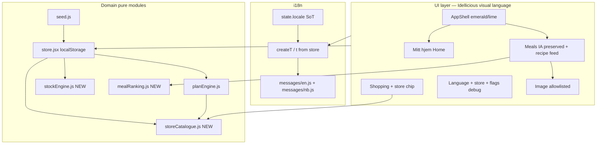
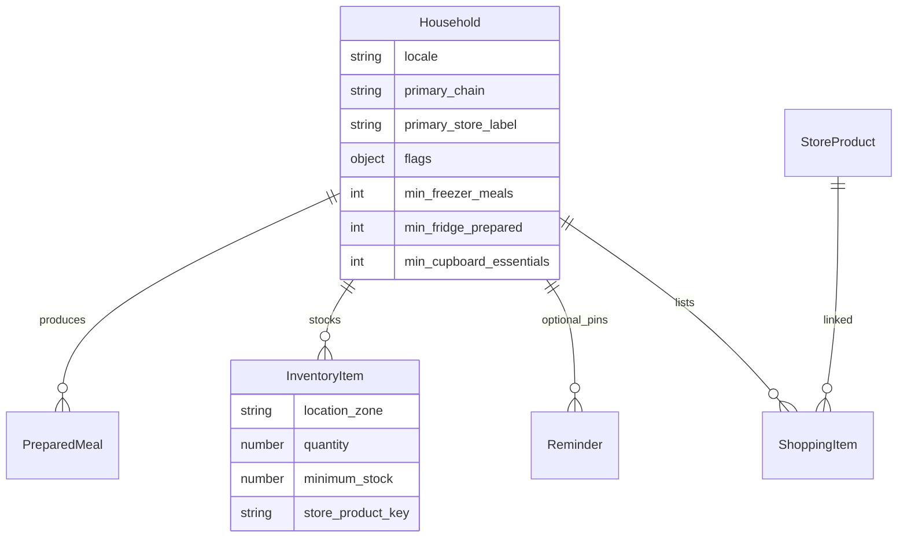

# NourishCare Evolution — Language, Stores, Home & Idellicious UI

| Field | Value |
|-------|--------|
| **Title** | NourishCare product evolution: EN/NO, Norwegian stores, Mitt hjem, stock reminders, Idellicious-style UI |
| **Author** | Engineering (TBD) |
| **Date** | 2026-08-08 |
| **Status** | Draft (rev 3.1 — product lock 2026-08-08; implement from PR0) |
| **Product** | NourishCare (Base44 APP-ID `6a655f2fcdc7bff6e81ee6f6`) |
| **Codebase** | `C:\Users\oivin\base44-apps\nourishcare` |
| **UI reference** | Idellicious (`C:\Users\oivin\base44-apps\Idellicious`) |
| **Related** | `docs/DESIGN.md`, `docs/DESIGN-SYMBIOTIC-PLAN.md` |
| **Audience** | Senior engineers implementing on the current Vite + React + local store stack |

---

## Overview

NourishCare is a mobile-first Base44 SPA that helps caregivers organise **small, frequent, energy-dense meals** for someone who needs to **eat more and gain weight** without shame, pressure, or medical claims. The app already has a solid domain core: household tenancy, trauma-informed logging, Norwegian grocery seed catalogue (REMA 1000, KIWI, COOP, SPAR, Bunnpris, Joker), inventory/shopping, prepared portions, and the symbiotic **Plan → Handle → Tilbered** session (`planDraft` + `planEngine.js`).

This evolution ships ten product capabilities on top of that foundation: **EN/NO language selector**, richer **Norwegian assortment** filtering by **store chain (and optional local label)**, a clear **Mitt hjem** household home surface for **produced/prepared inventory**, gentle **stock reminders** for freezer / refrigerator / cupboards, first-class **meal categories** (meals, shakes, snacks, soups, desserts) with **real food photography**, and a **visual refresh** that adopts Idellicious’s modern card feed, emerald/lime warm aesthetic, bottom-nav shell, and `Image` component — **without** losing NourishCare’s trauma-informed Norwegian caregiver semantics, symbiotic prep flow, or weight-gain clinical goal framing.

**Stack (unchanged for this phase):** Vite + React 18 + Tailwind + `@base44/sdk`, entity schemas in `base44/entities/*.jsonc`, primary runtime state in `src/lib/store.jsx` + `localStorage` key `nourishcare_state_v3_empty` (soft-extend; bump only if shape is incompatible).

**Persistence policy (explicit):** **v1 ships local-only.** Runtime reads/writes go through `store.jsx` → `localStorage`. Base44 SDK is used today only for `base44.auth.me()` / login redirect (`src/api/base44Client.js`). Entity JSONC files are **schema documentation for a future sync phase** — do **not** implement dual-write or entity CRUD in these PRs. When cloud sync becomes a product priority, mirror household/locale/store fields via SDK in a dedicated follow-up, not this evolution.

---

## Background & Motivation

### Clinical / product goal

Help users **eat more and gain weight** (underweight, low appetite, post-trauma food anxiety, caregiver support). Language and UX must be:

- **Never shaming** — no “failed,” “must eat,” streaks, compliance %, body imagery, or calorie-first dashboards (calories stay hidden by default via `household.hide_calories`).
- **Trauma-informed** — agency, optional logging, “something small is enough,” “skipped without pressure” as a success state (`LOG_STATUSES` / `MealPlanEntry.status` already encode this).
- **Practical** — regular and frequent consumption: small meals, shakes, snacks, soups, desserts that feel manageable in volume and effort.

There is **no structured weight-goal entity**, weigh-in log, or BMI field. Clinical framing is **copy + meal design only** (see Non-Goals and §5).

### Current state (implemented)

| Area | Path | What works | Gap vs this request |
|------|------|------------|---------------------|
| Shell | `src/components/layout/AppShell.jsx` | 5-tab bottom nav (I dag · Måltider · Kjøkken · Handleliste · Støtte), quick exit, PlanSessionBar | Warm `nc-*` palette, not Idellicious emerald/lime card feed; no photo-led discovery |
| Copy | `src/lib/copy.js` | Full **Norwegian** trauma-informed strings + `PLAN_COPY`, `CHAINS`, `SHOP_CATEGORIES` | **No EN locale** or language selector |
| Store state | `src/lib/store.jsx` | Metrics, `gentleAlerts` (hard-coded NB for freezer/fridge/milk/ok), prep, shopping→inventory always `location: 'Tørrvare'`, planDraft | No cupboard engine; no `location_zone`; alerts not Reminder-backed |
| Catalogue | `src/data/seed.js` `STORE_PRODUCTS` | 16 essentials; multi-chain prices; Shopping search uses `preferred_chains` for price only, **does not filter** by availability | No primary store; no availability filter |
| Price resolve | `planEngine.js` L76 | `preferred_chains?.[0] \|\| 'kiwi'` only | Diverges from Shopping’s full preferred list walk |
| Chains UI | `Settings.jsx`, `Onboarding.jsx` | Multi-select `preferred_chains` | No primary chain radio / local label |
| Recipes | `seed.js` `RECIPES` + `recipe.jsonc` | Categories: `food_prep`, `dinner`, `smoothie_shake`, `snack_small`; emoji `icon`; names/steps NB only | No `soup`/`dessert`; no `image_url`; no `name_en` |
| Meals IA | `Meals.jsx` | Tabs: **Økt · Uke · Smoothies · Middager · Småmåltider · Forbered**; deep links `?tab=session&step=` | Need photo feed without dropping plan/prep |
| Kitchen | `src/pages/Kitchen.jsx` | “Måltidsbeholdning”, prepared + pantry, portion ± | Not **Mitt hjem** |
| Household | `household.jsonc` + `buildEmptyState` | min_*, discreet, preferred_chains; **no** `flags`, `locale`, `primary_chain` | Need locale, store, flags |
| Reminders | `reminder.jsonc` | Gentle types; not driven by stock engine | Missing stock types; unused by gentleAlerts |
| Tests | `package.json` | Vite build only — **no** vitest/jest | Need tooling for banned phrases + pure engines |
| Idellicious | sibling app | AppShell, RecipeCard, Image, Unsplash `u()` | Not ported |

### Pain points

1. Caregivers shopping in Norway need products that match **their chain** (and ideally a named local store).
2. UI is calm but text-heavy; food motivation improves with real photography.
3. EN-speaking caregivers cannot switch language without code changes.
4. Produced inventory is buried under Kitchen metrics.
5. Freezer/fridge alerts exist; cupboard emptiness and formal stock reminder model do not.
6. Soup and dessert are common easy options but not first-class discovery categories.

---

## Goals & Non-Goals

### Goals

1. **EN/NO i18n** with dual dictionaries, Settings + onboarding language control, default `nb`.
2. **Norwegian assortment v1.1**: expand seed; filter and price via shared catalogue helpers and **primary chain**.
3. **Store selector**: primary chain + optional local label; shopping/search/restock/planEngine share one resolve path.
4. **Mitt hjem**: household home surface for **produced** inventory + stock zone meters.
5. **Stock alerts**: deterministic freezer / fridge / cupboard formulas; ephemeral UI cards by default; optional user-pinned Reminder rows only.
6. **Meal design**: categories meals (`dinner`), shakes, snacks, soups, desserts; small frequent intake; recipe `name_en` for EN UI.
7. **Idellicious-style UI**: card feed, emerald/lime, bottom nav, `Image` component (allowlisted HTTPS hosts).
8. Preserve Plan → Handle → Tilbered, trauma-informed logging, discreet mode, quick exit, empty-start.
9. Accessibility WCAG 2.1 AA targets, mobile-first.
10. Incremental PRs; pure engines unit-tested with Vitest.

### Non-Goals

- Live Norwegian retail price APIs or reverse-engineered chain apps.
- Full Next.js/Prisma rewrite from `docs/DESIGN.md`.
- Medical device claims, BMI calculators, **structured weight-goal entity**, weigh-ins, compliance scoring, calorie-first UX.
- Public social feed, gamification, shame language.
- Multi-household enterprise RBAC beyond current local household model.
- Replacing planEngine with Idellicious shopping-merge semantics.
- Native Web Push beyond in-app cards for this phase.
- **SDK entity dual-write / cloud sync** in these PRs (local-only v1).
- **Auto-creating Reminder entity rows** on every stock recompute (see KD-13).
- **Translating full recipe ingredient/step bodies** to EN in v1 (titles + alts only; steps may stay NB until content PR).

---

## Proposed Design

### Architecture (high level)



### Design principle: adopt look, keep soul

| Adopt from Idellicious | Keep from NourishCare |
|------------------------|------------------------|
| Emerald/lime warm surfaces, gradient logo tile | Trauma-informed copy & banned shame phrases |
| Card feed photo aspect `4/3`, gradient title overlay | No like/dislike feed ranking |
| Bottom nav + sticky header blur | 5 care tabs + quick exit + discreet mode |
| `Image` component | PlanSessionBar + planEngine |
| Unsplash allowlist helper | Norwegian catalogue, NOK øre, log states |

**Do not port:** Idellicious thumbs up/down as primary ranking.

---

### 1. Language selector (EN / NO)

#### Approach

```
src/lib/i18n/
  index.js          # createT(locale), DEFAULT_LOCALE='nb', applyDocumentLang(locale)
  locales.js        # 'en' | 'nb'
  messages/nb.js    # migrate COPY / PLAN_COPY / labels
  messages/en.js    # same keys
  banned.js         # shame substrings both locales
  recipeDisplay.js  # recipeDisplayName(recipe, locale), recipeImageAlt(recipe, locale)
src/lib/copy.js     # thin re-export of nb for backward compat during migrate
```

#### Locale source of truth (KD-14)

| Field | Role |
|-------|------|
| **`state.locale`** (`'nb' \| 'en'`) | **Single source of truth** for UI language |
| `household.locale` | **Mirror only** — written on every `setLocale` for future multi-device sync; **never read** for rendering in v1 |

```js
// loadState soft-default
locale: parsed.locale || parsed.household?.locale || 'nb'

// setLocale(locale) — single path
function setLocale(locale) {
  const next = locale === 'en' ? 'en' : 'nb';
  update((prev) => ({
    ...prev,
    locale: next,
    household: { ...prev.household, locale: next },
  }));
  applyDocumentLang(next); // document.documentElement.lang = next
}

// StoreProvider useEffect on mount + whenever state.locale changes:
useEffect(() => { applyDocumentLang(state.locale); }, [state.locale]);
```

- Settings: segmented control **Norsk | English**.
- Onboarding step 0: language choice (required copy keys in PR1).
- Catalogue display: `locale === 'nb' ? name_nb : (name_en || name_nb)`.
- Recipe display: `recipeDisplayName` / `recipeImageAlt` (see §1.1).

#### Recipe content language (§ Issue 8)

| Field | v1 requirement |
|-------|----------------|
| System recipes | Add `name_nb` (alias of current `name`) + **`name_en`** on every seed recipe |
| `name` | Keep as primary NB display fallback for existing code |
| Ingredients / steps | **May remain Norwegian in v1** (Non-Goal: full recipe body translation) |
| PreparedMeal.name | Stored at prep time in active locale’s display name (or always NB shelf name — **prefer store NB name + display helper on read**) |
| MealPlanEntry.recipe_name | Same: display via helper when `recipe_id` resolves; denormalised string is fallback |

```js
// src/lib/i18n/recipeDisplay.js
export function recipeDisplayName(recipe, locale) {
  if (!recipe) return '';
  if (locale === 'en') return recipe.name_en || recipe.name_nb || recipe.name || '';
  return recipe.name_nb || recipe.name || recipe.name_en || '';
}

export function recipeImageAlt(recipe, locale) {
  if (locale === 'en') return recipe.image_alt_en || recipe.image_alt_nb || recipeDisplayName(recipe, 'en');
  return recipe.image_alt_nb || recipe.image_alt_en || recipeDisplayName(recipe, 'nb');
}
```

#### API

```js
export function createT(locale) {
  const dict = locale === 'en' ? en : nb;
  return function t(key, vars) { /* dot-path; functions for plurals */ };
}
// Context: { t, locale, setLocale }
```

#### Migration & mid-stream language rule (Issue 15)

1. PR1: extract dictionaries; migrate AppShell, Settings, Onboarding, Welcome clinical paragraph.
2. **Rule for PR2–PR6:** any **new** user-visible string **must** call `t(key)` with **both** `nb` and `en` keys added in the **same PR**. No hard-coded NB in new components.
3. PR7: residual sweep of pre-existing hard-coded strings + EN trauma-tone pass only (not first translation of new UI).

#### Tone rules (both locales)

| Use | Avoid |
|-----|--------|
| Meal available / Måltid tilgjengelig | Failed / Du må spise |
| Something small is enough | Compliance / streak broken |
| Only two easy dinners remain | Critical stockout failure |
| Preparing four freezer portions would restore your buffer | You failed to prep |

#### Tooling for banned phrases (Issue 5)

See **PR0**: Vitest + `npm test`. `banned.js` exports arrays; test loads both message trees and fails if banned substrings appear in default strings (allowlist exceptions documented in test file).

---

### 2. Norwegian store product assortment

#### Current seed

16 essentials in `STORE_PRODUCTS` (`seed.js`); `multiPrice()` for all six chains; `available_chains: CHAINS`.

#### v1.1 expansion

Curated care-kitchen assortment **~40–60 SKUs** (dairy fats, easy protein, liquid meals, soft carbs, soups, snacks/desserts, frozen ready). Fields stay aligned with `store-product.jsonc`.

- UI prices: **«Estimert» / “Estimated”**.
- Extend `ingredientMap.js` for new soup/dessert recipes.

| Metric | Target |
|--------|--------|
| Seed SKUs | 40–60 |
| Essential restock set | 16–24 (`is_essential_seed: true`) |
| Search latency | &lt; 5 ms client filter |

---

### 3. Store selector

#### Model

```js
// household (state + household.jsonc)
{
  preferred_chains: ['kiwi', 'rema_1000', 'coop'], // multi-select “also shop at”
  primary_chain: 'kiwi',                            // NEW active filter + first price
  primary_store_label: 'KIWI Majorstuen',            // NEW optional free text
}
```

#### Shared catalogue module (Issue 7) — required

**Single module** `src/lib/storeCatalogue.js` used by Shopping, planEngine, restock, and any price chip:

```js
export function resolveChainOrder(household) {
  const primary = household.primary_chain || household.preferred_chains?.[0] || 'kiwi';
  const rest = (household.preferred_chains || []).filter((c) => c !== primary);
  return [primary, ...rest];
}

export function productsForHousehold(products, household) {
  const chain = resolveChainOrder(household)[0];
  return (products || []).filter(
    (p) => !p.available_chains?.length || p.available_chains.includes(chain)
  );
}

export function priceFor(product, household) {
  for (const c of resolveChainOrder(household)) {
    const row = product.prices?.find((p) => p.chain === c);
    if (row) return { ...row, chain: c };
  }
  return product.prices?.[0] ? { ...product.prices[0] } : null;
}
```

**PR4 must update:**

| Call site today | Change |
|-----------------|--------|
| `planEngine.js` L76 `preferred_chains?.[0]` | `resolveChainOrder(household)[0]` + `priceFor` |
| `Shopping.jsx` `priceFor` local + search list | import shared helpers; filter hits via `productsForHousehold` |
| `store.jsx` `addShoppingFromCatalogue`, `restockEssentials` | shared `priceFor` / chain order |

Existing open shopping lines are **not** removed when primary chain changes (only search/restock/pricing of new adds).

#### UI

- Settings → Butikk: radio primary chain + optional local label + multi-select “also shop”.
- Shopping header chip: `KIWI · Majorstuen`; tap opens sheet.
- Onboarding: pick primary after language.

---

### 4. Mitt hjem (“My home”)

#### Mapping

| Concept | Implementation |
|---------|----------------|
| Household identity | `state.household.name`; AppShell title |
| Auth | Base44 `auth.me()` unchanged; local-only data |
| Produced inventory | `state.prepared` |
| Raw stock | `state.inventory` + `location_zone` |

#### Nav rebrand (KD-15)

- **Bottom nav label:** `Hjem` / `Home` (replaces `Kjøkken` / Kitchen).
- **Route:** remain **`/kitchen`** for deep-link stability; optional alias `/home` → same component.
- Page H1: `Mitt hjem` / `My home`; subtitle preserves “prepared meals & stock”.

#### Layout

```mermaid
flowchart TB
  subgraph Home[Mitt hjem]
    Hero[Household name + ready portions]
    Zones[Freezer | Fridge | Cupboard meters]
    Produced[Produced meals grid]
    Actions[Prep session · Log · Shop restock]
  end
```

**Produced cards:** `Image` when `image_url` present; else soft gradient + emoji/`icon` placeholder (no hard dependency on PR3 photos).

**Empty produced:** CTA → `/meals?tab=session`.

Zone meters use **stockEngine** formulas (§6) — ship engine **before or with** Home meters (see PR plan reorder).

---

### 5. Clinical framing: eat more / gain weight

#### Copy-only (no goal entity)

- **Required PR1 keys** on Welcome + Onboarding intro:
  - nb: *NourishCare hjelper husholdningen med å ha små, energirike alternativer klare — så det blir enklere å spise litt mer, litt oftere.*
  - en: *NourishCare helps your household keep small, energy-rich options ready — so eating a little more, more often, feels manageable.*
- Settings: no weight target controls (Non-Goal).
- `SupportProfile.notes_private` remains private; never in stock alerts.

#### Readiness → recipe ordering (Issue 13)

```js
// src/lib/mealRanking.js
/**
 * Stable sort for Meals Discover feed only.
 * Does not mutate plan week or session selections.
 */
export function sortRecipesForReadiness(recipes, readiness, profile) {
  // If appetite very_low|low OR profile.prefer_liquid:
  //   tier0: smoothie_shake, soup, dessert with difficult_day_suitable
  //   tier1: snack_small difficult_day_suitable
  //   tier2: other difficult_day_suitable
  //   tier3: rest
  // Within tier: preserve original array order (stable)
  // Profile boost (optional): if difficult_day_foods / favourite_foods non-empty,
  // reduce tier by 0.5 when matchProfileFood(recipe, token) is true.
}

/**
 * Match rule (stable for Vitest):
 * - Empty profile arrays → no boost.
 * - For each token in difficult_day_foods ∪ favourite_foods:
 *   - Normalize: trim, lower-case (locale 'nb' or 'en' lower), collapse whitespace.
 *   - Match if normalized token is a **substring** of any of:
 *     recipeDisplayName(recipe, 'nb'), recipeDisplayName(recipe, 'en'),
 *     or any ingredient.name lowercased.
 * - Case-insensitive; diacritics kept as-is (no strip) for v1 simplicity.
 * - Exact equality is a special case of substring; no fuzzy/edit-distance.
 */
```

- **Call site:** Meals Discover/Recipes sub-surface only (`Meals.jsx`).
- Soft banner via `t('meals.easierFirstToday')` when reordering active.
- Cross-link: Today readiness sheet save updates `state.readiness`; Meals reads it.
- Unit tests in Vitest for order stability + profile boost cases (empty profile, substring hit on name_en, miss).

---

### 6. Stock reminders (freezer / fridge / cupboard)

#### KD-13 — Persistence model

| Layer | Behaviour |
|-------|-----------|
| **`evaluateStock()` pure** | Always returns in-memory alert DTOs |
| **`state.stockAlerts`** | Derived in `store.jsx` via `useMemo` (replaces body of current `gentleAlerts`) |
| **Reminder entity rows** | **Never auto-inserted** on recompute |
| **User pin** | Settings → Stock: pin modes (see Reminder types below) |
| **Upsert key** | `(type)` unique among stock pin types for household |
| **User-disabled pin** | `enabled: false` — engine still shows ephemeral cards; pin does not fire extra UI |
| **Severity change** | Ephemeral cards update immediately; pinned Reminder `message` refreshed only on explicit pin re-save |

**Acceptance criteria:** N inventory/prepared toggles produce **≤1 ephemeral card per alert `id`** (`low_freezer`, `low_fridge`, `low_fridge_ingredients`, `low_cupboard`, plus optional single `ok`).

**Migration of `gentleAlerts`:** Replace with `stockAlerts` via `t()`. Map today’s branches:

| Today (`store.jsx`) | Rev 3 alert id |
|---------------------|----------------|
| low freezer prepared | `low_freezer` |
| low fridge prepared | `low_fridge` |
| milk `store_product_key === 'whole_milk'` low | **`low_fridge_ingredients`** (generalized to all fridge-zone essentials) |
| buffer ok | `ok` |

| Alert id | action |
|----------|--------|
| `low_freezer` | `prep` → `/meals?tab=session` |
| `low_fridge` | `kitchen` → `/kitchen` |
| `low_fridge_ingredients` | `shopping` → `/shopping` (restores milk-class path) |
| `low_cupboard` | `shopping` → `/shopping` |
| `ok` | null |

Deprecate exporting `gentleAlerts` name after one PR (alias temporarily).

#### KD-21 — Fridge prepared vs fridge essentials (rev 3)

Dairy/drinks map to **`location_zone: 'fridge'`** (correct cold storage). That must not make them invisible to stock alerts.

| Concern | Source of truth | Alert |
|---------|-----------------|-------|
| **Fridge meter** (Home) | Prepared `fridge` + `ready_now` portions only | Meter attention; alert `low_fridge` |
| **Fridge ingredients** (raw stock) | Essentials with `location_zone === 'fridge'` below `minimum_stock` | Alert `low_fridge_ingredients` (≤1 card; lists count; milk is a special case of this) |
| **Cupboard meter + alert** | Essentials with `location_zone === 'cupboard'` (or unknown → cupboard) | `low_cupboard` |
| **Freezer meter + alert** | Prepared `freezer` portions | `low_freezer` |

**KD-16 refined:** Fridge **meter** stays prepared-only. **Raw fridge inventory is in scope** via a separate alert path (not folded into the prepared meter). Product copy “freezer / refrigerator / cupboard” = prepared freezer + prepared fridge + fridge ingredients + cupboard staples.

#### Pure formulas — single source of truth

```js
// src/lib/stockEngine.js

function isEssentialItem(inv, essentialKeySet) {
  return inv.store_product_key && essentialKeySet.has(inv.store_product_key);
}

function essentialsInZone(inventory, zone, essentialKeySet) {
  return (inventory || []).filter((i) => {
    const z = i.location_zone || 'cupboard';
    return z === zone && isEssentialItem(i, essentialKeySet);
  });
}

function lowLines(items) {
  return items.filter(
    (i) => i.restock_enabled !== false && (i.quantity ?? 0) < (i.minimum_stock ?? 1)
  );
}

function okCount(items) {
  return items.filter((i) => (i.quantity ?? 0) >= (i.minimum_stock ?? 1)).length;
}

/**
 * @returns stock metrics + alerts
 */
export function evaluateStock({ household, prepared, inventory, essentialKeySet }) {
  const minFreezer = household.min_freezer_meals ?? 6;
  const minFridgePrepared = household.min_fridge_prepared ?? 2;
  const minCupboardOk = household.min_cupboard_essentials ?? 5;
  // Soft: if user set min_smoothie_servings, treat whole_milk minimum_stock
  // effective floor as max(item.minimum_stock, 1) — does not invent inventory rows.
  // min_smoothie_servings is NOT a separate alert id; it only influences milk line
  // when present (see Settings wiring). Default seed milk minimum_stock remains 1–2.

  const freezer_portions = sumRemaining(prepared, (p) => p.storage_type === 'freezer');
  const fridge_prepared_portions = sumRemaining(
    prepared,
    (p) => p.storage_type === 'fridge' || p.storage_type === 'ready_now'
  );

  const cupboardItems = essentialsInZone(inventory, 'cupboard', essentialKeySet);
  const fridgeEssentialItems = essentialsInZone(inventory, 'fridge', essentialKeySet);

  const cupboard_essentials_low = lowLines(cupboardItems);
  const cupboard_essentials_ok = okCount(cupboardItems);
  const fridge_essentials_low = lowLines(fridgeEssentialItems);
  const fridge_essentials_ok = okCount(fridgeEssentialItems);

  const alerts = [];

  if (freezer_portions < minFreezer) {
    alerts.push({
      id: 'low_freezer',
      zone: 'freezer',
      severity: 'attention',
      messageKey: 'stock.lowFreezer',
      messageParams: { n: freezer_portions },
      action: 'prep',
    });
  }

  // Prepared fridge only (meter / KD-16)
  if (fridge_prepared_portions < minFridgePrepared) {
    alerts.push({
      id: 'low_fridge',
      zone: 'fridge',
      severity: 'attention',
      messageKey: 'stock.lowFridge',
      messageParams: { n: fridge_prepared_portions },
      action: 'kitchen',
    });
  }

  // Raw fridge essentials (dairy, drinks, …) — restores / generalizes milk gentleAlert
  // Gate: only if at least one fridge-zone essential exists OR any fridge essential is low.
  // Empty inventory → no low_fridge_ingredients (avoids noise; cupboard handles empty coach).
  if (fridge_essentials_low.length >= 1) {
    const milkLow = fridge_essentials_low.some((i) => i.store_product_key === 'whole_milk');
    alerts.push({
      id: 'low_fridge_ingredients',
      zone: 'fridge',
      severity: 'attention',
      messageKey: milkLow ? 'stock.lowFridgeIngredientsMilk' : 'stock.lowFridgeIngredients',
      messageParams: { n: fridge_essentials_low.length },
      action: 'shopping',
    });
  }

  // Cupboard: low lines OR (has ever tracked cupboard essentials path — see empty-start gate)
  if (shouldEmitCupboardAlert(household, inventory, cupboard_essentials_low, cupboard_essentials_ok, minCupboardOk)) {
    alerts.push({
      id: 'low_cupboard',
      zone: 'cupboard',
      severity: 'attention',
      messageKey: 'stock.lowCupboard',
      messageParams: {
        low: cupboard_essentials_low.length,
        ok: cupboard_essentials_ok,
        min: minCupboardOk,
      },
      action: 'shopping',
    });
  }

  const fridgeIngOk = fridge_essentials_low.length === 0;
  if (
    freezer_portions >= minFreezer &&
    fridge_prepared_portions >= minFridgePrepared &&
    fridgeIngOk &&
    cupboard_essentials_ok >= minCupboardOk &&
    cupboard_essentials_low.length === 0
  ) {
    const ready = freezer_portions + fridge_prepared_portions;
    alerts.push({
      id: 'ok',
      zone: null,
      severity: 'info',
      messageKey: 'stock.bufferOk',
      messageParams: { n: ready },
      action: null,
    });
  }

  return {
    freezer_portions,
    fridge_prepared_portions,
    fridge_essentials_ok,
    fridge_essentials_low,
    cupboard_essentials_ok,
    cupboard_essentials_low,
    alerts,
  };
}

/**
 * Empty-start gate for cupboard (rev 3):
 * - Always emit if any cupboard essential is below min (user has stock data).
 * - Emit “below min ok count” only if onboarding_complete === true
 *   AND (cupboardItems.length > 0 OR household.flags.coachCupboardEmpty !== false).
 * - Brand-new empty household (no inventory, onboarding incomplete): **no** low_cupboard.
 * - After onboarding, empty cupboard still coaches once via ok < min when
 *   coachCupboardEmpty is true (default true after onboarding).
 */
function shouldEmitCupboardAlert(household, inventory, low, ok, minOk) {
  if (low.length >= 1) return true;
  if (ok >= minOk) return false;
  if (!household.onboarding_complete) return false;
  // onboarding complete and below buffer
  return true;
}
```

**Copy keys (both locales):**

| Key | Intent |
|-----|--------|
| `stock.lowFridgeIngredients` | “Some fridge staples are running low.” |
| `stock.lowFridgeIngredientsMilk` | Prefer when milk among low (near today’s “Smoothie-ingredienser (melk) kan snart ta slutt.”) |

#### Worked examples (deterministic tests)

| Scenario | Inputs | Alerts |
|----------|--------|--------|
| Empty, onboarding incomplete | prepared=[], inventory=[] | `low_freezer`, `low_fridge` only — **no** cupboard, **no** fridge_ingredients |
| Empty, onboarding complete | same, `onboarding_complete: true` | + `low_cupboard` (ok=0&lt;5) |
| 5 dairy essentials full in **fridge**, 0 cupboard, prepared healthy | dairy zone fridge qty≥min; freezer 6; fridge prep 2 | **no** low_fridge_ingredients; **low_cupboard** if onboarded (ok=0); no low_freezer/low_fridge |
| Milk low in fridge | whole_milk qty&lt;min, zone fridge; rest healthy prepared+cupboard | `low_fridge_ingredients` only (milk messageKey) |
| 5 cupboard essentials full, freezer 6, fridge prep 2, fridge dairy ok | — | `ok` only |
| Freezer 1, rest healthy | freezer_portions=1 | `low_freezer` only |

**Essential detection:** `store_product_key ∈ essential seed keys`. Free-text inventory without key is **not** essential.

#### Zone meters (Home UI)

| Meter | Display value | Attention if |
|-------|---------------|--------------|
| Freezer | `freezer_portions` / `min_freezer_meals` | portions &lt; min |
| Fridge (prepared) | `fridge_prepared_portions` / `min_fridge_prepared` | portions &lt; min |
| Fridge staples (optional chip) | `fridge_essentials_ok` / low count | `fridge_essentials_low.length ≥ 1` |
| Cupboard | `cupboard_essentials_ok` / `min_cupboard_essentials` (+ low chip) | low≥1 or (onboarded ∧ ok&lt;min) |

#### Inventory `location_zone` heuristics (Issue 6)

Complete map used by `toggleShop`, restock→inventory, and `loadState` migration:

| `category` | `location_zone` | Default `location` label (nb) | en |
|------------|-----------------|-------------------------------|-----|
| `dairy` | `fridge` | Kjøleskap | Fridge |
| `meat_fish` | `fridge` | Kjøleskap | Fridge |
| `frozen` | `freezer` | Fryser | Freezer |
| `drinks` | `fridge` | Kjøleskap | Fridge |
| `nutritional_drinks` | `cupboard` | Skap | Cupboard |
| `fruit_veg` | `cupboard` | Skap | Cupboard |
| `bread_bakery` | `cupboard` | Skap | Cupboard |
| `pantry` | `cupboard` | Skap | Cupboard |
| `snacks` | `cupboard` | Skap | Cupboard |
| `household` | `cupboard` | Skap | Cupboard |
| (unknown) | `cupboard` | Skap | Cupboard |

```js
// src/lib/inventoryZones.js
export function zoneForCategory(category) { /* table above */ }
export function defaultLocationLabel(zone, locale) { /* ... */ }

// loadState migration for each inventory item:
if (!item.location_zone) {
  item.location_zone = inferZoneFromLegacy(item);
  // if location matches /frys/i → freezer; /kjøl|fridge/i → fridge;
  // else if category → zoneForCategory; else cupboard
}
// Note: current code always writes location: 'Tørrvare' (store.jsx toggleShop) — treat as cupboard
```

**PR that adds `location_zone` must update `toggleShop` in the same PR** (no orphan schema).

#### Reminder entity types (optional pins only)

```jsonc
"low_freezer_stock",           // pin zone freezer prepared
"low_fridge_stock",            // pin zone fridge prepared
"low_fridge_ingredients_stock", // pin raw fridge essentials (milk-class)
"low_cupboard_stock",          // pin cupboard
"restock_essentials"           // pin “daily essentials restock check” → shopping
```

| Pin mode (Settings) | Reminder `type` | Deep-link |
|---------------------|-----------------|-----------|
| Freezer buffer | `low_freezer_stock` | `/meals?tab=session` |
| Fridge prepared | `low_fridge_stock` | `/kitchen` |
| Fridge staples | `low_fridge_ingredients_stock` | `/shopping` |
| Cupboard | `low_cupboard_stock` | `/shopping` |
| Restock essentials daily | `restock_essentials` | `/shopping` (highlight restock CTA) |

`pinStockReminder(mode)` where `mode ∈` table above. Upsert by `type`. **`restock_essentials` is a first-class pin**, not a dead enum — it does not require a separate evaluateStock id; ephemeral UI already covers lows; pin is a daily supporter nudge to open shopping/restock.

#### Household thresholds & Settings wiring

| Field | Default | Wired to stockEngine? | Settings UI |
|-------|---------|----------------------|-------------|
| `min_freezer_meals` | 6 | **Yes** — freezer prepared | Editable |
| `min_fridge_prepared` | 2 | **Yes** — fridge prepared | Editable (NEW label) |
| `min_cupboard_essentials` | 5 | **Yes** — cupboard ok count | Editable (NEW) |
| `min_smoothie_servings` | 4 | **Partial** — when inventory has `whole_milk`, effective `minimum_stock` for that line = `max(item.minimum_stock ?? 1, min(2, ceil(min_smoothie_servings / 4)))` optional soft floor; **does not** create a separate alert id beyond `low_fridge_ingredients` | Keep editable; helper text: “Used when milk is tracked in fridge stock” |
| `min_easy_breakfasts` | 5 | **No v1** | Keep field visible with badge **«Kommer» / “Coming soon”** `disabled` or `readOnly` + hint not wired to alerts |
| `min_snacks` | 7 | **No v1** | Same — future |
| `min_nutritional_drinks` | 4 | **No v1** | Same — future (nutritional_drinks zone is cupboard; could later feed cupboard math) |

**Do not leave dead controls without labeling.** PR5 updates Settings labels accordingly.

---

### 7. Meal design & Meals IA (Issue 4)

#### Category model

| Internal id (entity enum only) | UI nb | UI en |
|--------------------------------|-------|-------|
| `dinner` | Måltider | Meals |
| `smoothie_shake` | Shakes | Shakes |
| `snack_small` | Snacks | Snacks |
| `soup` | Supper | Soups |
| `dessert` | Desserter | Desserts |
| `food_prep` | Komponenter / Batch | Batch components |

**Never add enum value `meal`.** UI label “Meals” maps to `dinner` only (KD-7).

**Label collision fix:** Top tab `prep` stays **Forbered / Prep** (meal-prep **guide**). Discover chip for `food_prep` uses **Komponenter / Batch** (or “Food prep”) — **not** the same string as the top tab.

**Seed migration:** retag in place — e.g. `r_potato_soup`, chicken soup-style rows → `category: 'soup'`. No dual-tag. Unknown categories in old data → show under All; containers fall through to default meal_box until retag.

#### Meals page IA (preserve plan/prep)

```
Top-level tabs (URL ?tab=) — STABLE ids:
  session  → Økt / Session     (planDraft wizard)     KEEP
  plan     → Uke / Week        (weekly planner)       KEEP  (default tab)
  recipes  → Oppdag / Discover (photo feed)           NEW replaces smoothies|dinners|snacks as primary
  prep     → Forbered / Prep   (meal-prep guide)      KEEP

Discover sub-chips (client filter, not URL-required):
  all | dinner | smoothie_shake | snack_small | soup | dessert | food_prep (label: Komponenter/Batch)

Legacy URL compatibility:
  ?tab=smoothies → redirect/treat as recipes + chip smoothie_shake
  ?tab=dinners   → recipes + chip dinner
  ?tab=snacks    → recipes + chip snack_small
  ?tab=session&step=plan|handle|tilbered → UNCHANGED (PlanSessionBar, Kitchen, Shopping)
```

| Tab id | Fate |
|--------|------|
| `session` | Keep first-class |
| `plan` | Keep first-class |
| `prep` | Keep first-class |
| `smoothies` / `dinners` / `snacks` | Compatibility aliases → Discover + chip |
| `food_prep` | Discover chip **“Komponenter / Batch”**, not dropped; tab `prep` remains guide |

#### Containers (Issue 14)

```js
// defaultContainersForCategory additions in containers.js
case 'soup':
  return [
    {
      type: 'soup_jar',
      count_per_portion: 1,
      notesKey: 'containers.soupJarNote', // i18n
      // nb fallback: 'Én suppeglass/krukke per porsjon. Frysesikker ved batch.'
    },
  ];
case 'dessert':
  return [
    {
      type: 'snack_pot',
      count_per_portion: 1,
      notesKey: 'containers.dessertPotNote',
      // nb: 'Liten pot til dessertporsjon. Noe lite er nok.'
    },
  ];
```

(`soup_jar` and `snack_pot` already exist in `CONTAINER_TYPES`.)

---

### 8. UX organisation

#### Navigation

```
┌─────────────────────────────────────────────┐
│  [logo] NourishCare / household    [exit][⚙] │
│  PlanSessionBar (when draft active)         │
├─────────────────────────────────────────────┤
│  Screen content                             │
├─────────────────────────────────────────────┤
│  Today · Meals · Home · Shop · Support      │
└─────────────────────────────────────────────┘
```

nb: I dag · Måltider · **Hjem** · Handle · Støtte  
en: Today · Meals · **Home** · Shop · Support

#### Discreet mode matrix (Issue 19)

| Surface | Normal | Discreet (`household.discreet_mode`) |
|---------|--------|--------------------------------------|
| App header title | App name / household | “Plan” / day-neutral (existing) |
| Nav Home | Hjem / Home | **Hjem / Home** (non-food word — OK as-is) |
| Nav Meals | Måltider / Meals | **Plan** / **Plan** |
| Stock alert body | Food-aware i18n (`stock.lowFreezer`) | `stock.discreetAttention` = “Påminnelse tilgjengelig” / “Reminder available” |
| MealCard images | Full photo | **Desaturate + reduce contrast** (`grayscale` + opacity), still show; do **not** blank (layout stability). Alt remains. |
| Produced Home photos | Full | Same desaturate |
| Quick exit / Settings | Always available | Always available |
| PlanSessionBar title | Forberedelsesøkt | Økt (existing PLAN_COPY) |
| Discover chip `dessert` | Desserter / Desserts | **Smått søtt / Small sweet** (KD-27; chip only, category id stays `dessert`) |

---

### 9–10. Idellicious-style UI + food visualization

#### Visual tokens + theme switch mechanism

Emerald/lime and classic beige are **two CSS variable packs**. Theme rollback = **CSS variables only** (no dual utility-class matrix). Flag-off **does not wipe localStorage**.

**Runtime wiring (required):**

```js
// StoreProvider (or AppShell) whenever flags.idelliciousUi changes:
useEffect(() => {
  const theme = state.household?.flags?.idelliciousUi === false ? 'classic' : 'emerald';
  document.documentElement.dataset.ncTheme = theme;
}, [state.household?.flags?.idelliciousUi]);
```

```css
/* src/index.css */
:root,
[data-nc-theme="emerald"] {
  --nc-bg: 152 40% 97%;
  --nc-green: 160 60% 36%;
  /* … emerald/lime pack … */
}

[data-nc-theme="classic"] {
  --nc-bg: 40 33% 97%;
  --nc-green: 152 28% 38%;
  /* … prior warm-beige NourishCare pack … */
}
```

Default missing flag → emerald (`true`). No other theme mechanism.

#### Image component + allowlist (Issues 17, 24)

Port Idellicious `image.jsx` + `use-size.jsx`.

```js
// src/lib/imageAllowlist.js
const ALLOWED_HOSTS = new Set([
  'images.unsplash.com',
  'media.base44.com',
  'static.wixstatic.com',
]);

export function sanitizeImageSrc(src) {
  try {
    const u = new URL(src);
    if (u.protocol !== 'https:') return null;
    if (!ALLOWED_HOSTS.has(u.hostname)) return null;
    return src;
  } catch {
    return null;
  }
}
```

- **v1:** recipe `image_url` only from seed allowlist / curated `recipeImages.js` Unsplash IDs — **reject free-text user image URLs** in forms.
- Offline / error: Idellicious `FALLBACK_IMAGE_URL` (or local `/placeholder-meal.png`).
- CSP: if Base44 hosting sets CSP, document need for `img-src` including `https://images.unsplash.com` (ops note in PR3).

#### Recipe photography fields

```jsonc
// recipe.jsonc
"image_url": { "type": "string" },
"image_alt_nb": { "type": "string" },
"image_alt_en": { "type": "string" },
"name_nb": { "type": "string" },
"name_en": { "type": "string" }
```

`confirmPrep` copies `image_url` onto PreparedMeal for Home grid.

#### MealCard

Caregiver-safe CTAs only: Add to prep session · Prep this now. **No** dislike/hide.

---

## Feature flags (Issue 2)

### Model

Add to household (entity + `buildEmptyState`):

```js
flags: {
  i18nEn: true,
  idelliciousUi: true,
  storeSelector: true,
  stockEngineV2: true,
  mealCategoriesV2: true,
  mealPhotos: true,
}
```

Soft-default on load: missing key → `true` (ship-by-default). Settings → **Developer / Experimental** (collapsed) toggles for rollback without storage wipe.

| Flag | Controls | Off behaviour |
|------|----------|---------------|
| `i18nEn` | Language control visibility | Force `nb` UI (locale field retained) |
| `idelliciousUi` | Emerald CSS pack via `data-nc-theme` | `dataset.ncTheme = 'classic'` (beige variable pack) |
| `storeSelector` | Primary store UI + **availability filter** + primary chip | Price via `preferred_chains` order only (**no** `productsForHousehold` availability filter); hide primary store chip / Settings primary radio optional collapse; `primary_chain` field retained but unused for filter |
| `stockEngineV2` | Cupboard + new formulas | Legacy freezer/fridge/milk-only branch |
| `mealCategoriesV2` | soup/dessert chips | Hide new chips; still render recipes by enum if present |
| `mealPhotos` | Image on cards | Emoji/gradient placeholder |

**PR policy:**

| PR | Flag? |
|----|-------|
| PR0 tooling | No |
| PR1 i18n | `i18nEn` optional; language ships default on |
| PR2 shell | `idelliciousUi` |
| PR3a MealCard | `mealPhotos` / `idelliciousUi` |
| PR3b categories | `mealCategoriesV2` |
| PR4 stores | `storeSelector` |
| PR5 stock engine | `stockEngineV2` |
| PR6 Home UI | uses stockEngine + photos flags |
| PR7 polish | none |

Kill-switch does **not** require storage wipe (Issue 25).

---

## API / Interface Changes

### New pure modules

```
src/lib/storeCatalogue.js   # resolveChainOrder, priceFor, productsForHousehold
src/lib/stockEngine.js      # evaluateStock
src/lib/inventoryZones.js   # zoneForCategory, migration helpers
src/lib/mealRanking.js      # sortRecipesForReadiness
src/lib/imageAllowlist.js   # sanitizeImageSrc
src/lib/i18n/*              # t, recipeDisplay, banned
```

### Store context

```js
{
  state, // includes locale, household.flags, stock derived fields
  locale, t, setLocale,
  metrics,           // extended with cupboard_essentials_ok, etc.
  stockAlerts,       // from evaluateStock; gentleAlerts alias deprecated
  setPrimaryStore({ chain, label }),
  setPreferredChains(chains),
  setFlag(key, boolean),
  pinStockReminder(mode),  // mode: freezer|fridge|fridge_ingredients|cupboard|restock_essentials; not called from evaluateStock
  productsForCurrentStore(), // → productsForHousehold; no-op filter when !flags.storeSelector
  // existing: confirmPrep, usePortion, logFood, planDraft actions, ...
}
```

**Removed / never shipped:** `evaluateAndSyncStockReminders()` auto-persist. Replaced by pure evaluate + optional `pinStockReminder`.

### Entity JSONC deltas

| Entity | Change |
|--------|--------|
| `household.jsonc` | `locale`, `primary_chain`, `primary_store_label`, `min_cupboard_essentials`, `min_fridge_prepared`, `flags` object |
| `recipe.jsonc` | enum +`soup`+`dessert`; `image_url`, `image_alt_nb`, `image_alt_en`, `name_nb`, `name_en` |
| `inventory-item.jsonc` | `location_zone` enum |
| `reminder.jsonc` | stock type enums |
| `prepared-meal.jsonc` | optional `image_url` |
| `store-product.jsonc` | unchanged schema |

---

## Data Model Changes



### Migration / persistence

```js
// loadState soft defaults (no wipe) — locale expression MUST match §1 / KD-14
locale: parsed.locale || parsed.household?.locale || 'nb'
household.primary_chain ||= preferred_chains?.[0] || 'kiwi'
household.flags = { ...DEFAULT_FLAGS, ...parsed.household?.flags }
household.min_fridge_prepared ??= 2
household.min_cupboard_essentials ??= 5
// inventory location_zone inference
// recipes without name_en: display falls back to name
// PR1 acceptance: partially migrated blobs with only household.locale still resolve UI language
```

Prefer **no storage key bump**; use soft defaults.

---

## Alternatives Considered

### A1 — next-intl / react-i18next

Rejected: two locales; banned-phrase control simpler with plain dicts.

### A2 — Live store locator APIs

Rejected: cost, privacy, no reliable public NO grocery inventory API.

### A3 — Sixth nav tab “Forbered” / separate Home

Rejected: five-tab limit; Home replaces Kitchen label.

### A4 — Skip Image port (emoji only)

Rejected: product requirement for real food visualization.

### A5 — Replace planEngine with Idellicious merge

Rejected: loses inventory netting, containers, session UX.

### A6 — Title-only “Mitt hjem” without nav rename (Issue 21)

**Approach:** Keep nav “Kjøkken”; only page H1 says Mitt hjem.

| Pros | Cons |
|------|------|
| Less disruption for returning NB users | Product request emphasises My home identity; Kitchen undersells produced inventory |

**Decision:** Nav rename to Hjem/Home (KD-15); route stays `/kitchen`. If product later rejects rename, A6 is one-line copy change.

### A7 — Primary store = reorder `preferred_chains[0]` only, no new field

| Pros | Cons |
|------|------|
| No schema field | No room for `primary_store_label`; multi-select order is ambiguous UX; Shopping pills ≠ single primary |

**Rejected:** explicit `primary_chain` + label is clearer; preferred_chains remains “also shop / price fallback order after primary.”

### A8 — Reuse Shopping multi-chain pills as sole store UX

Pills remain for **preferred** multi-select display; primary still set in Settings/sheet. Pills alone cannot encode local store label.

---

## Security & Privacy Considerations

| Topic | Treatment | Severity |
|-------|-----------|----------|
| Threat model | Household meal/stock; not clinical diagnostics | Low–Med |
| Auth | Base44 optional; data localStorage | Med |
| Multi-tab | last-write-wins localStorage; acceptable v1 | Low |
| Image src | HTTPS allowlist only; no user-pasted URLs v1 | Med |
| Stock alerts | Default supporter framing; discreet bodies | Med |
| Trauma notes | `notes_private` isolated | High if leaked |
| Price claims | Estimated only | Low |

---

## Observability

| Signal | How |
|--------|-----|
| stockEngine throw | try/catch → empty alerts + dev `console.warn`; toast only if user-initiated action |
| Image deny/fail | fallback asset |
| Locale / store set | silent persist |

No product analytics on skip/adherence.

---

## Rollout Plan

### Staged

1. Internal — all flags default true; EN tone review owner: product + eng  
2. Beta caregivers  
3. General  

### Rollback

- Flag off theme → CSS variable restore only  
- Flag off stockEngineV2 → legacy gentleAlerts branch kept one release  
- No storage wipe  

### Risks

| Risk | Severity | Mitigation |
|------|----------|------------|
| EN diet-culture copy | High | banned.js Vitest + human review |
| Unsplash / CSP | Med | allowlist + fallback |
| Home rename confusion | Med | route stable; A6 fallback |
| Catalogue over-filter | Med | free-text add always |
| Mid-stream mixed i18n | Med | PR2–6 must ship both locales for new strings |
| Reminder spam | High if ignored KD-13 | ephemeral only + pin API |

---

## Open Questions

1. ~~**Default locale for brand-new installs**~~ → **Decided 2026-08-08 (user / KD-26):** always **`nb`** for new installs. Do **not** use `navigator.language`.
2. ~~Nav Hjem vs Kjøkken~~ → **Decided KD-15:** Hjem/Home label, `/kitchen` route.
3. ~~**Dessert in discreet mode**~~ → **Decided 2026-08-08 (user / KD-27):** chip soft label **“Smått søtt” / “Small sweet”** when discreet (do not hide; do not use “Dessert” / “Desserter”). Normal mode keeps Desserter/Desserts.
4. **primary_chain filter scope:** Search+price only (recommended) vs also hide non-matching lines on list? → **Search+price+restock only.**
5. Cloud sync timing for household mirror fields? → **Out of scope v1.**
6. ~~Soup migration~~ → **Decided KD-17:** in-place `category: 'soup'` retag.
7. Who owns EN trauma copy review? → **Product owner + eng pair; checklist in PR7.**
8. ~~Next implementation step~~ → **Decided 2026-08-08 (user):** start **PR0** (Vitest tooling).

---

## References

| Resource | Path |
|----------|------|
| System design | `nourishcare/docs/DESIGN.md` |
| Symbiotic plan | `nourishcare/docs/DESIGN-SYMBIOTIC-PLAN.md` |
| Client store | `nourishcare/src/lib/store.jsx` (`gentleAlerts`, `toggleShop` → `location: 'Tørrvare'`) |
| Plan engine | `nourishcare/src/lib/planEngine.js` (L76 preferred_chains[0]) |
| Containers | `nourishcare/src/lib/containers.js` |
| Seed | `nourishcare/src/data/seed.js` |
| Meals tabs | `nourishcare/src/pages/Meals.jsx` |
| Idellicious Image | `Idellicious/src/components/ui/image.jsx` |
| Idellicious RecipeCard | `Idellicious/src/components/RecipeCard.jsx` |

---

## Key Decisions

| # | Decision | Rationale |
|---|----------|-----------|
| **KD-1** | Stay on Base44 Vite SPA + `store.jsx` / localStorage | Matches shipped stack; avoid Next rewrite for this evolution |
| **KD-2** | Lightweight dual dictionaries + `t()` — not next-intl | Two locales; banned-phrase tests simple |
| **KD-3** | Default locale **`nb`** | Norwegian-first product (see KD-26 for install rule) |
| **KD-4** | `primary_chain` + optional label; shared `storeCatalogue.js` | One price/filter path; no live API |
| **KD-5** | Nav label **Hjem/Home**; route **`/kitchen`** | My home identity without breaking links |
| **KD-6** | Pure `stockEngine.js` → ephemeral `stockAlerts`; Reminder pins user-only | Prevents reminder spam; testable formulas |
| **KD-7** | Categories add `soup`+`dessert`; internal meals id **`dinner` only** | No `meal` enum; UI label Meals |
| **KD-8** | Port Image + MealCard; no dislike ranking | Appetite support without judgment |
| **KD-9** | Emerald/lime via CSS variables; rollback = variable restore | Idellicious warmth + calm alerts |
| **KD-10** | Expand seed 40–60 SKUs; estimated prices | Realism without live API |
| **KD-11** | `location_zone` + full category map; toggleShop updated same PR | Cupboard math needs structure |
| **KD-12** | `household.flags` with soft default **true** | Incremental rollback without wipe |
| **KD-13** | Stock Reminder rows **never auto-created** on recompute | Issue 1 — single persistence model |
| **KD-14** | **`state.locale` is SoT**; household.locale is write-through mirror only | Issue 10 |
| **KD-15** | Meals IA keeps **session + plan + prep**; Discover replaces smoothies/dinners/snacks with legacy URL aliases | Issue 4 |
| **KD-16** | Fridge **meter** = prepared portions only | Aligns with current `metrics.fridge` |
| **KD-17** | Soup seed **in-place retag** to `category: 'soup'` | Prior open Q |
| **KD-18** | Recipe **`name_en` + display helper** in v1; steps may stay NB | Partial i18n honesty |
| **KD-19** | **PR0 Vitest** for banned.js + pure engines | Enforce language safety |
| **KD-20** | **v1 local-only**; entity JSONC is docs; no SDK dual-write | No premature dual-write |
| **KD-21** | **Fridge-zone essentials** get separate alert `low_fridge_ingredients` (generalizes milk); cupboard stays cupboard-zone only | Dairy→fridge zone must not orphan milk alert; refrigerator raw stock in product scope |
| **KD-22** | Cupboard “ok &lt; min” coach only after **`onboarding_complete`**; always alert if any cupboard line low | Empty-start less surveillant; still coaches post-onboarding |
| **KD-23** | Theme via **`document.documentElement.dataset.ncTheme`** = `emerald` \| `classic` | Single switch for `idelliciousUi` flag |
| **KD-24** | Discover `food_prep` chip label **Komponenter/Batch**; tab `prep` = Forbered guide | Avoid IA name collision |
| **KD-25** | `restock_essentials` pin mode → shopping/restock; not a separate evaluateStock id | Enum used, not dead |
| **KD-26** | Brand-new installs always default **`locale: 'nb'`** — never `navigator.language` | Product lock 2026-08-08 |
| **KD-27** | Discreet Discover chip for `dessert`: **“Smått søtt” / “Small sweet”** (not hide, not “Dessert”) | Product lock 2026-08-08 |

---

## PR Plan

Realistic incremental order. Effort: **S** &lt;1 day, **M** 1–3 days, **L** 3–5 days.

### PR0 — Tooling (S) — **START HERE** (product lock 2026-08-08)

- **Title:** `chore(test): add Vitest and npm test for pure modules`
- **Files:** `package.json`, `vitest.config.js`, `src/lib/i18n/banned.js` (stub), smoke test
- **Depends on:** none
- **Description:** Add vitest (or node:test). `npm test` runs. Enables PR1 banned tests and later engine tests. **Next step approved: implement PR0 first.**
- **Flag:** none

### PR1 — i18n foundation (M)

- **Title:** `feat(i18n): EN/NO dictionaries, state.locale SoT, Settings + Welcome clinical copy`
- **Files:** `src/lib/i18n/**`, `copy.js` compat, `store.jsx` (`locale`, `setLocale`, `applyDocumentLang`), Settings, Onboarding, Welcome, AppShell sample keys, `household.jsonc` locale, banned Vitest
- **Depends on:** PR0
- **Description:** Dual messages; language control; required eat-more framing keys; document local-only v1.
- **Flag:** `i18nEn` (default on)
- **Rule:** subsequent PRs add both locales for new strings

### PR2 — Idellicious visual shell + Image (M)

- **Title:** `feat(ui): emerald/lime shell, Image component, allowlist`
- **Files:** `image.jsx`, `use-size.jsx`, `imageAllowlist.js`, `index.css`, `tailwind.config.js`, `AppShell.jsx`
- **Depends on:** none (∥ PR1); i18n keys via `t()` if PR1 merged else temporary keys file
- **Description:** Port Image; CSS variable packs under `[data-nc-theme=emerald|classic]`; StoreProvider sets `document.documentElement.dataset.ncTheme` from `flags.idelliciousUi`; header gradient; nav styles; sanitizeImageSrc.
- **Flag:** `idelliciousUi`

### PR3a — MealCard on existing categories (M)

- **Title:** `feat(meals): MealCard photo feed for existing recipe categories`
- **Files:** `MealCard.jsx`, `Meals.jsx` Discover tab + legacy aliases, `recipeImages.js` allowlist, seed `image_url`/`name_en`/`image_alt_*` for **existing** recipes, `recipeDisplay.js`, `recipe.jsonc` image/name fields
- **Depends on:** PR2; PR1 preferred
- **Description:** Photo cards; session CTAs; no soup/dessert yet; no dislike; grayscale discreet.
- **Flag:** `mealPhotos`

### PR3b — soup/dessert + containers + ranking (M)

- **Title:** `feat(meals): soup/dessert categories, containers, readiness sort`
- **Files:** `seed.js` retag + new recipes, `recipe.jsonc` enum, `containers.js` cases, `mealRanking.js`, Meals chips, Vitest ranking/containers
- **Depends on:** PR3a
- **Description:** In-place soup retag; dessert recipes; sortRecipesForReadiness; i18n chip labels both locales.
- **Flag:** `mealCategoriesV2`

### PR4a — Shared catalogue helpers + primary store (M)

- **Title:** `feat(stores): storeCatalogue helpers and primary_chain selector`
- **Files:** `storeCatalogue.js`, `planEngine.js`, `Shopping.jsx`, `store.jsx` add/restock, Settings/Onboarding store UI, `household.jsonc`, Vitest priceFor/order
- **Depends on:** PR1 for labels
- **Description:** Single resolve path; primary radio + label; chip on Shopping; flag-off = preferred_chains price order only, **no** availability filter, hide primary chip; **no** 40-SKU dump yet.
- **Flag:** `storeSelector`

### PR4b — Assortment expansion (M)

- **Title:** `feat(stores): expand Norwegian seed catalogue to 40–60 SKUs`
- **Files:** `seed.js`, `ingredientMap.js`
- **Depends on:** PR4a
- **Description:** Curated SKUs; available_chains subsets; essentials set for stockEngine.
- **Flag:** none (data)

### PR5 — Stock engine + location_zone (M)

- **Title:** `feat(stock): stockEngine formulas, location_zone, replace gentleAlerts`
- **Files:** `stockEngine.js`, `inventoryZones.js`, `store.jsx` (toggleShop zones + stockAlerts), entity reminder/inventory/household thresholds, Today alert UI via `t()`, Vitest examples from §6, Settings pin API
- **Depends on:** PR4b ideal for essential set; can use current 16 essentials
- **Description:** Implement exact formulas including `low_fridge_ingredients`; empty-start cupboard gate; Settings min_* wiring labels; pin modes including `restock_essentials`; ≤1 card per alert id; **no** auto Reminder insert; migrate inventory zones; legacy flag branch.
- **Flag:** `stockEngineV2`

### PR6 — Mitt hjem Home UI (M)

- **Title:** `feat(home): Mitt hjem surface with zone meters and produced grid`
- **Files:** `Kitchen.jsx` / home components, `AppShell.jsx` nav labels, discreet matrix, confirmPrep image denorm
- **Depends on:** PR5 (meters); PR3a optional (photos with placeholder fallback)
- **Description:** Nav Hjem/Home; hero; meters bound to stockEngine metrics; produced list; empty CTA session.
- **Flag:** uses existing flags

### PR7 — Residual i18n + EN tone + a11y (M)

- **Title:** `chore(i18n): residual string sweep, EN trauma pass, a11y`
- **Files:** remaining pages, PlanSessionBar, Support, grep hygiene
- **Depends on:** PR1–PR6
- **Description:** No new features; EN copy review checklist; contrast/focus on emerald theme; alt text audit.
- **Owner:** eng + product for EN tone

### PR8 — Docs pointer (S, optional)

- **Title:** `docs: link evolution decisions from DESIGN.md`
- **Files:** `docs/DESIGN.md`, `docs/DESIGN-SYMBIOTIC-PLAN.md`
- **Depends on:** conceptual complete
- **Description:** Short addendum only.

### Verification table

| PR | Checks |
|----|--------|
| PR0 | `npm test` green |
| PR1 | nb↔en toggle persists; `document.lang`; banned test fails if “failed to eat” added |
| PR1 | locale fallback `parsed.locale \|\| household.locale \|\| 'nb'` |
| PR2 | Image Unsplash; reject `http://evil`; `data-nc-theme` toggles with flag |
| PR3a | MealCard; session add works; discreet grayscale |
| PR3b | soup chip; Batch chip ≠ Forbered tab; sort stable + profile substring boost |
| PR4a | planEngine + Shopping same price for primary; flag-off disables availability filter |
| PR4b | ≥40 SKUs; search filter by chain when flag on |
| PR5 | empty+!onboarded → 2 cards (freezer+fridge prep); milk in fridge zone → low_fridge_ingredients; pin restock_essentials works; toggleShop sets zone≠ always Tørrvare |
| PR6 | meters match engine; optional fridge staples chip; `/kitchen` loads; portion − updates |
| PR7 | grep hard-coded UI strings ≈ 0 outside seed |

---

*End of design document (rev 3.1 — product lock 2026-08-08).*
