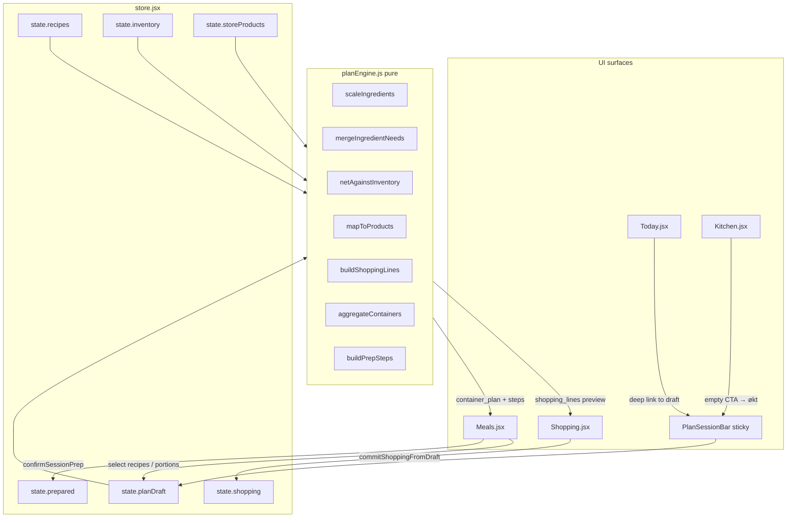
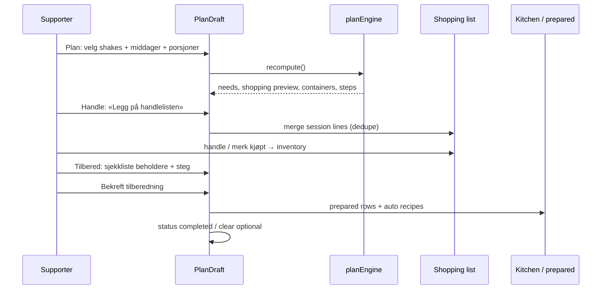
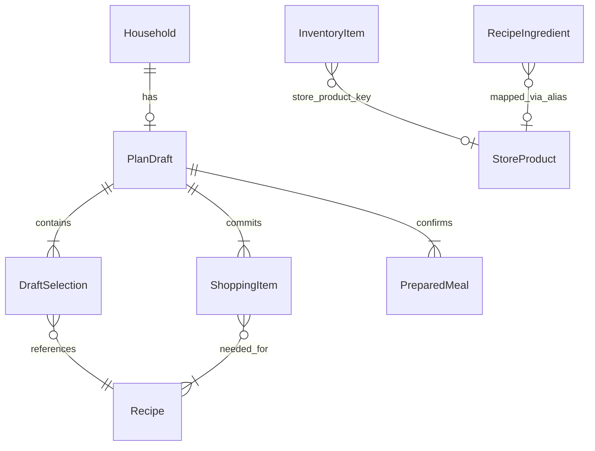

# NourishCare — Symbiotic Plan → Handle → Tilbered

| Field | Value |
|-------|--------|
| **Title** | Interactive recipes, shopping list & batch prep as one system |
| **Author** | Engineering (TBD) |
| **Date** | 2026-07-27 |
| **Status** | Approved for implementation (2026-07-27) |
| **Product** | NourishCare (Base44 app at `base44-apps/nourishcare`) |
| **Audience** | Senior engineers implementing on the current React + local store stack |
| **Related** | `docs/DESIGN.md` (system design), this doc is the **feature design** for intertwined prep/shopping |

---

## Overview

Today NourishCare’s meal recipes, shopping list, batch-container calculator, and kitchen portions are **functionally adjacent but not data-linked**. Selecting a recipe on Meals can confirm prep (`confirmPrep` in `src/lib/store.jsx`) and write prepared portions, but it never computes ingredients, never nets inventory, and never generates shopping lines. Shopping (`src/pages/Shopping.jsx`) is catalogue typeahead + essentials restock only. The batch calculator (`calculateBatchContainers` in `src/lib/containers.js`) is single-recipe and lives inside Meals tabs, invisible from Shopping and Today.

This design introduces a **shared `PlanDraft` / `PrepSession`** as the binding object between:

1. **Selected meals & shakes** (with portion counts)
2. **Computed shopping lines** (inventory-netted, catalogue-mapped, NOK estimates)
3. **Container plan** (existing `containers.js` logic, multi-recipe)
4. **Ordered prep plan** (session steps + confirm → kitchen + auto recipe generation)

The UX surface is one calm flow: **Plan → Handle → Tilbered** (Norwegian product UI). The same draft appears as a sticky summary, cross-links, and deep-links so Meals, Shopping, Kitchen, and Today feel like **one system**, not siloed tabs.

---

## Background & Motivation

### Current state (implemented)

| Area | File(s) | What works | Gap |
|------|---------|------------|-----|
| Global state | `src/lib/store.jsx` | `confirmPrep`, `toggleShop`, `addShoppingFromCatalogue`, inventory on purchase, metrics | No draft session; prep does not touch shopping |
| Containers | `src/lib/containers.js` | `CONTAINER_TYPES`, `calculateBatchContainers`, `formatBatchContainerSummary` | Single recipe only; not stored as session plan |
| Recipes | `src/data/seed.js`, Meals modal | System recipes with free-text ingredients; `enrichRecipe` | No `store_product_key` / unit base; no multi-select |
| Shopping | `src/pages/Shopping.jsx` | Catalogue search, preferred chains, NOK total, restock essentials | No recipe origin; no reverse “needed for …” |
| Kitchen | `src/pages/Kitchen.jsx` | Prepared portions, portion used, pantry list | No path from shopping completion → ready-to-prep |
| Auto recipes | `src/lib/recipeGenerator.js` | One new recipe after each prep confirm | Unchanged; stays on confirm |
| Empty start | `buildEmptyState()` | No fictional household data; seed recipes + store products only | Must remain empty until user acts |

### Pain points

1. **Supporter must mentally bridge** “what I plan to cook” → “what I buy” → “which boxes I need.”
2. **Double work**: ingredients retyped into shopping; container count recalculated by eye.
3. **Siloed tabs**: changing portions on Meals does not update Shopping; Shopping lines do not show which recipes need them.
4. **No multi-recipe session**: real prep days mix shakes + one dinner batch.
5. **Inventory unused for shopping generation** (only purchase→inventory and gentle milk alert).

### Why now

Core surfaces (Meals prep, shopping catalogue, containers, kitchen portions) exist and are stable. The missing piece is a **session object + pure computation layer**, not a rewrite of navigation or entities.

---

## Goals & Non-Goals

### Goals

1. **Symbiotic UX**: one draft session visible across Meals / Shopping / Kitchen / Today with shared sticky summary and reverse links.
2. **Recipe → shopping**: select meals/shakes + portions → merge ingredients → net inventory → map to `StoreProduct` / free-text → dedupe → NOK via preferred chains (REMA, KIWI, COOP, SPAR, Bunnpris, Joker).
3. **Shopping → recipes**: each shopping line shows which selected recipes need it (`needed_for[]`).
4. **Batch calculator → prep plan**: multi-recipe container totals + ordered session steps; **Bekreft tilberedning** still creates kitchen portions + auto-generated recipe (existing `confirmPrep` behavior, extended).
5. **`PlanDraft` data model** in client state (localStorage) with optional Base44 entity later.
6. **Mobile-first Norwegian UI**, trauma-informed copy (no shame, no “must buy / failed prep”), empty start preserved.
7. **Incremental PRs** on current Vite + React + `store.jsx` stack.

### Non-Goals

- Live store price APIs (seed catalogue + estimated NOK only).
- Full Next.js/Prisma rewrite from `docs/DESIGN.md` (deferred; this feature ships on Base44 SPA).
- Automatic deduction of inventory when prep is confirmed (v1: optional soft prompt only; shopping check remains purchase→inventory).
- Meal-plan calendar auto-fill from draft (stretch; week plan stays independent in v1).
- Barcode scanning, multi-device real-time collab, or medical nutrition calculation.
- English product UI strings.
- Shame language, spending guilt, calorie-first shopping.

---

## Key Decisions

| # | Decision | Rationale |
|---|----------|-----------|
| **KD-1** | Introduce client-side **`planDraft`** on `state` (not a new bottom-nav tab as primary entry). Entry: sticky **«Forberedelsesøkt»** chip + Meals tab **«Økt»** + deep links. | Avoids sixth nav item; reuses mental model of Meals → Forbered; sticky summary makes draft ubiquitous. |
| **KD-2** | Flow name in UI: **Plan → Handle → Tilbered** (three steps inside one session shell). | Norwegian, action-oriented, matches user request; “Handle” = shopping without medical tone. |
| **KD-3** | Pure engines in **`src/lib/planEngine.js`** (and thin unit helpers) — no React inside algorithms. | Testable; same functions feed Meals sticky, Shopping banner, and prep confirm. |
| **KD-4** | Ingredient identity: **`normalizeIngredientName` + optional `store_product_key`** via curated map; free-text fallback. | Recipes already use free-text (`Helmelk`, `Banan`); seed has `essential_key`s — bridge without rewriting all recipes in one PR. |
| **KD-5** | Unit strategy: convert to **base units** (`g`, `ml`, `stk`) for merge/net; display in human units; shopping packs use catalogue pack sizes when mapped. | `2 dl` + `1 L` milk merge correctly; pack ceil for `whole_milk` 1 L. |
| **KD-6** | Inventory netting: subtract inventory with matching `store_product_key` or normalized name; never go negative; show **«har hjemme»** line. | Gentle transparency; no punishment if inventory incomplete. |
| **KD-7** | Shopping commit: draft lines **merge into** `state.shopping` with `source: 'prep_session'`, `session_id`, `needed_for`; re-commit updates quantities for session-owned lines only. | Manual catalogue lines untouched; session can refresh without wiping user adds. |
| **KD-8** | Prep confirm from session: loop `confirmPrep` (or batch API) **per selected recipe**; generate **one** auto recipe per confirmed recipe (existing behavior); mark draft `status: 'completed'`. | Minimal change to proven kitchen path; multi-recipe = sequential confirms with one toast summary. |
| **KD-9** | Reverse links stored on shopping lines as `needed_for: [{ recipe_id, recipe_name, amount_label }]`. | Shopping UI can show chips without re-running full engine if draft cleared. |
| **KD-10** | Persist draft in localStorage with rest of state (`STORAGE_KEY`); no new Base44 entity in PR1–3; add `PrepSession` entity only when cloud sync is product-ready. | Matches current offline-first SPA; empty start still works. |
| **KD-11** | Optional ingredients: default **exclude** from shopping; toggle «Inkluder valgfritt» on Plan step. | Reduces list noise; trauma-informed “something small is enough.” |
| **KD-12** | Copy tone: «Handleliste oppdatert fra plan», «Beholdere klare», never «Du mangler X kritiske varer». | Aligns with `src/lib/copy.js` principles. |

---

## Proposed Design

### Architecture (high level)



### User flow: Plan → Handle → Tilbered



### Unified session shell (symbiotic appearance)

**Not a separate app mode that hides tabs.** The draft is ambient:

1. **`PlanSessionBar`** (sticky under header or above bottom nav when draft is non-empty):
   - Step pills: `Plan` · `Handle` · `Tilbered` (active step highlighted)
   - Compact stats: `3 retter · 12 varer · ~349,00 kr · 8 beholdere`
   - Primary CTA changes by step: «Gå til handle» / «Se tilberedning» / «Bekreft»
   - Collapse chevron for low cognitive load

2. **Same object on every tab**:
   - **Meals**: full Plan + Tilbered editors; tab **«Økt»** becomes default when draft active
   - **Shopping**: banner «Fra forberedelsesøkt» + filter chip for session lines; reverse chips on items
   - **Kitchen**: if draft ready and shopping mostly checked → soft card «Klar til tilberedning?»
   - **Today**: quick action «Fortsett forberedelse» when draft exists; metrics already show shopping open count

3. **Deep links** (search params):
   - `/meals?tab=session&step=plan`
   - `/meals?tab=session&step=handle` (or `/shopping?from=session`)
   - `/meals?tab=session&step=tilbered`

### Plan step (recipe selection)

- Multi-select from existing recipe lists (smoothies / middager / småmåltider) with portion stepper per selection (default = `recipe.portions`).
- «Legg til i økt» from recipe modal (alongside existing single-recipe confirm — keep both: **quick prep** vs **session prep**).
- Session list cards show: name, portions, category icon, remove, container subtotal.
- Live recompute on every change (cheap: ≤30 recipes × few ingredients).

### Handle step (shopping)

- Preview table grouped by `SHOP_CATEGORIES` (reuse `src/lib/copy.js`).
- Columns conceptually: name · need · have · buy · chain · NOK · needed_for.
- Actions:
  - **Legg på handlelisten** → commit/merge
  - **Oppdater session-linjer** if draft changed
  - **Fjern session-linjer** (optional undo)
- Respect preferred chains from `state.household.preferred_chains`.
- Price: first preferred chain with a price row, else first available (same as `Shopping.jsx` `priceFor`).

### Tilbered step (batch + instructions)

- **Aggregated containers** across all selected recipes (sum counts per `CONTAINER_TYPES` id).
- **Ordered prep plan** (see algorithms): sort by category (dinner → snack → shake) or by cook time; interleave “finn beholdere” checklist first.
- Per-recipe accordion with steps scaled portion note.
- Storage default per recipe (shake → fridge, dinner → freezer) editable.
- **Bekreft tilberedning** → multi `confirmPrep` + draft complete.

---

## Data Model Changes

### Client state: `planDraft` (primary for v1)

Add to `buildEmptyState()` / persisted state:

```js
// state.planDraft — null when empty, or:
{
  id: 'draft_…',                 // uid
  household_id: 'hh_…',
  status: 'planning' | 'shopping' | 'ready_to_prep' | 'prepping' | 'completed' | 'abandoned',
  step: 'plan' | 'handle' | 'tilbered',
  created_at: ISO,
  updated_at: ISO,
  include_optional: false,
  selections: [
    {
      id: 'sel_…',               // stable row id
      recipe_id: 'r_bp_shake',
      recipe_name: 'Banan-peanøttsmør-shake',
      category: 'smoothie_shake',
      portions: 4,
      storage_type: 'fridge',    // fridge | freezer | ready_now
      storage_location: 'Kjøleskap',
    },
  ],
  // Cached recompute results (optional; can derive on read)
  computed: {
    ingredient_needs: [ /* IngredientNeed */ ],
    shopping_lines: [ /* DraftShoppingLine */ ],
    container_plan: { lines: [], total_containers: 0, … },
    prep_steps: [ /* PrepStep */ ],
    estimate_total_ore: 0,
    last_computed_at: ISO,
  },
  committed_shopping_ids: [],    // shopping item ids owned by this session
  completed_prep_ids: [],        // prepared meal ids from confirm
}
```

### IngredientNeed (engine output)

```ts
type IngredientNeed = {
  key: string;                 // store_product_key or 'ft:' + normalized name
  name_nb: string;
  category: string;            // SHOP_CATEGORIES id or 'pantry'
  needed_base: number;         // in base unit
  base_unit: 'g' | 'ml' | 'stk';
  have_base: number;
  buy_base: number;            // max(0, needed - have)
  display_needed: string;      // "8 dl" / "2 L"
  display_have: string;
  display_buy: string;
  store_product_key: string | null;
  estimated_price_ore: number | null; // per pack when mapped
  packs_to_buy: number;        // ceil for pack products
  preferred_chain: string | null;
  needed_for: Array<{
    recipe_id: string;
    recipe_name: string;
    amount_label: string;      // "4× (2 dl)"
    optional: boolean;
  }>;
  optional_only: boolean;
};
```

### DraftShoppingLine → ShoppingItem extensions

Extend shopping rows written from session (keep existing fields; add):

| Field | Type | Notes |
|-------|------|-------|
| `source` | string | `'manual' \| 'catalogue' \| 'restock' \| 'prep_session'` |
| `session_id` | string | `planDraft.id` |
| `needed_for` | array | reverse links (see above) |
| `recipe_ids` | string[] | flat list for filter |
| `name_normalized` | string | merge key |
| `quantity` | string/number | packs or count (existing) |

Update `base44/entities/shopping-item.jsonc` when cloud-syncing these fields (PR for entity can trail client).

### PreparedMeal (minor)

Already gets `containers_summary` / `container_lines` from `confirmPrep`. Optional:

| Field | Notes |
|-------|--------|
| `session_id` | Link batch to draft for analytics / undo of whole session |

Update `prepared-meal.jsonc` when persisting remotely.

### Recipe ingredient mapping (seed, not entity rewrite)

Add curated map in `src/data/ingredientMap.js` (or section of seed):

```js
export const INGREDIENT_ALIASES = {
  helmelk: { store_product_key: 'whole_milk', base_unit: 'ml', category: 'dairy' },
  melk: { store_product_key: 'whole_milk', base_unit: 'ml', category: 'dairy' },
  banan: { store_product_key: 'bananas', base_unit: 'stk', category: 'fruit_veg' },
  bananer: { store_product_key: 'bananas', base_unit: 'stk', category: 'fruit_veg' },
  // … oats, yoghurt, peanut butter, eggs, bread, cheese, pasta, rice, butter, frozen berries, ready soup, crackers
};
```

Optional later: `ingredients[].store_product_key` on recipes themselves.

### Future Base44 entity `PrepSession` (deferred)

Mirror `planDraft` for multi-device; not required for feature acceptance on current SPA.



### Migration / empty start

- No migration of demo data (none exists).
- `loadState()`: if parsed state lacks `planDraft`, treat as `null`.
- Bump storage key only if incompatible shape; prefer soft default `planDraft: null` without bump (`nourishcare_state_v3_empty` can absorb).

---

## Algorithms

All pure functions in **`src/lib/planEngine.js`** (new). Helpers may live in `src/lib/units.js`.

### 1. Parse quantity (Norwegian decimals)

```js
function parseNbNumber(q) {
  if (typeof q === 'number') return q;
  return parseFloat(String(q).replace(',', '.').replace(/\s/g, '')) || 0;
}
```

### 2. Unit normalization → base

| Input unit | Base | Factor |
|------------|------|--------|
| g | g | 1 |
| kg | g | 1000 |
| ml | ml | 1 |
| dl | ml | 100 |
| L / l | ml | 1000 |
| ts | ml | ~5 (display only; optional ingredients often) |
| ss | ml | ~15 |
| stk, skive, skiver, pk | stk | 1 |
| unknown | stk | quantity as-is, flag `unit_uncertain` |

**Risk (medium):** spoon units for oil/honey are approximate — acceptable for shopping packs; show free-text quantity if unmapped.

### 3. Scale ingredients for selection

For each selection:

```
scaled_qty_base = parse(ingredient.quantity) * unitFactor * (selection.portions / recipe.portions)
```

Skip optional if `!draft.include_optional`.

### 4. Merge ingredient needs

Group by `store_product_key` if known, else `normalizeName(name)`:

- `normalizeName`: lower case, trim, strip diacritics optional, collapse spaces, singular heuristics (`bananer`→`banan`).
- Sum `needed_base`; concat `needed_for` entries.
- If any contribution non-optional → line not `optional_only`.

### 5. Inventory netting

For each need:

```
have = sum(inventory items matching key or normalized name, converted to base)
buy_base = max(0, needed_base - have)
```

Matching priority:

1. `store_product_key` equality  
2. Else `normalizeName(inventory.name) === normalizeName(need.name)`

If units incompatible (cannot convert), **do not subtract** (conservative — may over-shop; safer than under-shop for care context). Soft UI note: «Ikke truffet lagerenhet».

### 6. Map to StoreProduct + pack ceil

```js
function packsToBuy(need, product) {
  // product pack size in base units when known
  // whole_milk: 1 L = 1000 ml → packs = ceil(buy_ml / 1000)
  // bananas: rough 5 stk/kg or buy as kg from pack_label — seed uses kg for bananas
  // default: ceil(buy_base) in stk for discrete items
}
```

Price:

```
estimated_line_ore = packs * resolvePrice(product, preferredChains).price_ore
```

Unmapped free-text: `packs_to_buy = max(1, ceil(buy))` if buy > 0; `estimated_price_ore = null`.

### 7. Shopping generation / commit merge

```js
function buildShoppingLines(needs, household, products) { /* DraftShoppingLine[] where buy > 0 */ }

function commitShoppingFromDraft(prevState, draft) {
  // 1. Remove previous unchecked session lines for this session_id (or update in place)
  // 2. Upsert: if open shopping has same store_product_key, increase quantity to max(existing, new)
  //    and merge needed_for
  // 3. Leave non-session and checked lines alone
  // 4. Set draft.status = 'shopping' | 'ready_to_prep'
}
```

**Dedup priority** (align with system design spirit):

1. Same `store_product_key` on open list  
2. Else same `name_normalized` + unit  
3. Else new line

### 8. Aggregate containers

```js
function aggregateContainers(selections, recipesById) {
  const map = new Map(); // type -> line
  for (const sel of selections) {
    const recipe = recipesById[sel.recipe_id];
    const batch = calculateBatchContainers(recipe, sel.portions); // existing
    for (const line of batch.lines) {
      // sum counts, merge notes
    }
  }
  return { lines, total_containers, freezable_needed, shake_needed, food_needed };
}
```

Reuse `CONTAINER_TYPES` labels from `containers.js`.

### 9. Prep instruction generation

```js
function buildPrepSteps(selections, recipesById, containerPlan) {
  const steps = [];
  // Phase 0: setup
  steps.push({ kind: 'setup', title: 'Finn frem beholdere', detail: format…, checklist: containerPlan.lines });
  steps.push({ kind: 'setup', title: 'Rydd plass i kjøleskap/fryser', … });
  // Phase 1: cook order
  const order = sortSelections(selections); // dinner (longest cook) first, then snacks, shakes last (fresh)
  let n = 1;
  for (const sel of order) {
    const recipe = recipesById[sel.recipe_id];
    steps.push({
      kind: 'recipe',
      order: n++,
      recipe_id: sel.recipe_id,
      title: `Tilbered ${recipe.name} (${sel.portions} porsjoner)`,
      body_steps: recipe.steps,
      containers: calculateBatchContainers(recipe, sel.portions),
      storage_type: sel.storage_type,
      estimate_minutes: (recipe.prep_minutes || 0) + (recipe.cook_minutes || 0),
    });
  }
  steps.push({ kind: 'finish', title: 'Merk med dato og sett på plass', … });
  return steps;
}
```

### 10. Session confirm prep

```js
function confirmSessionPrep({ draft, recipes, confirmPrepOne }) {
  const results = [];
  for (const sel of draft.selections) {
    const recipe = recipes.find(r => r.id === sel.recipe_id);
    results.push(confirmPrepOne({
      recipe,
      portions: sel.portions,
      storageType: sel.storage_type,
      storageLocation: sel.storage_location,
      session_id: draft.id,
    }));
  }
  // draft.status = 'completed'; optional clear after toast
  return results;
}
```

**Auto recipe generation:** keep **one new recipe per prepared recipe** via existing `generateRecipeFromUse` path inside `confirmPrep` (KD-8). Toast: «Tilberedt 3 batcher · 3 nye oppskrifter i biblioteket».

### Complexity & scale targets

| Metric | Expected v1 |
|--------|-------------|
| Selections per session | 1–8 (UI soft max 12) |
| Ingredients after merge | ≤40 lines |
| Recompute latency | &lt; 16 ms typical on mid phone (pure JS) |
| Shopping list open lines | typically &lt; 60 |
| Storage | draft &lt; 50 KB JSON |

---

## API / Interface Changes

No HTTP API in v1 (client store). Store API additions:

```js
// src/lib/store.jsx — new methods on context value

createOrGetDraft()
setDraftStep(step)
addSelection({ recipe_id, portions?, storage_type? })
updateSelection(selectionId, patch)
removeSelection(selectionId)
setIncludeOptional(boolean)
recomputeDraft()              // or auto inside update
commitDraftToShopping()
removeDraftShoppingLines()
confirmDraftPrep()            // multi confirmPrep
abandonDraft()
clearCompletedDraft()
```

```js
// src/lib/planEngine.js — public pure API

export function recomputePlan(draft, { recipes, inventory, storeProducts, household })
export function buildShoppingLines(...)
export function aggregateContainers(...)
export function buildPrepSteps(...)
export function mergeShoppingCommit(existingShopping, draftLines, sessionId, householdId)
```

### Recipe modal UX change (critical interfaces)

Before: only «Tilbered batch · generer ny oppskrift».

After:

```
[ Legg til i forberedelsesøkt ]   // secondary/primary soft
[ Tilbered bare denne nå ]        // existing confirmPrep path
```

Norwegian labels exact (product UI):

- «Legg til i forberedelsesøkt»
- «Tilbered bare denne nå»
- «Oppdater handleliste fra plan»
- «Bekreft tilberedning for hele økten»

---

## UI Surfaces

### Shared: `PlanSessionBar` (`src/components/plan/PlanSessionBar.jsx`)

- Rendered from `AppShell` when `state.planDraft?.selections?.length > 0` and status ≠ abandoned.
- Compact on mobile; tap expands step switcher.
- Discreet mode: title «Økt» instead of food-heavy wording if needed.

### Meals (`src/pages/Meals.jsx`)

| Change | Detail |
|--------|--------|
| New tab `session` / label **«Økt»** | Full Plan / Handle preview / Tilbered wizard |
| Recipe lists | Checkbox or «+ økt» without leaving list |
| Recipe modal | Dual CTAs (session vs instant prep) |
| Existing `prep` tab | Can redirect to session Tilbered or remain as single-recipe quick path (recommend: keep quick path; promote session in copy) |

### Shopping (`src/pages/Shopping.jsx`)

| Change | Detail |
|--------|--------|
| Top banner | When draft has uncommitted changes: «Planen har nye varer» + button |
| Item subtitle | `Trengs til: Banan-shake, Yoghurtskål` from `needed_for` |
| Filter | «Fra økt» chip |
| Total | Unchanged `shoppingTotalOre`; session estimate also in bar |

### Kitchen (`src/pages/Kitchen.jsx`)

| Change | Detail |
|--------|--------|
| Empty prepared CTA | Link to `/meals?tab=session` |
| Soft card | If draft `ready_to_prep` and ≥70% session shopping checked → «Klar til tilberedning?» |

### Today (`src/pages/Today.jsx`)

| Change | Detail |
|--------|--------|
| Hurtighandling | «Forberedelsesøkt» → session |
| Alert bridge | Low freezer gentle alert action `prep` → open session with suggested dinner portions (stretch: prefill) |

### Copy module

Add keys to `src/lib/copy.js` (or PLAN_COPY object):

```js
export const PLAN_COPY = {
  sessionTitle: 'Forberedelsesøkt',
  stepPlan: 'Plan',
  stepHandle: 'Handle',
  stepPrep: 'Tilbered',
  addToSession: 'Legg til i forberedelsesøkt',
  commitShopping: 'Legg på handlelisten',
  confirmAll: 'Bekreft tilberedning for hele økten',
  neededFor: (names) => `Trengs til: ${names.join(', ')}`,
  haveAtHome: 'Har hjemme',
  buy: 'Kjøp',
  // no shame strings
};
```

### Mobile-first layout notes

- Sticky bar height ≤ 56 px collapsed; expand as bottom sheet for step details on small screens.
- 48 px touch targets (existing pattern).
- Avoid multi-column tables; stacked cards with need/have/buy as pills.

---

## Alternatives Considered

### A1 — Shopping-only “add from recipe” without session object

**Approach:** Button on recipe → push ingredients to shopping; containers stay on Meals.

| Pros | Cons |
|------|------|
| Faster to ship | No multi-recipe merge; no prep plan glue; reverse links weak |
| | Recomputes diverge when portions change |

**Rejected** as primary: fails symbiotic requirement.

### A2 — New sixth nav tab «Forbered»

**Approach:** Dedicated full-screen hub only.

| Pros | Cons |
|------|------|
| Clear home for flow | Nav overcrowding; Today/Meals/Shopping still feel separate unless bar also exists |
| | Extra route maintenance |

**Rejected as sole entry**; optional later. Prefer tab inside Meals + sticky bar (KD-1).

### A3 — Fully server-side PrepSession entity first (Base44)

**Approach:** Entity + sync before UI.

| Pros | Cons |
|------|------|
| Multi-device early | Current app is localStorage-first; slows iteration; empty start still local |

**Deferred** (KD-10): client draft first; entity when auth sync is product priority.

### A4 — Auto-confirm shopping on every selection change

| Pros | Cons |
|------|------|
| Zero commit step | Pollutes list while browsing recipes; hard undo |

**Rejected:** explicit «Legg på handlelisten» (Handle step).

---

## Security & Privacy Considerations

| Topic | Treatment |
|-------|-----------|
| Threat model | Low: household meal planning data; no clinical diagnosis |
| Auth | Unchanged Base44 `base44.auth.me()`; draft stays in localStorage per device |
| Data handling | Shopping + prep stay household-scoped; no third-party retail API calls |
| Sensitive notes | Session does not include readiness/appetite; do not attach FoodLog |
| Consent | Supporter-only mode unchanged; draft is operational kitchen data |
| XSS | Recipe/ingredient names rendered as text (React default escape) |
| Price data | Seed estimates only — UI must not claim live shelf price accuracy («Estimert») |

**Severity risk:** medium — over-aggressive inventory netting → under-shopping. **Mitigation:** conservative unit match; show have/need; user can edit quantities.

---

## Observability

Client-only v1:

| Signal | How |
|--------|-----|
| Draft created / committed / confirmed | Optional `console` in dev; future audit event keys `prep_session.*` |
| Engine failures | Try/catch around recompute; toast «Kunne ikke beregne listen — prøv igjen» without blame |
| Metrics (product) | Counts only: sessions completed, avg selections — **no** skip/adherence analytics |

When Base44 functions exist: log `prep_session.commit_shopping`, `prep_session.confirm` with ids only (no free-text notes dump).

Alerting: none for v1 beyond existing toast patterns.

---

## Rollout Plan

### Feature flag

```js
// state.household.flags.planSessionV1 !== false  (default ON for internal; or)
const PLAN_SESSION_ENABLED = true; // toggle in Settings for safe rollback
```

Settings: «Forberedelsesøkt» on/off — when off, hide bar and session tab; keep instant prep.

### Staged rollout

1. **Internal / single household** — flag on, seed mapping coverage for top 20 ingredients.
2. **All users** — flag default on; monitor support feedback on pack sizes.
3. **Harden** — expand `INGREDIENT_ALIASES`, optional recipe-level keys.

### Rollback

- Flag off restores previous Meals/Shopping UX.
- `abandonDraft` + remove session shopping lines (unchecked only).
- No schema migration required for rollback if shopping extra fields ignored by old UI.

---

## Risks

| Risk | Severity | Mitigation |
|------|----------|------------|
| Unit conversion wrong (dl vs L, ss) | High for milk/oil | Curated factors; pack ceil; manual edit always available |
| Alias misses free-text ingredients | Medium | Free-text shopping line; improve map iteratively |
| Multi-confirmPrep generates many recipes | Medium | Toast clarity; later option “generate one only” |
| Sticky bar + bottom nav clutter | Medium | Collapse by default; hide when draft empty |
| Double shopping (session + essentials) | Low | Dedupe by `store_product_key` |
| Inventory stale → wrong net | Medium | Show «har hjemme» editable; conservative no-subtract on unit mismatch |
| User confirms prep before shopping | Low | Soft warning if session lines still open unchecked — never block (agency) |

---

## Implementation Path (current stack)

```
src/
  lib/
    planEngine.js          # NEW pure engine
    units.js               # NEW parse + convert
    store.jsx              # draft actions + confirmDraftPrep
    containers.js          # reuse calculateBatchContainers
    recipeGenerator.js     # unchanged
    copy.js                # PLAN_COPY
  data/
    ingredientMap.js       # NEW aliases → essential_key
    seed.js                # planDraft: null in empty state
  components/
    plan/
      PlanSessionBar.jsx   # NEW sticky
      SessionPlanStep.jsx  # NEW
      SessionHandleStep.jsx
      SessionPrepStep.jsx
      NeededForChips.jsx
  pages/
    Meals.jsx              # tab + modal CTAs
    Shopping.jsx           # banner + reverse links
    Kitchen.jsx            # CTA card
    Today.jsx              # quick action
  components/layout/
    AppShell.jsx           # mount PlanSessionBar
base44/entities/
  shopping-item.jsonc      # optional fields (source, session_id, needed_for)
  prepared-meal.jsonc      # optional session_id
```

**No full rewrite.** Keep Vite + React Router + localStorage. Base44 entities stay documentation + future sync.

### Suggested tests (pure)

- `planEngine.test.js`: milk merge 4×2 dl → 800 ml → 1 L pack; inventory 1 L milk → buy 0; optional excluded; multi-recipe banana sum; container aggregate 4 shake bottles + 6 meal boxes.

---

## Open Questions

1. **Should confirming prep auto-remove unused session shopping lines?** (Recommend: no — user may still need items.)
2. **Generate one auto-recipe per session vs per recipe?** Current code = per recipe; product may want quieter generation (KD-8 keeps per recipe unless product says otherwise).
3. **Week plan integration:** auto-add today’s `plan` entries into session? Stretch for PR4.
4. **Inventory decrement on prep:** opt-in later?
5. **Pack sizes for bananas/eggs:** seed pack semantics need product QA (kg vs stk).

---

## PR Plan

Ordered, each PR shippable and flag-safe.

### PR1 — Engine + data foundations

- Add `src/lib/units.js`, `src/lib/planEngine.js`, `src/data/ingredientMap.js`
- Extend `buildEmptyState` with `planDraft: null`
- Unit tests for merge, net, pack ceil, containers aggregate
- **No UI yet** (or dev-only harness)

### PR2 — Store actions + Meals session tab (Plan + Tilbered)

- Draft CRUD + `recomputeDraft` in `store.jsx`
- Meals tab **«Økt»**: selections UI, container summary, prep steps
- Recipe modal: «Legg til i forberedelsesøkt»
- `confirmDraftPrep` wrapping multi `confirmPrep`
- Feature flag

### PR3 — Shopping symbiotic Handle step

- `commitDraftToShopping` / session line ownership
- Shopping banner, `needed_for` chips, filter «Fra økt»
- Handle step in session wizard + deep link `/shopping?from=session`
- Extend shopping-item entity JSONC fields

### PR4 — Sticky bar + Today/Kitchen cross-links

- `PlanSessionBar` in AppShell
- Today quick action; Kitchen ready-to-prep card
- Soft warning if prep before shop
- Copy polish + discreet mode labels

### PR5 — Hardening

- Expand ingredient map coverage for all seed recipes
- Settings toggle; abandon/clear flows; edge-case empty recipes
- Optional: prefill session from gentle low-freezer alert
- Docs update in `docs/DESIGN.md` pointer to this feature

---

## References

| Resource | Path / note |
|----------|-------------|
| System design | `docs/DESIGN.md` |
| Client store | `src/lib/store.jsx` (`confirmPrep`, shopping, inventory) |
| Containers | `src/lib/containers.js` |
| Recipe generation | `src/lib/recipeGenerator.js` |
| Seed recipes & products | `src/data/seed.js` |
| Meals UI | `src/pages/Meals.jsx` |
| Shopping UI | `src/pages/Shopping.jsx` |
| Kitchen UI | `src/pages/Kitchen.jsx` |
| Today UI | `src/pages/Today.jsx` |
| Trauma-informed copy | `src/lib/copy.js` |
| Entities | `base44/entities/*.jsonc` |
| Chains | REMA 1000, KIWI, COOP, SPAR, Bunnpris, Joker (`CHAINS` in copy.js) |

---

## Appendix A — Example session (happy path)

1. Supporter opens Meals → Banan-peanøttsmør-shake ×4, Kremet kyllingpasta ×6.
2. Engine: milk 8 dl → 800 ml → buy 1× Helmelk 1 L if none in inventory; pasta 400 g; chicken 400 g; etc.
3. Containers: 4× shakeflaske 250 ml + 6× matboks liten.
4. Commit shopping → list shows reverse chips.
5. After shop, Tilbered checklist → confirm → 2 prepared batches + 2 generated recipes → draft completed.

## Appendix B — Norwegian UI strings (product, not docs)

| Key concept | UI (nb) |
|-------------|---------|
| Session | Forberedelsesøkt |
| Plan | Plan |
| Shop | Handle |
| Prep | Tilbered |
| Sticky CTA shop | Gå til handleliste |
| Sticky CTA prep | Se tilberedning |
| Estimate | Estimert total |
| Have | Har hjemme |
| Reverse link | Trengs til |

---

*End of design document.*
