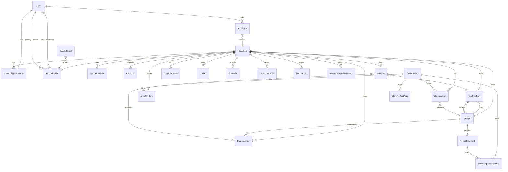
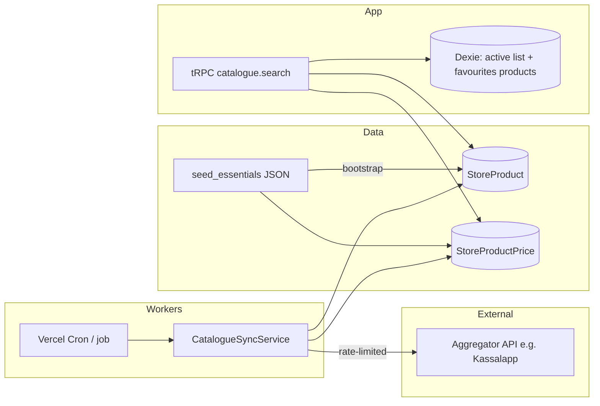
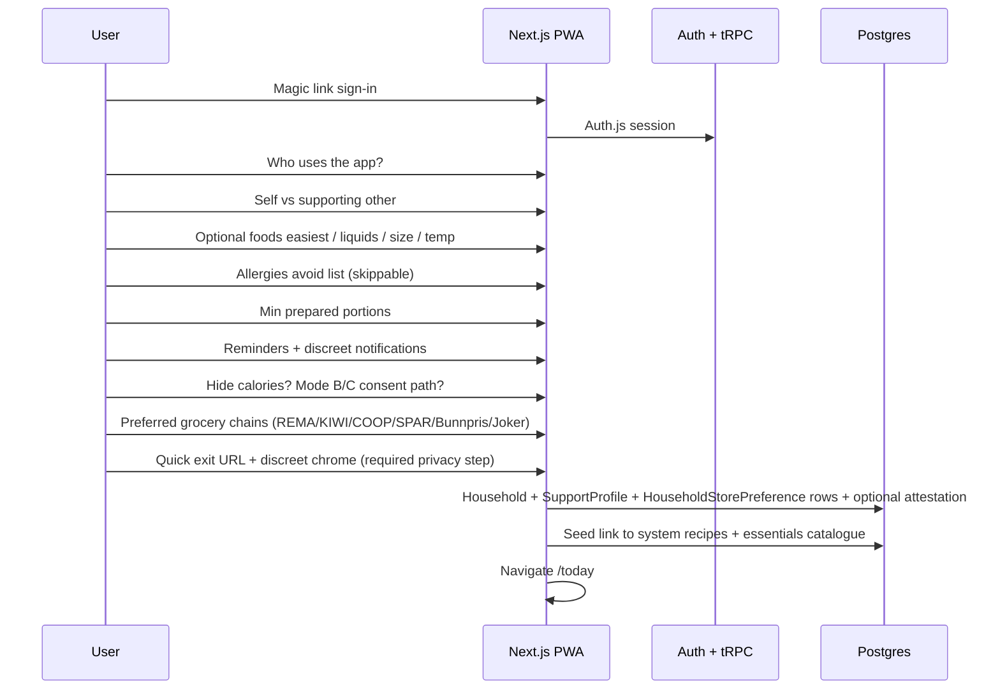
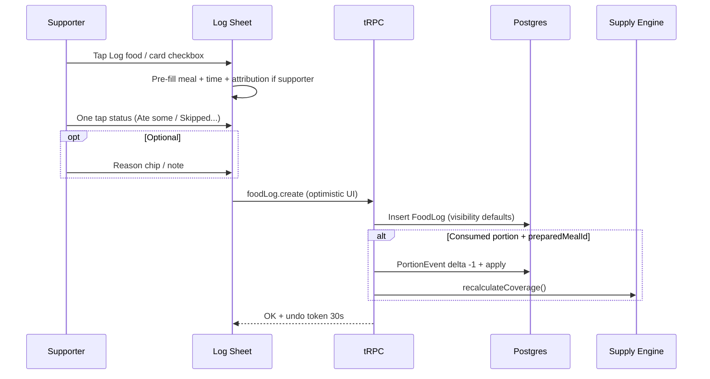
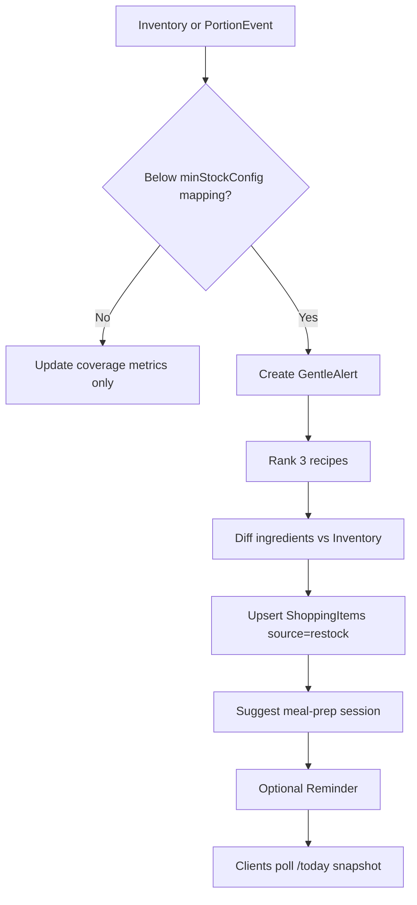
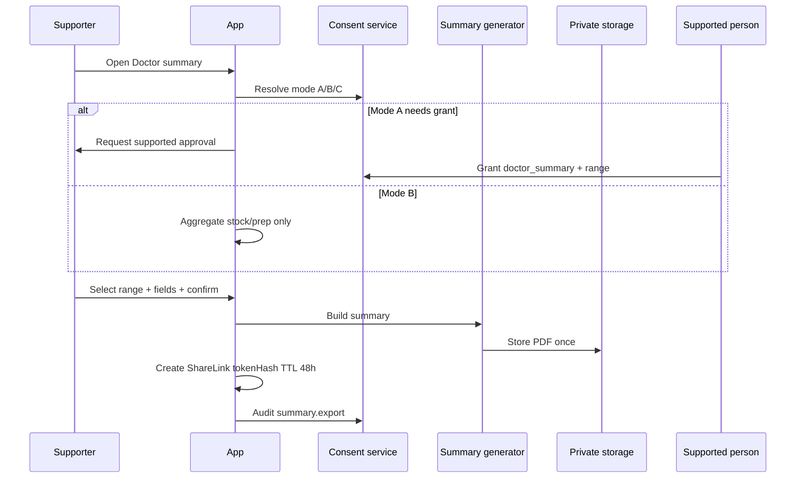
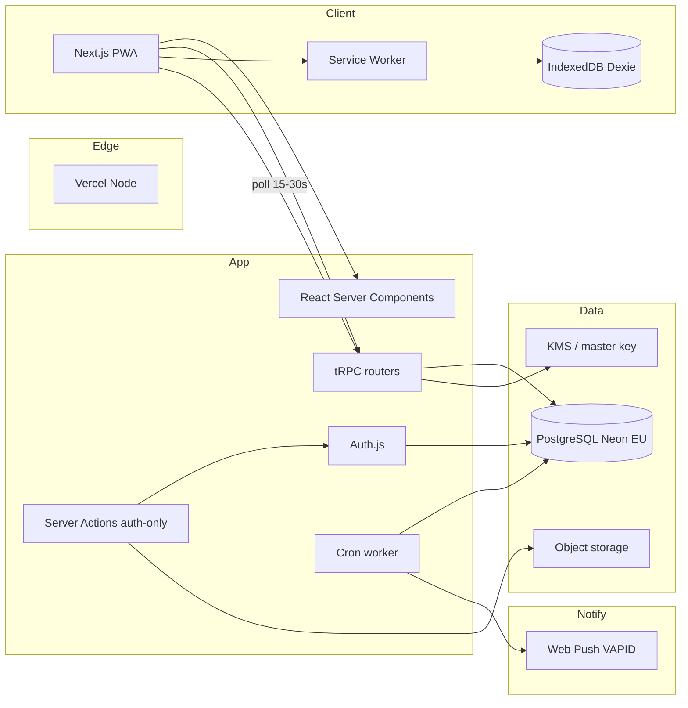
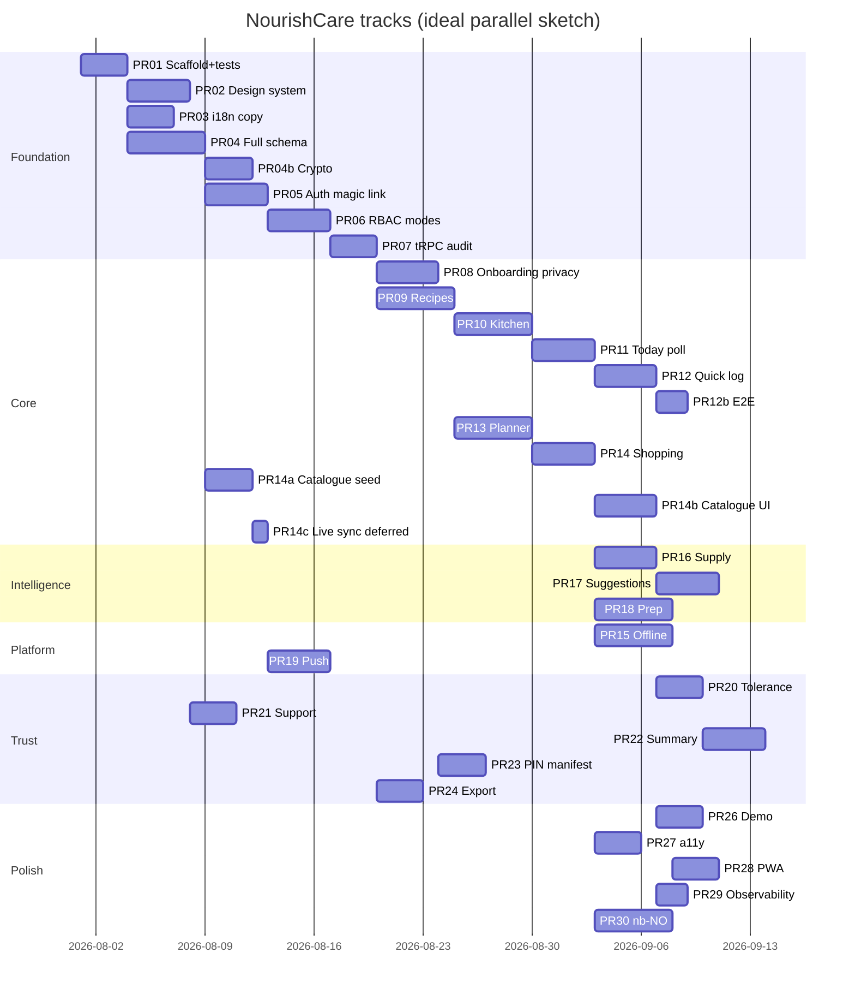
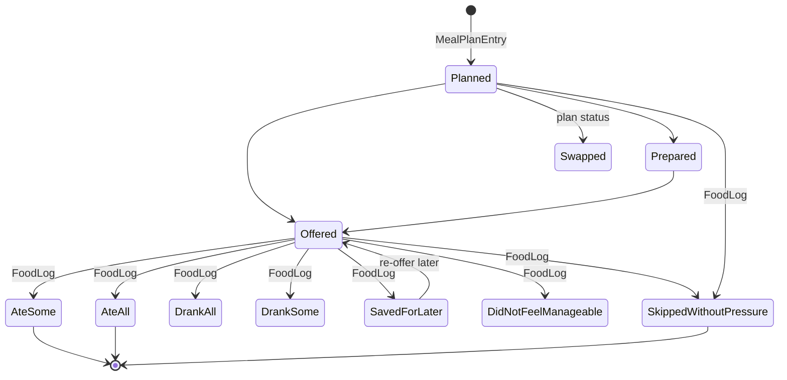

# NourishCare Support App — System Design Document

| Field | Value |
|-------|--------|
| **Title** | NourishCare Support App — Technical Design |
| **Author** | Engineering (TBD) |
| **Date** | 2026-07-26 |
| **Status** | Approved for implementation (user decisions applied) — rev 5 |
| **Approved** | 2026-07-26 |
| **Product** | NourishCare — meal support & household food management PWA |
| **Audience** | Senior engineers implementing the greenfield product |

---

## Overview

NourishCare is a **mobile-first progressive web app** that helps a supportive partner or caregiver organise meals, inventory, shopping, and gentle reminders for someone who is underweight, has very low appetite, and may experience food-related anxiety after trauma. It is a **practical meal-management and household-organisation tool**, not a medical diagnostic or treatment product.

The system combines: a calm daily dashboard, flexible meal planning, a recipe library with high-energy / low-volume starter content, kitchen inventory with portion tracking, supply-protection automation, **shopping lists backed by Norwegian grocery product catalogues** (REMA 1000, KIWI, COOP, SPAR, Bunnpris, Joker), meal-prep workflows, optional shared views for the supported person, consent-gated doctor summaries, and trauma-informed language throughout. Primary interaction target: **log an eating event in under 10 seconds of interaction time** on a phone (sheet open → success toast; offline queue counts as success); keep suitable food reliably available without shame, pressure, or gamification.

**Stack summary (rationale in Key Decisions):** Single Next.js 15 app (App Router) + TypeScript + Tailwind CSS + shadcn/ui; PostgreSQL + Prisma; Auth.js v5 (**magic link only**); **tRPC for all client data** (Server Actions only for auth form progressive enhancement); **poll-first multi-device sync** (15–30s) with optional Upstash-backed SSE later; Dexie + Workbox for offline shopping/recipes/**catalogue favourites**; Web Push; next-intl (EN + nb-NO ready); **Norwegian retail catalogue v1 = curated seed essentials + free-text** (REMA/KIWI/COOP/SPAR/Bunnpris/Joker); live aggregator **deferred post-v1** behind `STORE_CATALOGUE_LIVE`; hosted on **Vercel + Neon EU** for beta.

---

## Background & Motivation

### Problem

Partners and caregivers supporting someone with low appetite often juggle:

- Remembering what is in the fridge/freezer and how many portions remain
- Shopping for “safe” high-energy foods without decision overload
- Preparing batches of easy meals (smoothies, soups, small dinners)
- Offering food respectfully without control or pressure
- Tracking what was manageable for clinical appointments — without the person feeling monitored

Existing tools (generic meal planners, calorie trackers, shared grocery apps) optimise for weight loss, compliance scores, or generic households. They often introduce **shame language**, calorie-first UX, or monitoring dynamics that are harmful in trauma-informed care.

### Current state

Greenfield product — no existing NourishCare codebase. Workspace context shows many React/Vite/Tailwind apps; for production auth, offline PWA, RBAC, and long-lived structured data, a full-stack Next.js + Postgres architecture is preferred over a thin SPA + BaaS-only approach.

### Pain points this design addresses

| Pain | Design response |
|------|-----------------|
| Running out of easy meals | Supply-protection engine + min stock + gentle restock |
| Logging feels heavy or judgmental | Checkbox log states, &lt;10s interaction, no scores |
| Supported person feels watched | RBAC, consent, discreet mode, quick exit |
| Decision fatigue | Difficult-day / low-effort modes, smart suggestions |
| Clinic visits lack structure | Consent-based doctor summary export |
| Offline at the store | Offline-first shopping list + recipe + product metadata cache |
| Norwegian multi-chain shopping | Catalogue typeahead + preferred chains (REMA, KIWI, COOP, SPAR, Bunnpris, Joker) + NOK prices |

---

## Goals & Non-Goals

### Goals

1. Calm, trauma-informed UX with explicit language do/don’t rules.
2. Full information architecture: Today, Meals, Kitchen, Shopping, Support + Settings.
3. Domain model covering all entities in the product spec with indexes and RBAC.
4. Core flows: onboarding, quick log, portion used/undo, low-stock automation, purchase→inventory, meal-prep batch, doctor summary, discreet mode / quick exit.
5. Non-medical smart suggestions + supply-protection algorithms.
6. Production backend: auth, RBAC (supporter vs supported), audit trail.
7. Offline-first shopping + recipes; installable PWA; push notifications.
8. Security/privacy: encryption in transit/at rest, field encryption for sensitive notes, consent, PIN/biometric lock, export/delete.
9. i18n EN default, nb-NO prepared; NOK currency (`129,00 kr`); European dates (`26.07.2026`).
10. Demo seed content that is realistic (mixed eaten / skipped / partial).
11. Incremental PR plan for a small team.
12. Testable pure engines (supply, suggestions, authz) and e2e smoke for consent/log.
13. **Norwegian store product inventory** for REMA 1000, KIWI, COOP, SPAR, Bunnpris, and Joker: catalogue-backed shopping, multi-chain price awareness, essentials seed fallback when live API is unavailable.

### Non-Goals

- **Not** a medical device, diagnostic tool, or treatment plan generator.
- **No** weight goals, BMI calculators, “compliance %”, failure streaks, or body imagery.
- **No** calorie counting as primary UX (optional hidden nutrition only).
- **No** public social feed, competitive leaderboards, or third-party food-ad marketplace.
- **No** automatic sharing of trauma notes or logs without explicit consent.
- **No** real-time location tracking or always-on “monitoring” of the supported person.
- **No** native iOS/Android apps in v1 (PWA only; Capacitor/store wrappers deferred).
- **No** multi-household enterprise tenancy in v1 (one support relationship primary; multi-supporter stretch).
- **No** product or admin analytics for skip rates, adherence %, or “failure” aggregates.
- **No** reverse-engineered unofficial chain mobile-app APIs as the production data path (TOS/fragility).
- **No** gamified “cheapest basket challenge” or shame around spending; price compare is calm and optional.

---

## Personas & Trauma-Informed UX

### Personas

**1. Alex — Supporter (primary user)**  
Partner/caregiver. Uses phone while cooking or shopping. Needs organisation, portion counts, prep reminders, and calm confidence that “there is always something ready.” Wants optional appointment summaries without medicalising the home.

**2. Sam — Supported person (optional account)**  
May have low appetite, food anxiety, sensory sensitivity. Needs control over what is shared, ability to mark “manageable / not manageable,” hide details, disable reminders, and never feel scored. May use a simplified view or not use the app at all (supporter-only mode is valid).

**3. Clinician (export consumer, not app user)**  
Receives a consent-gated PDF/text summary. Needs frequency patterns, tolerated foods, and questions — not raw trauma notes or weight unless separately provided outside the app.

### Trauma-informed principles

1. **Agency first** — supported person can withdraw consent, hide logs, delete own entries anytime; supporter-only mode has restricted export surface (see Consent modes).
2. **No punishment** — skip is a first-class success state (“Skipped without pressure”).
3. **Offer ≠ force** — distinguish Prepared / Offered / Eaten / Saved.
4. **Language safety** — copy system enforces approved phrasing (lint in tests).
5. **Discreet by default option** — notifications and **in-app chrome** can avoid food/health wording (home-screen icon caveats below).
6. **Low cognitive load** — large targets, simple language mode, few required fields.
7. **Household framing** — metrics are stock and readiness, not performance.

### Language do / don’t

| Use | Avoid |
|-----|--------|
| Meal available | Failed |
| Would this feel manageable? | Bad day |
| Something small is enough | You must eat |
| Ready when you are | Missed target |
| Logged | Not enough |
| Skipped without pressure | Compliance |
| Try another option | Weight goal failed |
| Only two easy dinners remain | Critical: you failed to restock |
| Preparing four freezer portions would restore your buffer | You must prep now |

**UI copy module:** `src/lib/copy/` — all user-visible strings via keys (`messages/en.json`); unit tests fail if banned substrings appear in default locale files (see Appendix D).

---

## Information Architecture & Screens

### Navigation

```
┌─────────────────────────────────────────────┐
│  NourishCare          [discreet] [⚙ Profile] │
├─────────────────────────────────────────────┤
│              (screen content)               │
├─────────────────────────────────────────────┤
│  Today │ Meals │ Kitchen │ Shopping │ Support│
└─────────────────────────────────────────────┘
```

- **Bottom nav (5 tabs):** Today · Meals · Kitchen · Shopping · Support  
- **Top-right:** Profile / Settings  
- **Global:** Quick Exit (shipped with privacy onboarding — before any real-user logging), optional PIN gate on resume  
- **Supported person v1:** same route tree + **capability hiding** (not a separate `/s/*` app); hide planner write, inventory write, shopping write as needed

### Screen map

| Screen | Route | Primary role | Notes |
|--------|-------|--------------|-------|
| Welcome | `/` | Guest | Marketing-light, calm CTA |
| Onboarding | `/onboarding/*` | Both | Skippable questions |
| Privacy & consent | `/onboarding/consent` | Both | Explicit sharing toggles + quick exit setup |
| Today dashboard | `/today` | Supporter (+ simplified for supported) | Default home |
| Daily meal plan | `/today?view=plan` | Supporter | Period cards Morning→Evening |
| Weekly planner | `/meals/planner` | Supporter | Drag-drop week grid |
| Recipe library | `/meals/recipes` | Both (read) | 4 categories |
| Recipe detail | `/meals/recipes/[id]` | Both | Variants, make smaller/easier |
| Add/edit recipe | `/meals/recipes/new` | Supporter | Custom recipes |
| Meal-prep mode | `/meals/prep` | Supporter | Batch workflow + timers |
| Kitchen inventory | `/kitchen` | Supporter | Prepared + pantry |
| Portion tracker | `/kitchen/portions` | Supporter | ± and “Portion used” |
| Shopping list | `/shopping` | Supporter | Offline-capable |
| Shopping history | `/shopping/history` | Supporter | Past purchases |
| Reminder centre | `/settings/reminders` | Supporter | Types, quiet, discreet |
| Quick food log | `/log` (sheet/modal) | Configurable | &lt;10s checkbox flow |
| Daily readiness | `/today/readiness` | Supporter | Optional soft check-in; private default |
| Food tolerance profile | `/support/preferences` | Both (supported owns) | Easy / not manageable |
| Support guidance | `/support` | Both | Trauma-informed articles |
| Emergency support | `/support/emergency` | Both | Contacts, DV resources |
| Doctor summary | `/support/summary` | Mode-dependent | Export gate |
| Settings | `/settings` | Both | Privacy, PIN, language, demo, **preferred stores** |
| Store preferences | `/settings/stores` | Supporter | Chains REMA/KIWI/COOP/SPAR/Bunnpris/Joker + labels |
| Audit (internal) | `/settings/activity` | Supporter | Shared-data change log |
| Public summary view | `/share/s/[token]` | Unauthenticated | Rate-limited; token/hash only |

### Mermaid — IA

```mermaid
flowchart TB
  subgraph Nav[Bottom Navigation]
    T[Today]
    M[Meals]
    K[Kitchen]
    S[Shopping]
    U[Support]
  end

  T --> TD[Today Dashboard]
  T --> QL[Quick Log Sheet]
  T --> DR[Daily Readiness]

  M --> WP[Weekly Planner]
  M --> RL[Recipe Library]
  M --> RD[Recipe Detail]
  M --> MP[Meal-Prep Mode]

  K --> KI[Inventory]
  K --> PT[Portion Tracker]
  K --> PS[Prepared Meals]

  S --> SL[Active List]
  S --> SH[History]
  S --> ER[Essential Restock]

  U --> SG[Guidance]
  U --> FP[Tolerance Profile]
  U --> DS[Doctor Summary]
  U --> EM[Emergency]

  Settings[Settings / Profile] --> Auth[Account]
  Settings --> Priv[Privacy PIN Discreet Quick Exit]
  Settings --> Rem[Reminders]
  Settings --> I18n[Language Currency]
```



---

## Design System

### Principles

- Soft neutrals, rounded cards (`rounded-2xl`), generous spacing (`p-4`+), large type (base 16–18px mobile), 48px min touch targets.
- No aggressive red alerts; use soft amber for “attention” and muted green for “ready.”
- No streaks, confetti for eating, harsh progress bars, or calorie donuts by default.

### Color tokens (CSS variables)

| Token | Light | Dark | Role |
|-------|-------|------|------|
| `--bg` | `#F7F4EF` warm off-white | `#1A1C1B` | Page background |
| `--surface` | `#FFFCF8` | `#242826` | Cards |
| `--surface-muted` | `#EFE9E0` | `#2E332F` | Secondary panels |
| `--text` | `#2C3330` | `#E8E6E1` | Primary text |
| `--text-muted` | `#5C6661` | `#A8B0AB` | Secondary |
| `--accent-green` | `#6B8F71` muted green | `#8AAD90` | Ready / available |
| `--accent-beige` | `#D4C4A8` warm beige | `#8A7B62` | Soft fill |
| `--accent-blue` | `#8A9EAF` soft blue | `#A3B5C4` | Info / liquids |
| `--accent-peach` | `#E8C4B0` gentle peach | `#C9A08C` | Gentle highlights |
| `--warning` | `#C4A35A` soft amber | `#D4B56A` | Low stock (never harsh red) |
| `--danger-soft` | `#B07A7A` muted rose | `#C49090` | Only true destructive confirm |
| `--focus` | `#5B7C8D` | `#8AADC0` | Focus ring 3px |

### Typography

- **UI:** `Inter` or `Source Sans 3` (system fallback stack).  
- **Display (optional):** `Fraunces` or `Literata` for headings — warm, not clinical.  
- Scale: `text-sm` 14 / `text-base` 16–18 / `text-lg` 20 / `text-xl` 24 / `text-2xl` 30.  
- Line height ≥ 1.5 for body; letter-spacing neutral.

### Components (shadcn/ui + custom)

- `Card`, `Button` (primary soft-green, secondary outline, ghost), `Checkbox` (large), `Chip`, `Sheet` (bottom for log), `Dialog` (confirmations), `Badge` (status: Ready now, Freezer, Expiring soon), `IconButton` 48px, `EmptyState`, `GentleAlert` (no alarm icons with sirens).  
- Status badges map to tokens above — never colour-only (icon + text). Multiple badges may show simultaneously (see PreparedMeal badges).

### Accessibility

- WCAG 2.2 AA targets: contrast, focus visible, `prefers-reduced-motion`, large text via root `rem`, high-contrast theme toggle.  
- Screen-reader labels on all checkboxes and portion ±.  
- Simple language mode shortens guidance copy.  
- Keyboard: bottom nav focusable; sheets trap focus; Esc closes.  
- No information by colour alone (status always includes text/icon).

### Dark mode

- Class-based (`dark`) via next-themes; system default with manual override in Settings.  
- Dark surfaces stay warm-neutral, not pure black clinical OLED blue.

---

## Domain Model

### Entity-relationship overview



### Multi-tenancy model

- **Household** is the isolation boundary (one kitchen, one shopping list, one inventory).  
- **HouseholdMembership**: `role ∈ {supporter, supported}`, `status ∈ {active, invited, withdrawn}`.  
- **v1 membership policy:** one **primary supporter** (required); optional second supporter deferred to v1.1 (schema allows multiple `supporter` rows, product UI invites only primary until flag `multiSupporter` is on).  
- 0–1 supported accounts per household (`supportedPersonUserId` nullable).

### Consent modes (supporter-only vs linked)

Critical for households where the supported person has **no account**.

| Mode | Condition | Who grants `shared_logging` / `supporter_view_logs` / `doctor_summary` | FoodLog / DailyReadiness as “person data” | Doctor summary content |
|------|-----------|------------------------------------------------------------------------|-------------------------------------------|------------------------|
| **A — Linked** | `supportedPersonUserId` set, membership active | **Only supported person** (or revoke anytime) | Full intake/readiness only with grants | Per field checklist + grant |
| **B — Supporter-only** | `supportedPersonUserId` is null | **No self-grant of person-data scopes.** Supporter may set household operational prefs only | **Must not** store intake logs as if they were the supported person’s clinical record without Mode C | **Aggregate household prep/stock only** (portions prepared, recipes used, shopping patterns, days of coverage). **Exclude** FoodLog statuses framed as Sam’s eating, DailyReadiness, difficulty reasons, private notes |
| **C — Attested proxy logging** | Supporter-only + one-time attestation | Supporter records attestation (`ConsentGrant.grantType = proxy_logging_attestation`, `grantedByUserId = supporter`, legal copy version). **Does not** equal full doctor_summary of person health | Supporter may create FoodLogs with `visibility = household_operational` and clear **“Logged by supporter”** attribution; never `private_supported` impersonation | Still **no** Mode A doctor summary of appetite/nausea until invite + Mode A grant. Optional export of **operational** meal-offer counts with disclaimer banner |

**UI copy (Mode B summary):**  
“This export covers household meal preparation and stock only. It does not include personal eating logs because a supported person account has not linked and consented.”

**UI copy (Mode C attestation):**  
“I am recording offers and meals with the knowledge of the person I support. This is household organisation, not medical monitoring. They can take control by creating an account and changing sharing anytime.”

**Invite path:** Mode B → Invite → supported accepts → Mode A; prior Mode C logs remain attributed to supporter; supported person may delete or re-visibility their own future entries.

Resolves former Open Question #1: **v1 = one primary supporter; equal multi-supporter deferred.**

### Entities (fields, types, indexes)

#### User

| Field | Type | Notes |
|-------|------|-------|
| id | uuid PK | |
| email | citext unique | Auth identity |
| name | text | Display |
| passwordHash | text nullable | **Unused in v1** (magic link only); column reserved |
| locale | text default `en` | `en` \| `nb-NO` |
| theme | enum | `system` \| `light` \| `dark` |
| discreetMode | boolean default false | Runtime chrome |
| pinHash | text nullable | Optional app lock |
| biometricEnabled | boolean | Client-enforced + session |
| calorieDisplayEnabled | boolean default false | Hidden by default |
| notificationSettings | jsonb | Quiet hours, channels |
| privacySettings | jsonb | `quickExitUrl`, icon preference |
| createdAt / updatedAt | timestamptz | |

**Indexes:** `email` unique; `(locale)`.

#### Household

| Field | Type | Notes |
|-------|------|-------|
| id | uuid PK | |
| name | text | e.g. “Home” |
| currency | text default `NOK` | |
| timezone | text | e.g. `Europe/Oslo` |
| minStockConfig | jsonb | See supply protection |
| expectedDailyOpportunities | int default 4 | For daysCoverage |
| freezerCapacityHint | int nullable | Optional portions |
| flags | jsonb default `{}` | Per-household product flags only (e.g. `{ "mealPrepV1": true }`). **Not** used for global live-catalogue kill switch — see flag layering |
| catalogueSyncEnabled | boolean default true | Per-household: may *receive* live prices when global live mode is on |
| dekWrapped | bytea nullable | Household DEK wrapped by KMS CMK |
| dekVersion | int default 1 | Key rotation |
| createdAt | timestamptz | |

**Canonical preferred chains (single source of truth):**  
**`HouseholdStorePreference` rows only.** There is **no** denormalised `Household.preferredChains[]` array (removed to avoid dual-write drift).

```ts
// src/server/household/preferredChains.ts
function orderedPreferredChains(hhId): StoreChain[] {
  return prefs
    .filter(p => p.enabled)
    .sort((a, b) => a.sortOrder - b.sortOrder)
    .map(p => p.chain);
  // If empty → DEFAULT_PREFERRED_CHAINS = [kiwi, rema_1000, coop, spar, bunnpris, joker]
}
function primaryChain(hhId): StoreChain {
  return orderedPreferredChains(hhId)[0];
}
```

**Write path:** `household.setStorePreferences({ rows: [...] })` is the **only** mutation — single transaction upserts/deletes `HouseholdStorePreference` by `(householdId, chain)`. Search, compare, restock, and onboarding all call `orderedPreferredChains`.

**StoreChain enum (v1):**  
`rema_1000` | `kiwi` | `coop` | `spar` | `bunnpris` | `joker`

| Chain | Display | Notes |
|-------|---------|-------|
| `rema_1000` | REMA 1000 | Discount |
| `kiwi` | KIWI | NorgesGruppen |
| `coop` | COOP | Coop Norge — optional `storeFormat` for Extra / Prix / Mega / Obs |
| `spar` | SPAR | NorgesGruppen |
| `bunnpris` | Bunnpris | Independent / discount |
| `joker` | Joker | NorgesGruppen |

#### HouseholdStorePreference

| Field | Type | Notes |
|-------|------|-------|
| id | uuid PK | |
| householdId | uuid FK | |
| chain | StoreChain | **One row per chain per household** (canonical) |
| storeFormat | text nullable | e.g. `extra`, `prix`, `mega`, `obs` for COOP |
| storeExternalId | text nullable | Provider store id when user pins a location |
| label | text nullable | User-facing “KIWI Majorstuen” |
| sortOrder | int | Preference rank (0 = primary) |
| enabled | boolean default true | Disabled chains excluded from search/restock order |

**Indexes:** unique `(householdId, chain)`; `(householdId, sortOrder)`.

**Catalogue live-flag layering (evaluation order):**

```
mayFetchLiveProvider = env.STORE_CATALOGUE_LIVE === true
                       && !circuitBreakerOpen
                       // global kill switch — never per-household flags.storeCatalogueLive

mayServeLivePricesToHousehold =
  mayFetchLiveProvider
  && household.catalogueSyncEnabled === true

// Cron: only runs provider when mayFetchLiveProvider
// Search/compare for household: live/cache prices only if mayServeLivePricesToHousehold;
// else seed + last-known cache only (or seed alone if never synced)
```

| Control | Scope | Name | Default |
|---------|-------|------|---------|
| Global live mode | Deploy/env | `STORE_CATALOGUE_LIVE` (ops docs only — not `Household.flags`) | **`false` for all v1** (seed-only); true only post-contract |
| Circuit breaker | Runtime | in-memory/redis after provider failures | closed |
| Household opt-in | DB | `Household.catalogueSyncEnabled` | `true` |

#### HouseholdMembership

| Field | Type | Notes |
|-------|------|-------|
| id | uuid PK | |
| householdId | uuid FK | |
| userId | uuid FK | |
| role | enum | `supporter` \| `supported` |
| isPrimary | boolean | Primary supporter for admin/delete |
| canLogFood | boolean | Supporter intake-log permission (still needs consent/attestation) |
| status | enum | active / invited / withdrawn |
| joinedAt | timestamptz | |

**Indexes:** unique `(householdId, userId)`; `(userId, status)`.

#### SupportProfile

| Field | Type | Notes |
|-------|------|-------|
| id | uuid PK | |
| householdId | uuid FK unique | |
| supportedPersonUserId | uuid nullable | If they have account |
| primarySupporterUserId | uuid | |
| preferredPortionSize | enum | tiny / small / medium |
| preferredTemperature | enum[] | hot / cold / room |
| preferredForm | enum[] | liquid / solid / either |
| favouriteFoods | text[] | |
| safeFoods | text[] | Familiar comfort |
| avoidedFoods | text[] | |
| allergies | text[] | |
| intolerances | text[] | |
| preferredTextures | text[] | smooth, soft, crunchy… |
| smellsToAvoid | text[] | |
| foodsForDifficultDays | text[] | |
| foodsForBetterDays | text[] | |
| preferredMealPeriods | text[] | morning, lunch… |
| reminderPermissions | jsonb | What may notify whom |
| notesPrivateCiphertext | bytea nullable | Envelope-encrypted; never in audit |
| notesPrivateNonce | bytea nullable | |
| proxyAttestationAt | timestamptz nullable | Mode C timestamp |
| proxyAttestationVersion | text nullable | Legal copy version |
| updatedAt | timestamptz | |

#### ConsentGrant

| Field | Type | Notes |
|-------|------|-------|
| id | uuid PK | |
| supportProfileId | uuid FK | |
| grantType | enum | `shared_logging` \| `supporter_view_logs` \| `doctor_summary` \| `reminders_to_supported` \| `proxy_logging_attestation` |
| grantedByUserId | uuid | Supported person for Mode A; supporter only for `proxy_logging_attestation` |
| granted | boolean | |
| grantedAt / revokedAt | timestamptz | |
| scopeJson | jsonb | e.g. date range for summary |
| policyVersion | text | Consent copy version |

**Indexes:** partial unique `(supportProfileId, grantType)` where `revokedAt is null` and `granted = true`.

**Actor rules:**

- `shared_logging`, `supporter_view_logs`, `doctor_summary`, `reminders_to_supported`: only if `grantedByUserId === supportedPersonUserId` (Mode A).  
- `proxy_logging_attestation`: only primary supporter, only when `supportedPersonUserId` is null; revoked automatically when supported person joins and sets their own grants.

#### Recipe

| Field | Type | Notes |
|-------|------|-------|
| id | uuid PK | |
| householdId | uuid nullable | null = system starter template |
| isSystem | boolean | Seed recipes |
| name | text | |
| slug | text | |
| category | enum | `food_prep` \| `dinner` \| `smoothie_shake` \| `snack_small` |
| description | text | Short |
| imageUrl | text nullable | Placeholder or blob URL |
| prepMinutes | int | |
| cookMinutes | int | |
| difficulty | enum | easy / medium / involved |
| servings | int | Default batch |
| portionSizeLabel | text | e.g. “small bowl” |
| instructions | jsonb | Ordered steps `[{order, text, timerSec?}]` |
| storageInstructions | text | |
| fridgeLifeDays | int nullable | |
| freezerLifeDays | int nullable | |
| reheatingInstructions | text | |
| allergens | text[] | |
| texture | text | |
| temperature | enum | hot / cold / either |
| energyDensity | enum | low / medium / high | Non-calorie framing |
| proteinSource | text nullable | |
| nutrientNotes | text nullable | Optional |
| estimatedCalories | int nullable | Hidden unless enabled |
| estimatedProteinG | int nullable | Hidden unless enabled |
| costEstimateOre | int nullable | NOK in øre |
| substitutions | jsonb | |
| makeRicher | jsonb | |
| makeSmaller | jsonb | |
| makeEasier | jsonb | |
| lowEffort | boolean | For low-effort mode |
| difficultDaySuitable | boolean | |
| mealPeriodHints | text[] | e.g. `morning`, `dinner` for plan generators |
| tags | text[] | e.g. `easy_breakfast`, `smoothie_pack` |
| createdByUserId | uuid nullable | |
| version | int default 1 | Optimistic concurrency for custom edits |
| createdAt / updatedAt | timestamptz | |

**Indexes:** `(householdId, category)`; GIN `(tags)`; `(isSystem, category)`; full-text optional on `name`.

**System recipes:** global `isSystem=true`, `householdId=null`. **Copy-on-write** into household when user edits (new row, `isSystem=false`).

#### RecipeFavourite

| Field | Type | Notes |
|-------|------|-------|
| id | uuid PK | |
| householdId | uuid FK | |
| userId | uuid FK | |
| recipeId | uuid FK | |
| createdAt | timestamptz | |

**Indexes:** unique `(userId, recipeId)`; `(householdId)` for offline recipe subset.

#### RecipeIngredient

| Field | Type | Notes |
|-------|------|-------|
| id | uuid PK | |
| recipeId | uuid FK | |
| name | text | |
| quantity | decimal | |
| unit | text | g, ml, pcs… |
| optional | boolean | |
| category | enum | Maps to shopping categories |
| sortOrder | int | |
| preferredStoreProductId | uuid nullable | Optional direct catalogue link (else RecipeIngredientProduct) |

#### MealPlanEntry

| Field | Type | Notes |
|-------|------|-------|
| id | uuid PK | |
| householdId | uuid FK | |
| date | date | Local household date |
| mealPeriod | enum | `morning` \| `mid_morning` \| `lunch` \| `afternoon` \| `dinner` \| `evening` |
| recipeId | uuid FK nullable | |
| customLabel | text nullable | Free-text meal |
| plannedPortions | decimal default 1 | |
| portionSizeLabel | text | |
| optional | boolean | |
| backupRecipeId | uuid nullable | |
| preparedMealId | uuid nullable | Link if already prepped |
| storageMethod | enum nullable | fridge / freezer / pantry / none |
| expiryDate | date nullable | |
| status | enum | `planned` \| `prepared` \| `offered` \| `completed` \| `skipped` \| `swapped` |
| reminderAt | timestamptz nullable | |
| notes | text | |
| sortOrder | int | |
| isLeftover | boolean | |
| isFreezerPull | boolean | |
| repeatRule | jsonb nullable | RRULE-lite |
| version | int default 1 | |

**Indexes:** `(householdId, date)`; `(householdId, date, mealPeriod)`.

**Swap meal:** no separate entity. **Swap** = set `status = swapped`, activate `backupRecipeId` into a new/updated entry (same period) with `status = planned`, or replace `recipeId` and write FoodLog if already offered. UI “Swap meal” always creates an audit-friendly plan change + optional log.

#### PreparedMeal

| Field | Type | Notes |
|-------|------|-------|
| id | uuid PK | |
| householdId | uuid FK | |
| recipeId | uuid FK nullable | |
| name | text | Denormalised display |
| portionsPrepared | int | |
| portionsRemaining | int | |
| storageLocation | text | “Freezer drawer 2” |
| storageType | enum | fridge / freezer / pantry / counter |
| preparedDate | date | |
| expiryDate | date nullable | |
| preparedByUserId | uuid nullable | |
| reheatingInstructions | text | |
| primaryStatus | enum | Cached primary for indexes — see badge rules |
| containerLabel | text nullable | |
| version | int default 1 | Offline / concurrent updates |
| createdAt / updatedAt | timestamptz | |

**Indexes:** `(householdId, primaryStatus)`; `(householdId, expiryDate)`; `(householdId, portionsRemaining)` where remaining > 0; `(householdId, storageType)`.

#### PortionEvent (increment log for offline-safe counters)

| Field | Type | Notes |
|-------|------|-------|
| id | uuid PK | |
| householdId | uuid FK | |
| preparedMealId | uuid FK | |
| delta | int | Usually -1 or +1 (undo) |
| clientRequestId | uuid | Idempotent |
| source | enum | `portion_used` \| `undo` \| `prep_confirm` \| `sync` |
| actorUserId | uuid | |
| automationBatchId | uuid nullable | Links auto shopping from same evaluation |
| createdAt | timestamptz | |
| rejectedReason | text nullable | e.g. would go below 0 after clamp |

**Indexes:** unique `(householdId, clientRequestId)`; `(preparedMealId, createdAt)`.

#### FoodLog

| Field | Type | Notes |
|-------|------|-------|
| id | uuid PK | |
| householdId | uuid FK | |
| loggedAt | timestamptz | |
| mealPlanEntryId | uuid nullable | |
| preparedMealId | uuid nullable | |
| recipeId | uuid nullable | |
| foodLabel | text | |
| status | enum | See logging states |
| amountCategory | enum nullable | all / some / none |
| difficultyReason | enum nullable | See reasons list |
| notesCiphertext | bytea nullable | Encrypted free text |
| notesNonce | bytea nullable | |
| createdByUserId | uuid | |
| onBehalfLabel | text nullable | Always set when supporter logs intake: “Logged by {name}” |
| visibility | enum | **`private_supported` \| `household_consented` \| `household_operational` \| `hidden`** |
| feedback | enum nullable | easy / manageable / not_manageable / try_later / do_not_suggest |
| undoneAt | timestamptz nullable | Soft undo |
| clientRequestId | uuid nullable | Idempotency |

**Indexes:** `(householdId, loggedAt desc)`; `(createdByUserId, loggedAt)`; `(householdId, status)`; unique `(householdId, clientRequestId)` where not null.

**Logging status enum:**  
`prepared` | `offered` | `ate_all` | `ate_some` | `drank_all` | `drank_some` | `saved_for_later` | `did_not_feel_manageable` | `skipped_without_pressure`

**Difficulty reasons:**  
`no_appetite` | `nausea` | `anxiety` | `texture` | `smell` | `too_large` | `too_hot` | `too_cold` | `too_sweet` | `too_heavy` | `pain` | `fatigue` | `unknown` | `prefer_not_to_say`

##### FoodLog visibility defaults & supporter logging UX

| Creator | Log kind | Default `visibility` | Requirements |
|---------|----------|----------------------|--------------|
| Supported person | Any intake | `private_supported` | Always allowed for self |
| Supporter | **Operational** (portion used, prepared, meal-prep confirm — may not create FoodLog at all; prefer PortionEvent) | N/A or `household_operational` | Always for kitchen ops |
| Supporter | **Intake** (ate/drank/skipped/offered as person eating event) | `household_consented` | Mode A: `shared_logging` or `supporter_view_logs` **or** Mode C: valid `proxy_logging_attestation`. UI title: “Log an offer / meal (as supporter)” with attribution chip; never looks like Sam logged it |
| Either | Hidden by supported person | `hidden` | Supported may hide individual entries from supporter view even if grant exists |

**Today widgets without grant (supporter):** stock metrics, prepared meals, shopping, plan **intent** cards. **Not shown:** DailyReadiness values, private FoodLog list, difficulty reasons, “how much they ate” aggregates.

#### MealPlanEntry vs FoodLog (source of truth)

- **MealPlanEntry** = **intent / presentation** for the day (what we planned to offer).  
- **FoodLog** = **historical record** of what happened (immutable except undo soft-delete).  
- On quick log linked to a plan entry: insert `FoodLog`, then **optionally** update `MealPlanEntry.status` (`offered` / `completed` / `skipped` / `swapped`) for Today UI.  
- Portion consumption prefers `preparedMealId` → `PortionEvent` + decrement; FoodLog may reference same meal.  
- If plan and log diverge (e.g. plan still `planned` but log exists), Today prefers **latest FoodLog** for that period’s “outcome” chip and plan status as secondary.

#### DailyReadiness

| Field | Type | Notes |
|-------|------|-------|
| id | uuid PK | |
| householdId | uuid FK | |
| date | date | |
| appetite | enum | very_low / low / moderate / good |
| nausea | enum | none / mild / moderate / strong |
| energy | enum | very_low / low / moderate / good |
| stress | enum nullable | |
| manageableFoods | text[] | |
| avoidToday | text[] | |
| preferHotCold | enum | |
| preferLiquidSolid | enum | |
| createdByUserId | uuid | |
| visibility | enum | default `private_supported` if created by supported; supporter-created only with Mode C and still **excluded from Mode B exports** |

**Indexes:** unique `(householdId, date)`.

**Supporter Today:** readiness widget only if `visibility` allows and grant/attestation permits; otherwise omit entirely (do not show empty clinical-looking panel).

#### InventoryItem

| Field | Type | Notes |
|-------|------|-------|
| id | uuid PK | |
| householdId | uuid FK | |
| name | text | Display (may be nb-NO product name) |
| nameNormalized | text | `lower(trim(name))` for merge/dedupe |
| category | enum | fruit_veg, dairy, meat_fish, bread, frozen, pantry, drinks, snacks, nutritional_drinks, household |
| quantity | decimal | |
| unit | text | |
| expiryDate | date nullable | |
| location | text nullable | |
| minimumStock | decimal nullable | |
| restockEnabled | boolean default true | |
| essential | boolean | One-tap restock set |
| barcode | text nullable | GTIN/EAN when known |
| sourceProductId | uuid FK nullable | → `StoreProduct` for restock suggestions |
| preferredChain | StoreChain nullable | Last/preferred buy chain |
| lastPurchasedAt | timestamptz | |
| version | int default 1 | LWW offline |
| updatedAt | timestamptz | |

**Indexes:** `(householdId, category)`; unique `(householdId, nameNormalized, unit)`; `(householdId, nameNormalized)`; `(sourceProductId)`.

#### ShoppingItem

| Field | Type | Notes |
|-------|------|-------|
| id | uuid PK | |
| householdId | uuid FK | |
| name | text | Free-text fallback or catalogue display name |
| nameNormalized | text | |
| quantity | decimal | Pack count or units |
| unit | text | |
| category | enum | Same as inventory |
| checked | boolean | Purchased |
| estimatedPriceOre | int nullable | From `StoreProductPrice` or manual |
| storeProductId | uuid FK nullable | → catalogue product |
| preferredChain | StoreChain nullable | Which chain to buy at |
| gtin | text nullable | Denormalised for offline dedupe |
| alternativeProductIds | uuid[] | Optional cross-chain alternatives |
| notes | text | |
| linkedRecipeId | uuid nullable | |
| automaticReason | text nullable | Why auto-added |
| automationBatchId | uuid nullable | For undo of auto lines with portion batch |
| favourite | boolean | |
| source | enum | manual / recipe / restock / essential / catalogue |
| checkedAt | timestamptz nullable | |
| purchasedQuantity | decimal nullable | On check |
| purchasedChain | StoreChain nullable | Where actually bought |
| addedToInventory | boolean | |
| listGroup | text default `active` | |
| clientId | uuid | Offline idempotency |
| version | int default 1 | |
| updatedAt | timestamptz | |
| deletedAt | timestamptz nullable | |

**Indexes:** `(householdId, checked, category)`; unique `(householdId, clientId)`; `(storeProductId)`; partial unique active line on `(householdId, gtin)` where gtin not null and checked=false and deletedAt is null (dedupe).

**Dedup priority:** (1) same `gtin` on active list → merge quantities; (2) else `nameNormalized` + unit as before.

#### StoreProduct (Norwegian grocery catalogue)

Global (not household-scoped) product master, populated by sync + seed.

| Field | Type | Notes |
|-------|------|-------|
| id | uuid PK | **Stable forever** — household FKs never rewritten on merge |
| gtin | text nullable | EAN-13/GTIN when known; unique when present |
| essentialKey | text nullable | e.g. `whole_milk` — seed essentials identity |
| externalId | text | Current primary provider product id |
| provider | text | e.g. `kassalapp`, `seed_essentials` (last authoritative writer) |
| providerIds | jsonb default `{}` | Map of all known ids, e.g. `{ "seed_essentials": "ess_whole_milk", "kassalapp": "12345" }` |
| nameNb | text | **As sold in NO stores** (primary display) |
| nameEn | text nullable | Optional EN helper for EN UI tooltips |
| brand | text nullable | |
| categoryApp | enum | Maps to NourishCare shopping categories |
| categoryProvider | text nullable | Raw provider category |
| sizeValue | decimal nullable | e.g. 1.0 |
| sizeUnit | text nullable | `l`, `ml`, `g`, `kg`, `stk` |
| packLabel | text nullable | e.g. `1 l`, `6-pk` |
| imageUrl | text nullable | Provider CDN; cache carefully |
| allergens | text[] | If available |
| ingredientsText | text nullable | Rarely used in UI |
| energyKcal | int nullable | **Hidden by default** (same rule as recipes) |
| proteinG | decimal nullable | Hidden by default |
| isEssentialSeed | boolean | Part of offline essentials set |
| availableChains | StoreChain[] | Chains known to stock (approx.) |
| active | boolean default true | Soft-disable discontinued |
| lastSyncedAt | timestamptz | |
| createdAt / updatedAt | timestamptz | |

**Indexes:** unique `(provider, externalId)`; unique `(gtin)` where gtin not null; unique `(essentialKey)` where essentialKey not null (**one product family row per essential**); GIN trigram on `nameNb` (requires `pg_trgm`); `(categoryApp)`; GIN `(availableChains)`; `(isEssentialSeed)`.

##### Seed ↔ live identity merge (v1)

1. **Stable `StoreProduct.id`:** seed ships fixed UUIDs; live sync **never** allocates a second row for the same GTIN or same `essentialKey`.  
2. **On live upsert with GTIN:** if a row exists with that `gtin` → **update in place** (name, image, `providerIds.kassalapp = …`, set `provider`/`externalId` to live if live is richer; keep seed id).  
3. **On live upsert without GTIN:** match `essentialKey` if provider payload maps to an essential; else create new non-essential row with live externalId.  
4. **Prices:** multiple `StoreProductPrice` rows per product (chain × store); seed `source=seed` and live `source=kassalapp` may coexist; **resolvePrice** prefers newest `lastSyncedAt` among applicable rows (see price resolve).  
5. **Orphan live row later matched by GTIN to seed:** merge into seed row, reassign prices FKs, soft-delete orphan (`active=false`), **do not** update household `storeProductId` (already pointed at stable seed id if linked via essential).  
6. Placeholder GTINs: seed may use well-known real GTINs for staples when known; else `gtin` null until first live match on `essentialKey`.

#### StoreProductPrice

| Field | Type | Notes |
|-------|------|-------|
| id | uuid PK | |
| storeProductId | uuid FK | |
| chain | StoreChain | |
| storeExternalId | text nullable | Store-level price when provider supports it |
| storeFormat | text nullable | COOP Extra/Prix/… |
| priceOre | int | Current price in øre |
| wasPriceOre | int nullable | Before sale |
| isOnSale | boolean default false | |
| currency | text default `NOK` | |
| validFrom | timestamptz nullable | |
| validTo | timestamptz nullable | |
| lastSyncedAt | timestamptz | |
| source | text | `kassalapp` \| `seed` \| `manual` |

**Indexes:** unique `(storeProductId, chain, coalesce(storeExternalId,''), coalesce(storeFormat,''))` or equivalent; `(chain, lastSyncedAt)`; `(isOnSale)` partial for offers UI.

##### resolvePrice(productId, chain, preference?) 

```ts
// Preference = HouseholdStorePreference row for this chain, if any
function resolvePrice(productId, chain, pref): StoreProductPrice | null {
  const rows = prices.filter(p => p.storeProductId === productId && p.chain === chain);
  // 1) Exact store pin
  if (pref?.storeExternalId) {
    const hit = rows
      .filter(p => p.storeExternalId === pref.storeExternalId)
      .sort(byLastSyncedDesc)[0];
    if (hit) return hit;
  }
  // 2) COOP format match when store not pinned
  if (pref?.storeFormat) {
    const hit = rows
      .filter(p => p.storeFormat === pref.storeFormat && p.storeExternalId == null)
      .sort(byLastSyncedDesc)[0];
    if (hit) return hit;
  }
  // 3) Chain-level (storeExternalId is null)
  const chainLevel = rows
    .filter(p => p.storeExternalId == null)
    .sort(byLastSyncedDesc)[0];
  if (chainLevel) return chainLevel;
  // 4) Any store row for chain (latest)
  return rows.sort(byLastSyncedDesc)[0] ?? null;
}
// UI always shows "Price as of {lastSyncedAt}" from chosen row; null → "Price unavailable — check in store"
```

Search/compare call `resolvePrice` per preferred chain (from `orderedPreferredChains` + preference row).

#### RecipeIngredientProduct (optional catalogue link)

| Field | Type | Notes |
|-------|------|-------|
| id | uuid PK | |
| recipeIngredientId | uuid FK | |
| storeProductId | uuid FK | |
| matchType | enum | `curated` \| `fuzzy` \| `user` |
| confidence | decimal nullable | 0–1 for fuzzy |
| householdId | uuid nullable | null = system curated; set = user override |

**Indexes:** `(recipeIngredientId)`; `(storeProductId)`.

**Essentials + starter recipes:** curated links for milk, yoghurt, bananas, eggs, bread, cheese, peanut butter, oats, frozen berries, pasta, rice, butter, oil, soup, crackers, nutritional drinks.

#### Reminder

| Field | Type | Notes |
|-------|------|-------|
| id | uuid PK | |
| householdId | uuid FK | |
| type | enum | offer_meal, prepare_smoothie, freezer_to_fridge, start_dinner, check_portions, buy_groceries, restock_drinks, prep_tomorrow, check_expiry, calm_meal_together, appointment, review_preferences |
| titleKey | text | i18n key |
| bodyKey | text | Normal body |
| discreetBodyKey | text | Discreet alternate |
| scheduledAt | timestamptz | |
| windowStart / windowEnd | time nullable | |
| repeat | jsonb nullable | |
| recipient | enum | supporter / supported / both |
| discreetMode | boolean | |
| enabled | boolean | |
| snoozedUntil | timestamptz nullable | |
| lastFiredAt | timestamptz | |
| createdByUserId | uuid | |

**Indexes:** `(householdId, enabled, scheduledAt)`; `(scheduledAt)` for worker.

#### SuggestionEvent (optional persistence)

| Field | Type | Notes |
|-------|------|-------|
| id | uuid | |
| householdId | uuid | |
| kind | text | |
| payload | jsonb | Ranked suggestions |
| createdAt | timestamptz | |
| dismissed | boolean | |

#### AuditEvent

| Field | Type | Notes |
|-------|------|-------|
| id | uuid PK | |
| householdId | uuid FK | |
| actorUserId | uuid | |
| action | text | e.g. `food_log.create`, `consent.revoke` |
| entityType | text | |
| entityId | uuid | |
| meta | jsonb | **Allowlisted only** — never free-text notes |
| createdAt | timestamptz | |

**Indexes:** `(householdId, createdAt desc)`; `(entityType, entityId)`.

##### Audit field allowlist

| Action | Allowed `meta` keys | Forbidden |
|--------|---------------------|-----------|
| `food_log.create` / `undo` | status, mealPlanEntryId, preparedMealId, visibility, createdByRole | notes, difficultyReason text, foodLabel freeform optional→use recipeId only |
| `prepared_meal.portion_used` | preparedMealId, delta, portionsRemainingAfter, automationBatchId | — |
| `consent.grant` / `revoke` | grantType, policyVersion | scope free text dumps |
| `summary.export` / `summary.access` | shareLinkId, fieldSet keys, range | PDF content |
| `inventory.upsert` | inventoryItemId, quantityAfter, nameNormalized | — |
| `shopping.auto_add` | shoppingItemId, automationBatchId, automaticReason key | — |
| `membership.*` | role, status | email in plain if avoidable — store userId only |
| `settings.export` / `purge` | scope | payload |
| `catalogue.sync` | provider, productCount, chain, success | API keys, raw payloads |

Retention: 2 years or until household delete. Prefer action + ids + counters.

#### PushSubscription

| Field | Type | Notes |
|-------|------|-------|
| id | uuid | |
| userId | uuid | |
| endpoint | text | |
| keys | jsonb | p256dh, auth |
| discreet | boolean | Mirror user preference |

### Supporting entities

#### IdempotencyKey

| Field | Type | Notes |
|-------|------|-------|
| id | uuid PK | |
| householdId | uuid FK | |
| key | uuid | clientRequestId |
| procedure | text | e.g. `preparedMeals.usePortion` |
| responseJson | jsonb | Cached success body |
| createdAt | timestamptz | TTL cleanup 7 days |

**Indexes:** unique `(householdId, key)`.

#### ShareLink (doctor summary / export)

| Field | Type | Notes |
|-------|------|-------|
| id | uuid PK | |
| householdId | uuid FK | |
| createdByUserId | uuid | |
| tokenHash | text | SHA-256 of secret token (never store raw) |
| purpose | enum | `doctor_summary` |
| fieldSet | jsonb | Included fields |
| rangeStart / rangeEnd | date | |
| mode | enum | `linked_consented` \| `household_aggregate` |
| blobKey | text nullable | Private object storage key for generate-once PDF |
| passwordHash | text nullable | Optional viewer password (Key Decision: optional in settings) |
| singleUse | boolean default false | If true, revoke after first successful view |
| expiresAt | timestamptz | Default now+48h |
| revokedAt | timestamptz nullable | |
| accessCount | int default 0 | |
| lastAccessAt | timestamptz | |
| createdAt | timestamptz | |

**Indexes:** `(tokenHash)` unique; `(householdId, createdAt)`.

**Security:** generate PDF **once** at export confirm → private blob; link resolves to short-lived signed URL after token+optional password check; rate-limit resolve (e.g. 20/hour/IP); audit every access; revoke sets `revokedAt`.

#### Invite

| Field | Type | Notes |
|-------|------|-------|
| id | uuid PK | |
| householdId | uuid FK | |
| email | citext | |
| role | enum | supporter \| supported |
| tokenHash | text | |
| invitedByUserId | uuid | |
| expiresAt | timestamptz | Default 7 days |
| acceptedAt | timestamptz nullable | |
| revokedAt | timestamptz nullable | |
| createdAt | timestamptz | |

**Indexes:** unique `(tokenHash)`; `(householdId, email)`.

One-time use: set `acceptedAt` and invalidate token; role bound at invite time (cannot escalate via client).

#### PreparedMeal status: storage vs badges

- **Store:** `storageType`, `portionsRemaining`, `expiryDate` (source of truth).  
- **Derive badges (set, multi-label UI):**

| Badge | Predicate |
|-------|-----------|
| `out_of_stock` | `portionsRemaining <= 0` |
| `almost_empty` | `0 < portionsRemaining <= 1` (config `almostEmptyAt`, default 1) |
| `expiring_soon` | `expiryDate != null && expiryDate <= today+2` |
| `freezer` | `storageType = freezer` && remaining > 0 |
| `fridge` | `storageType = fridge` && remaining > 0 |
| `ready_now` | remaining > 0 && (storageType in fridge/counter) && not needs prep |
| `needs_preparation` | explicit flag or storageType implies raw prep (rare for PreparedMeal) |

- **primaryStatus** (single column for indexes/filters), **precedence:**  
  `out_of_stock` > `expiring_soon` > `almost_empty` > `freezer` | `fridge` | `ready_now` > `needs_preparation`.

### minStockConfig (Household JSON)

```json
{
  "freezerMeals": 6,
  "smoothieServings": 4,
  "easyBreakfasts": 5,
  "snacks": 7,
  "nutritionalDrinks": 4,
  "readyMeals": 3,
  "daysCoverageTarget": 3
}
```

---

## Norwegian Grocery Catalogue (REMA, KIWI, COOP, SPAR, Bunnpris, Joker)

Shopping is **catalogue-aware** for Norwegian dagligvare. Free-text lines remain always available (offline, custom items, API outage).

### Goals

1. Typeahead product search filtered by household **preferred chains**.  
2. Show **nb-NO product names**, pack size, **NOK** price (`129,00 kr`), chain badge(s), gentle sale tags.  
3. Optional **“Compare across my stores”** for essentials — calm, not gamified (no “you wasted money”).  
4. One-tap essential restock resolves to catalogue products for preferred chain.  
5. Automation restock prefers `StoreProduct` + price; alternatives if preferred missing.  
6. Graceful degradation to **seed essentials** + free-text when live catalogue unavailable.

### Data source strategy (legal-aware)

| Path | Role | Notes |
|------|------|--------|
| **A — Curated offline seed (v1 / dogfood / GA path)** | Essentials + demo + free-text | **Decided:** v1 ships seed-only. ~16+ NourishCare staples with typical NOK ranges and `availableChains` for all six chains. No live API contract required for v1. |
| **B — Licensed aggregator (post-v1)** | Live products + multi-chain prices | Deferred until legal + product choose a provider (e.g. Kassalapp). Server-side API key only; gated by `STORE_CATALOGUE_LIVE`. **PR 14c not in v1 GA scope.** Compliance owner: product + legal when reopened. |
| **C — Unofficial chain app reverse-engineering** | **Never production default** | Known fragility and ToS risk. Spike-only if ever. |

**Do not** scrape chain websites from client devices. All provider calls from **server workers** with rate limits and caching.

### Chain coverage matrix (v1)

| StoreChain | Display | Group | v1 catalogue | Notes |
|------------|---------|-------|--------------|-------|
| `rema_1000` | REMA 1000 | Discount | Yes | High priority for price-sensitive households |
| `kiwi` | KIWI | NorgesGruppen | Yes | Common urban chain |
| `coop` | COOP | Coop Norge | Yes | Support optional `storeFormat`: Extra, Prix, Mega, Obs when provider returns format |
| `spar` | SPAR | NorgesGruppen | Yes | |
| `bunnpris` | Bunnpris | Independent | Yes | May have sparser aggregator coverage → seed + free-text fill gaps |
| `joker` | Joker | NorgesGruppen | Yes | Convenience-oriented assortment |

If aggregator lacks a chain for a product, still show product if seed-linked; price row may be missing → UI “Price unavailable — check in store”.

### Sync architecture



**Job schedule (suggested):**

| Job | Cadence | Behaviour |
|-----|---------|-----------|
| `catalogue.syncEssentials` | Daily | Refresh prices for `isEssentialSeed` / `essentialKey IS NOT NULL` + household favourites GTINs — only if `STORE_CATALOGUE_LIVE` |
| `catalogue.syncSearchCache` | 6–12h | Optional warm cache of top queries (server Redis/memory) |
| `catalogue.pruneStale` | Weekly | Mark `active=false` if missing N days; keep GTINs for history |

**Cache TTLs:** product master 24h soft; prices 6–12h; on sale flags revalidated with price sync. Client search hits Postgres (trigram / ILIKE fallback); never call aggregator per keystroke.

**Rate limits:** max concurrent provider requests (e.g. 2); exponential backoff; circuit breaker opens after N failures → serve seed + last cache only.

**Cron may call provider only when** `STORE_CATALOGUE_LIVE && !circuitOpen`. Per-household `catalogueSyncEnabled` does **not** stop the cron (shared product master) but **does** gate serving live-derived prices on that household’s search responses (seed/cache fallback when false).

### Catalogue search API (tRPC)

```ts
// catalogue.search
input: {
  q: string,                    // min 2 chars
  chains?: StoreChain[],        // default orderedPreferredChains(household)
  categoryApp?: Category,
  limit?: number,               // default 20
}
output: {
  items: Array<{
    product: StoreProductDTO,
    prices: Array<{ chain, priceOre, isOnSale, packLabel, asOf }>, // resolvePrice per chain
    bestPriceOre: number | null,
  }>,
  source: 'live_cache' | 'seed' | 'mixed',
}

// catalogue.compareEssentials
input: { storeProductId?: uuid, essentialKey?: string }
// Resolve product by id or essentialKey; prices via resolvePrice for each orderedPreferredChains
// UI copy: "Across your stores" (not "You overpaid")

// catalogue.resolveEssential
input: { essentialKey: string, chains?: StoreChain[] }
// See resolveEssential below — PR 14a acceptance

// catalogue.getProduct
// household.setStorePreferences  // ONLY write path for chain order + store pins
```

**Authz:** search available to household members with shopping read (supporter write for preferences).

##### resolveEssential(key, preferredChains)

```ts
function resolveEssential(key: EssentialKey, chains: StoreChain[]): {
  product: StoreProduct | null,
  price: StoreProductPrice | null,
  chain: StoreChain | null,
  freeTextFallback: { nameNb: string, nameEn: string } | null,
} {
  const product = db.storeProduct.findFirst({
    where: { essentialKey: key, active: true },
  });
  if (!product) {
    return { product: null, price: null, chain: null,
      freeTextFallback: ESSENTIAL_LABELS[key] }; // from seed constants matching Appendix A
  }
  for (const chain of chains) { // already ordered
    const pref = householdStorePreference(chain);
    const price = resolvePrice(product.id, chain, pref);
    if (price) return { product, price, chain, freeTextFallback: null };
  }
  // Product exists but no price for preferred chains
  return { product, price: null, chain: chains[0] ?? null, freeTextFallback: null };
}
```

**PR 14a acceptance:** unit tests for all 16 essential keys × all six chains (seed prices present for at least primary three); fallback free-text when product missing; `essentialKey` unique on StoreProduct.

### Product UX

| Surface | Behaviour |
|---------|-----------|
| **Shopping typeahead** | Debounced 200ms → `catalogue.search`; rows: nameNb, packLabel, price `Intl nb-NO`, chain chips, sale soft peach badge |
| **Add free text** | Always last option: “Add “{q}” as custom item” |
| **Compare** | Sheet listing preferred chains’ prices for same GTIN/product family; no red “bad choice” |
| **Essential restock** | For each key → `resolveEssential(key, orderedPreferredChains)`; set line from product+price; free-text if null product |
| **Check purchased** | Prefill qty/unit from pack; set `sourceProductId` + `purchasedChain` on InventoryItem; optional GTIN camera scan **v1.1** |
| **Estimated total** | Sum `estimatedPriceOre` for unchecked lines with known prices; show “approx.” |
| **Onboarding / Settings** | `setStorePreferences` multi-select chains (order = sortOrder); optional store labels / COOP format / storeExternalId |
| **Offline** | Dexie caches product DTO for items on active list + favourites + essentials seed blob (~small JSON) |

### Automation integration

| Rule | Catalogue behaviour |
|------|---------------------|
| Ingredient low / essential restock | Prefer `InventoryItem.sourceProductId` + `resolvePrice`; else if essential → `resolveEssential`; set `storeProductId`, `preferredChain = primaryChain()`, `estimatedPriceOre` from resolved price |
| Missing preferred product | Walk remaining `orderedPreferredChains`; calm copy “KIWI price unavailable — REMA option listed” |
| Dedup | GTIN first, then nameNormalized |
| Recipe → shopping | Expand ingredients; if `RecipeIngredientProduct` curated → catalogue line; else free-text name |

### Failure modes

| Failure | UX |
|---------|-----|
| Aggregator down | Banner: “Store prices may be outdated”; search seed + cached products only |
| Chain missing from provider | Chain still selectable; seed flags; free-text |
| Stale price | Show `lastSyncedAt` in detail (“Price as of 26.07.2026”) |
| No GTIN | Name-based only; higher merge ambiguity |

### Compliance & secrets

- `CATALOGUE_API_KEY` / provider secrets: server env only; never exposed to client or PWA.  
- Log provider request ids, not full payloads with PII.  
- Product images: hotlink only if ToS allows; else proxy or skip image.  
- **v1 / beta / GA:** keep **`STORE_CATALOGUE_LIVE=false`** (seed-only) — **user decision**. Do **not** use `Household.flags.storeCatalogueLive`.  
- Licensing / data compliance owner: **Product + Legal** only when reopening live aggregator (post-v1).

### Seed essentials (multi-chain)

Bootstrap products (illustrative nb-NO names; GTINs filled from provider/seed file at implement time):

| Essential key | Example nameNb | categoryApp | Typical chains |
|---------------|----------------|-------------|----------------|
| whole_milk | Helmelk 1 l | dairy | all six |
| fullfat_yoghurt | Yoghurt naturell 4% | dairy | all |
| bananas | Bananer | fruit_veg | all |
| eggs | Egg 12-pk | dairy | all |
| bread | Kneipp / loff | bread | all |
| cheese | Gulost / Norvegia-type | dairy | all |
| peanut_butter | Peanøttsmør | pantry | rema, kiwi, coop, spar, bunnpris, joker |
| oats | Havregryn | pantry | all |
| frozen_berries | Frosne bær | frozen | all |
| pasta | Pasta | pantry | all |
| rice | Ris | pantry | all |
| butter | Smør | dairy | all |
| olive_oil | Olivenolje | pantry | all |
| ready_soup | Ferdigsuppe | pantry | all |
| crackers | Knekkebrød / kjeks | snacks | all |
| nutritional_drinks | Næringsdrikk | nutritional_drinks | coop, kiwi, rema, spar (as available) |

Seed prices: mid-range NOK in øre per chain band (discount vs full-service) updated occasionally by hand if live sync off.

---

## Core Flows

### 1. Onboarding



- All preference questions skippable (except privacy quick-exit default); defaults favour privacy.  
- **Preferred chains:** onboarding writes `HouseholdStorePreference` via `setStorePreferences`. Empty → `orderedPreferredChains` returns `DEFAULT_PREFERRED_CHAINS` = all six (or config `[kiwi, rema_1000, coop]`).  
- If “supporting someone else” without their account: Mode B; optional Mode C attestation before intake logging; doctor summary aggregate-only until invite.

### 2. Quick food log (&lt;10 seconds interaction)

**Timer definition (PR 12 acceptance):**  
`t0` = log sheet fully interactive; `t1` = success toast or offline “Saved on device” toast. Target: **p50 interaction time &lt; 10s** (not including network RTT). Offline outbox success counts. Client emits `time_to_log_ms = t1 - t0`.



**Undo:** snackbar 30s; calls `foodLog.undo` + compensating `PortionEvent` +1 if portion was decremented; after sync, undo still allowed until `undoDeadline = createdAt + 30s` server-side (clock skew ±5s). Max **one** undo per `clientRequestId`. Outstanding offline undos: max 20 in outbox; older drop with gentle “could not undo” if server rejected.

### 3. Portion used / undo

1. **Portion used** → `PortionEvent(delta=-1)` with `clientRequestId`; server applies clamp `remaining = max(0, remaining+delta)`; if clamped and would have gone negative, set `rejectedReason` but still return clamped state; bump `version`.  
2. `automationBatchId = uuid` if supply engine runs in same transaction and auto-adds shopping.  
3. Undo → `PortionEvent(delta=+1)` referencing original; reverse shopping lines with same `automationBatchId` still unchecked and `source=restock` (delete or soft-delete).

### 4. Low-stock automation



### 5. Shopping purchase → inventory (catalogue-aware)

1. User adds item via **catalogue typeahead** or free text; line stores `storeProductId` / `gtin` / `preferredChain` / `estimatedPriceOre` when known.  
2. Check item → prompt quantity (default pack count) + expiry if perishable; optional chain confirmation if multiple prices.  
3. Upsert `InventoryItem` on GTIN if present else `(householdId, nameNormalized, unit)`; set `sourceProductId`, `barcode=gtin`, `preferredChain`; LWW on `version`/`updatedAt`.  
4. Restock automation merge: **GTIN first**, else `nameNormalized`; do not duplicate active lines; append `automaticReason`.  
5. Estimated list total recalculates from remaining unchecked catalogue prices.

### 6. Meal-prep batch workflow

Stages: **Select recipes → Portions → Ingredient check → Shop gaps → Prep mode (steps + timers) → Confirm portions → Locations → Labels → PreparedMeal + PortionEvent prep_confirm**.

Batch optimiser (v1 heuristic): longest cook first → parallel chop → blend packs → portion/label/freeze.

### 7. Doctor summary export (consent)



### 8. Discreet mode & quick exit

| Layer | Behaviour | Platform notes |
|-------|-----------|----------------|
| In-app title/chrome | Switchable immediately to neutral (“Notes”) | Always works |
| Notification body | `discreetBodyKey` | Works if permission granted |
| Quick exit | `location.replace(quickExitUrl)`; clear sensitive history; optional PIN soft-lock | Always works |
| Home screen name/icon | Best-effort alternate manifest | **iOS/Android often freeze manifest at install**; Settings copy: “Home screen name/icon may not change until you remove and re-add the app.” Runtime discreet UX is the **supported** guarantee |

Do not claim install-time anonymity as reliable.

---

## Smart Suggestions & Supply Protection

### Design constraints

- **Non-medical:** no diagnoses, no calorie prescriptions, no health risk scores.  
- Explainable rules + fixed v1 weights.  
- Limit 3 primary suggestions.

### Coverage metrics — mapping table (implementable)

| Config / metric key | Entity | Predicate |
|---------------------|--------|-----------|
| `freezerMeals` | PreparedMeal | `storageType = freezer` AND `portionsRemaining > 0` → **sum** `portionsRemaining` |
| `readyMeals` | PreparedMeal | `storageType IN (fridge, counter)` AND `portionsRemaining > 0` → sum remaining |
| `smoothieServings` | PreparedMeal + InventoryItem | **v1:** sum `PreparedMeal.portionsRemaining` where linked `recipe.category = smoothie_shake` OR recipe tags contain `smoothie_pack`; **plus** sum `InventoryItem.quantity` where `category = nutritional_drinks` and quantity > 0. (No InventoryItem.tags field. Optional v1.1: estimate servings from dairy/fruit staples via essentialKey — out of scope for v1 metrics.) |
| `easyBreakfasts` | PreparedMeal + InventoryItem | Prepared: `recipe.lowEffort` OR tags `&& easy_breakfast` OR (`recipe.mealPeriodHints` contains `morning` AND `difficultDaySuitable`); Inventory: `essential` breakfast staples (eggs, bread, oats, yoghurt) with `quantity >= minimumStock` or qty > 0 count as 1 “option” each |
| `snacks` | PreparedMeal + Inventory | `recipe.category = snack_small` remaining sum; inventory `category = snacks` lines with qty > 0 count |
| `nutritionalDrinks` | InventoryItem | `category = nutritional_drinks` AND `quantity > 0` → sum quantity (unit servings) |
| `readyPortions` (dashboard) | PreparedMeal | fridge/counter remaining sum |
| `freezerPortions` | PreparedMeal | freezer remaining sum |
| `easyMeals` | PreparedMeal | `recipe.lowEffort OR difficultDaySuitable` remaining sum |
| `daysCoverage` | computed | `(readyPortions + freezerPortions) / expectedDailyOpportunities` (household field, default **4**) |
| `expiringSoon` | PreparedMeal + InventoryItem | `expiryDate <= today+2` and still usable |
| `shoppingRemaining` | ShoppingItem | `checked = false` AND `deletedAt is null` |
| `mealsTomorrow` | MealPlanEntry | `date = tomorrow` count (optional meals count 0.5 if desired — v1 count all) |
| `prepTasksRemaining` | derived | open prep reminders + low-stock alert count |

**Low stock trigger:** for each minStockConfig key, if mapped **available** &lt; configured minimum → fire rule for that key.

### Ranking score — v1 defaults

Hard filters (exclude entirely):

1. Allergen hit vs `SupportProfile.allergies`  
2. `feedback = do_not_suggest` on recipe (aggregate: any log with this recipeId + feedback in last 90d, or explicit profile avoid list match on recipe name)  
3. Recipe in `avoidedFoods` name match  

```ts
// v1 weights (sum = 1.0 for positive terms before penalties)
const W = {
  tolerance: 0.30,
  ingredientAvailability: 0.20,
  lowEffortDifficultDay: 0.15,
  expiryUrgency: 0.15,
  notRecent: 0.10,
  tempFormMatch: 0.10,
  // penalties subtract
  recentRepeat: 0.15, // if served < 48h ago
};

function tolerance(R, profile, logs): number {
  // 0..1
  let s = 0.5;
  if (nameIn(profile.favouriteFoods, R)) s += 0.2;
  if (nameIn(profile.safeFoods, R)) s += 0.15;
  if (nameIn(profile.foodsForDifficultDays, R) && difficultDay) s += 0.2;
  if (nameIn(profile.foodsForBetterDays, R) && !difficultDay) s += 0.1;
  // feedback aggregates last 30d
  const fb = feedbackScores(logs, R.id); // easy +0.2, manageable +0.1, not_manageable -0.25, try_later 0
  s += fb;
  if (R.difficultDaySuitable && difficultDay) s += 0.1;
  return clamp01(s);
}
```

`difficultDay` true when today’s DailyReadiness (if visible) has `appetite ∈ {very_low, low}` OR `nausea ∈ {moderate, strong}` OR user enabled Difficult-day mode toggle; else false.

### Low-effort & difficult-day plan generators (PR 13)

```
function generateDayPlan(date, mode, household):
  periods = [morning, mid_morning, lunch, afternoon, dinner, evening]
  candidates = recipes where:
    mode == low_effort -> lowEffort == true OR difficulty == easy
    mode == difficult_day -> difficultDaySuitable == true
      OR category in (smoothie_shake, snack_small)
      OR tags overlap foodsForDifficultDays
  prefer PreparedMeal remaining > 0 matching candidates (zero prep)
  for each period:
    pick highest rank for period using mealPeriodHints + tolerance
    assign backup = second pick or smoothie_shake default
  fill at least 3 periods; mark others optional
```

### Automation rules (v1)

| Rule | Trigger | Actions |
|------|---------|---------|
| Low meal stock | mapped metric &lt; min | GentleAlert, 3 recipes, shopping upsert, prep suggestion, reminder |
| Ingredient low | InventoryItem qty &lt; minimumStock & restockEnabled | Shopping upsert with `storeProductId` if `sourceProductId` set; price from preferred chain; dedupe **GTIN then** nameNormalized; automaticReason |
| Expiring food | expiry within 2 days | Suggest recipes; boost rank |
| Portion consumed | PortionEvent -1 | Recalc coverage; maybe low stock |
| Tomorrow not covered | mealsTomorrow &lt; 3 suitable | Suggest available meals, freezer→fridge, simple shop list (catalogue-linked ingredients when mapped) |
| Essential restock | One-tap | Add essential checklist via seed/catalogue map per preferred chain; skip if already on list (GTIN/key) |
| Preferred product unavailable | No price row for preferred chain | Walk `orderedPreferredChains`; calm copy |

---

## Backend Architecture



### Technology choices

| Layer | Choice | Why |
|-------|--------|-----|
| Layout | **Single Next.js app** (`src/…`) | Small team; no fake monorepo |
| Framework | Next.js 15 App Router + TS | SSR/RSC, API routes, PWA-friendly |
| UI | Tailwind + shadcn/ui | Fast calm design system |
| API | **tRPC for all product queries/mutations** | One authz/audit path |
| Server Actions | **Auth.js forms + rare progressive enhancement only** | Avoid dual mutation stacks |
| DB | PostgreSQL + Prisma | Relational domain |
| Auth | Auth.js v5 **magic link only in v1** | Lower credential stuffing risk |
| Multi-device sync | **Poll-first** `household.snapshot` every 15–30s while focused; exponential backoff background | Reliable on Vercel serverless; no sticky SSE |
| Optional later | SSE + Upstash Redis pub/sub on long-lived Node if needed | Not v1 default |
| Offline | Workbox + Dexie | Shopping + recipes |
| Push | web-push + VAPID | Standard PWA push |
| i18n | next-intl | EN + nb-NO |
| PDF | @react-pdf/renderer | Generate-once to blob |
| Hosting | Vercel + **Neon EU** preferred | Residency |
| Images | Placeholder illustrations v1; Vercel Blob household path v1.1 | Reduce scope |
| Queue | Vercel Cron + shared secret; Inngest optional later | Reminders + expiry + **catalogue price sync** |
| Grocery catalogue | Licensed aggregator (e.g. Kassalapp) + seed essentials | Multi-chain NO products/prices; ToS-safe |

### API boundary (Key Decision)

| Use | Mechanism |
|-----|-----------|
| All product reads/writes from client | **tRPC** (`protectedProcedure` + authz + audit) |
| Login/magic-link/sign-out forms | **Server Actions** or Auth.js routes only |
| Cron | Route handlers with `CRON_SECRET` |
| Share link resolve | Public route handler + rate limit |

**Do not** implement `foodLog.create` as a Server Action.

### API surface (tRPC routers)

```ts
export const appRouter = router({
  household: householdRouter,       // snapshot for poll
  recipes: recipesRouter,
  mealPlan: mealPlanRouter,
  preparedMeals: preparedMealsRouter, // usePortion, syncIncrements
  inventory: inventoryRouter,
  shopping: shoppingRouter,         // sync + catalogue-linked lines
  catalogue: catalogueRouter,       // search, compare, product get, admin sync trigger
  foodLog: foodLogRouter,
  readiness: readinessRouter,
  reminders: remindersRouter,
  suggestions: suggestionsRouter,
  consent: consentRouter,
  summary: doctorSummaryRouter,
  supportContent: supportRouter,
  settings: settingsRouter,
  audit: auditRouter,
  invites: invitesRouter,
});
```

### Offline sync protocols

#### `shopping.sync`

```ts
input: {
  since: string | null, // ISO updatedAt cursor
  mutations: Array<{
    clientId: string,
    op: 'upsert' | 'check' | 'delete',
    payload: ShoppingItemPatch,
    clientUpdatedAt: string,
  }>
}
// Server: apply in order; idempotent by clientId;
// LWW: if server.version > client and different field set, return conflict with server row;
// nameNormalized merge on restock: collapse duplicates into one active line
output: { serverRows: ShoppingItem[], conflicts: Conflict[], serverTime: string }
```

#### `preparedMeals.syncIncrements`

```ts
input: {
  events: Array<{
    clientRequestId: string,
    preparedMealId: string,
    delta: number, // -1 | +1
    source: 'portion_used' | 'undo',
    clientCreatedAt: string,
  }>
}
// Server algorithm:
// for each event:
//   if IdempotencyKey/PortionEvent exists for clientRequestId -> return prior result
//   lock PreparedMeal row
//   next = max(0, remaining + delta)
//   if delta < 0 && remaining + delta < 0: apply clamp, note clamped
//   write PortionEvent, update remaining, version++, derive primaryStatus
//   evaluateSupplyProtection (automationBatchId)
// return results[] including portionsRemaining + clamped flag
```

**Client UX when clamped:** toast “Portions were already at zero on another device” — non-shaming, operational.

**Inventory absolute fields:** LWW by `updatedAt`/`version`; restock automation uses `nameNormalized` unique active shopping line.

### Auth & sessions

- HTTP-only secure cookies; CSRF on mutations.  
- Session: `userId`, active `householdId`, `role`, `isPrimary`.  
- **v1 auth: magic link only** (email). Passwords/2FA deferred.  
- PIN client gate; server still enforces authz.  
- Invites: token TTL 7d, one-time, role-bound.

### RBAC matrix

| Capability | Supporter | Supported |
|------------|-----------|-----------|
| Plan meals / prep / inventory write | Yes | No (read available meals) |
| Shopping write | Yes | Optional read |
| Log intake food | Mode A grant or Mode C attestation + `canLogFood` | Always own logs |
| View household intake logs | Mode A `supporter_view_logs` / shared_logging | Own + shared |
| Tolerance profile write | Suggest only | Owner |
| Disable own reminders | N/A | Yes |
| Doctor summary export | Mode A grant or Mode B aggregate-only | Grant/revoke in Mode A |
| Delete own entries | Own | Own |
| Delete all household data | Primary supporter + confirm | Own account data |
| Withdraw consent | N/A | Anytime (Mode A) |
| Audit log view | Yes (allowlisted meta) | Limited own |

### Realtime / multi-device (v1)

- **Primary:** `household.snapshot` poll every **20s** while tab focused (Today, Kitchen, Shopping); 60s when backgrounded (Page Visibility).  
- On mutation success, invalidate local query cache immediately (optimistic).  
- **Not v1:** long-lived SSE on Vercel serverless without a bus.  
- **v1.1 optional:** Upstash Redis pub/sub + SSE on a compatible host if poll UX insufficient.

---

## Crypto & residency

### Residency

- **Key Decision:** prefer **EU region** for Neon + Vercel project (Norway/EEA users).  
- If EU not available at provision time: **block closed beta with real users** until EU or explicit legal exception; engineering spike may use any region with synthetic data only.

### Field encryption

| Field | Protection |
|-------|------------|
| All traffic | TLS 1.2+ |
| DB disk | Provider at-rest encryption |
| `SupportProfile.notesPrivate*` | Application envelope encryption |
| `FoodLog.notes*` | Application envelope encryption |
| Other structured fields | TLS + DB at-rest + access control only |

**Key hierarchy:**

1. **CMK** in cloud KMS (or sealed `MASTER_KEY` in secrets manager for v1 if KMS cost deferred — document risk).  
2. **Household DEK** (32-byte random) generated at household create; stored as `dekWrapped` = Wrap(CMK, DEK); `dekVersion`.  
3. Encrypt notes: `nonce || secretbox(DEK, plaintext)`.  

**Paths:** encrypt/decrypt only in server services (`src/server/crypto/*`); never send DEK to client.  
**Export/delete:** decrypt on server for export zip; purge deletes ciphertext and DEK wrap.  
**Rotation:** rewrap DEK with new CMK version; optional re-encrypt notes job.  
**Prisma:** application layer (not transparent Prisma middleware for v1) so allowlists stay explicit.

**PR:** crypto helpers before SupportProfile private notes, food log notes, and export (**PR 04b**, before PR 08 notes fields used).

---

## Offline-First, PWA & Push

### PWA

- `manifest.webmanifest`: name NourishCare; optional discreet assets.  
- **Install-time name/icon swap is best-effort** (see Discreet mode).  
- `display: standalone`; theme_color soft beige/green.

### Offline scope (v1)

| Data | Offline read | Offline write | Sync |
|------|--------------|---------------|------|
| Shopping list | Yes | Yes | `online` + resume + manual + opportunistic Background Sync |
| Store product metadata (active list + favourites + essentials seed) | Yes | N/A (read-only cache) | Refresh on sync / search when online |
| Recipes + favourites | Yes | Queue custom edits | On reconnect |
| Today plan snapshot | Yes (last fetch) | Log/portion queue | On reconnect |
| Inventory snapshot | Last snapshot | Portion events queue | `syncIncrements` |
| Support articles | Cached | N/A | — |

**Dexie additions:** `storeProducts` (subset), `storeProductPrices` (preferred chains only), `essentialsSeed` blob version.

### Sync triggers (primary path)

1. `window` `online` event  
2. App resume / `visibilitychange` → visible  
3. Manual pull-to-refresh  
4. **Background Sync API** — opportunistic only (poor Safari support); never sole path  

### Browser support matrix

| Feature | Chromium Android | Safari iOS | Notes |
|---------|------------------|------------|-------|
| PWA install | Good | Add to Home Screen | |
| Web Push | Good | **Requires Home Screen install, iOS 16.4+** | Onboarding/settings explain |
| Background Sync | Good | Weak / absent | Fallback online event |
| IndexedDB | Good | Good | |
| Poll snapshot | Good | Good | v1 realtime backbone |

### Service worker

- Precache app shell + copy catalogs.  
- Runtime cache: images SWR.  
- Offline fallback page with cached shopping.

### Push notifications

- Contextual permission; quiet hours; discreet bodies.  
- iOS: copy “Install to Home Screen to receive gentle reminders.”

---

## Security & Privacy

### Threat model (abridged)

| Threat | Severity | Mitigation |
|--------|----------|------------|
| Abusive partner coercion / surveillance | High | Mode A agency; Mode B export limits; no self-grant person data; quick exit; discreet runtime UX; DV resources |
| Account takeover | High | Magic link, rate limits, no password stuffing surface in v1 |
| Data breach of health-adjacent logs | High | TLS, at-rest, field encryption notes, audit allowlist, EU hosting |
| Over-sharing to clinician | Medium | Mode gates, preview, generate-once blob, revoke |
| XSS session theft | Medium | CSP, HttpOnly cookies |
| IDOR | Medium | Session household scoping |
| Push lock-screen leak | Medium | Discreet bodies |
| Regulatory / special category data | High | Legal review + DPIA before closed beta; see Risks |

### Abuse controls

| Surface | Control |
|---------|---------|
| Magic link request | Rate limit 5/hour/email, 20/hour/IP |
| Login callback | Standard Auth.js + brute force delay |
| Invite create | 10/day/household; token TTL 7d one-time |
| Summary link resolve | 20/hour/IP; lock after password fails |
| Data export | 3/day/user |
| Cron routes | `Authorization: Bearer CRON_SECRET` |
| tRPC | Per-user 120 req/min default |
| Catalogue search | 60/min/user; no client→provider calls |
| Aggregator API | Server global rate + circuit breaker |

### Controls

- AuthZ: RBAC + consent modes.  
- PIN / biometric client gate.  
- Export JSON + PDF.  
- Delete: soft then hard 30 days; immediate hard option.  
- Consent versioning.  
- Medical disclaimer in Support.

---

## Testing Strategy

| Layer | What | Gate |
|-------|------|------|
| Unit | Supply mapping metrics, suggestion rank + hard filters, plan generators, status badge precedence, copy banned phrases, visibility defaults, audit meta allowlist, **essential→chain product resolve**, **GTIN dedupe**, catalogue circuit-breaker fallback | CI required |
| Unit | Authz matrix (role × procedure × mode A/B/C) | PR 06 merge gate |
| Integration | Prisma + tRPC procedures (portion clamp, shopping sync conflicts, consent deny) | CI |
| E2E Playwright | Magic link test harness; quick log &lt;10s interaction path; consent deny blocks summary person fields; offline shopping outbox flush | Smoke on main |
| Manual | Trauma-informed copy review; DV resource accuracy (content freeze before GA) | Checkpoint before PR 17/21 GA |
| Crypto | Encrypt/decrypt roundtrip; export includes decrypt; purge removes DEK | PR crypto |

CI: Vitest + Playwright project in PR 01 tooling; authz tests PR 06; e2e smoke PR 12b after log ships.

---

## Internationalisation & Locale

- **Default UI:** English (`en`).  
- **Prepare:** `nb-NO` message files for chrome/categories/buttons.  
- **Store product names:** primarily **Norwegian as sold** (`StoreProduct.nameNb`); EN UI still shows `nameNb` on list rows (shoppers recognise shelf names); optional `nameEn` subtitle when present.  
- **Category labels:** always via app locale (`fruit_veg` → “Fruit and vegetables” / “Frukt og grønt”).  
- **Chain names:** proper nouns (REMA 1000, KIWI, COOP, SPAR, Bunnpris, Joker) — not translated.  
- **Currency:** `Intl.NumberFormat('nb-NO', { style: 'currency', currency: 'NOK' })` → `129,00 kr`; store **øre**.  
- **Dates:** `26.07.2026` product default numeric European form.  
- next-intl plurals/lists.

---

## Media / images

**v1:** curated placeholder illustrations (static `/public/recipes/*.svg`) — no user upload.  
**v1.1 PR:** signed upload to Vercel Blob, path `householdId/recipes/…`, max 2MB, image MIME allowlist, authz supporter-only. Virus scan optional via provider.

---

## Demo Content Plan

Seed script `prisma/seed.ts` + `demo/seed-household.ts`:

| Content | Quantity | Notes |
|---------|----------|-------|
| Smoothie/shake recipes | 8 | Spec + variants |
| Dinner recipes | 8–15 | Batch/freezer flags |
| Snacks / small meals | 10–15 | |
| Food prep | 4+ | Smoothie packs |
| Freezer prepared | 6 | Mixed remaining |
| Fridge ready | 3–4 | |
| 7-day meal plan | Full | Backups |
| Shopping list | ~15 | Catalogue-linked nb-NO names + free-text mix; REMA/KIWI/COOP prices in øre |
| Store products (demo) | 20–40 | Seed essentials + a few chain-specific lines |
| Reminders | 4–5 | |
| Food logs | ~20 | Mixed outcomes |
| Doctor summary sample | 1 | Mode-appropriate |
| Daily readiness | 3 days | Low/moderate mix |

Names: “Demo Home”; “Alex” / “Sam”. Imperfect adherence.  
**Demo household:** `HouseholdStorePreference` rows for kiwi (0), rema_1000 (1), coop (2). Shopping history shows sale on one line without gamification.

---

## Observability

### Logging

- Structured JSON (pino): `requestId`, `userId`, `householdId`, route, latency.  
- **Never** log notes plaintext, readiness details, or full PII.

### Metrics (allowlist)

**Allowed:** `food_log_created`, `time_to_log_ms`, `shopping_sync_conflicts`, `push_delivery_fail`, `portion_used`, `summary_exported`, `summary_link_access`, `auth_magic_link_sent`, API RED.

**Forbidden (product + admin):** `skip_rate`, `compliance_pct`, `adherence_*`, `failure_count`, `streak_*`, “bad day” aggregates, ranking users by intake.

### Alerting

- 5xx, cron failure, DB, push auth, crypto/KMS errors.  
- **No** alerts on skipped meals.

---

## Rollout Plan

1. **Internal dogfood** — synthetic data until crypto + consent modes land; **seed catalogue + free-text shopping** (no live API).  
2. **Closed beta** — **blocked on:** legal/DPIA checklist, **EU residency**, Mode B/C UX review, quick exit shipped. Catalogue: **seed-only** (`STORE_CATALOGUE_LIVE=false`). Household product flags: `mealPrepV1`, `doctorSummary`, `supportedPersonApp`, `offlineShopping`.  
3. **v1 GA** — content freeze on DV/emergency lists; product flags default on; **catalogue remains seed-only**. Live aggregator is **out of v1 GA scope**.  
4. **Post-v1 / v1.1** — optional PR 14c after provider contract; enable `STORE_CATALOGUE_LIVE` only when licensed.

**Rollback:** feature flags; expand/contract migrations.

---

## Alternatives Considered

### 1. Supabase vs Next.js + Prisma + Neon

| | Supabase | Chosen |
|--|----------|--------|
| Speed | Faster RLS + Realtime | More setup |
| Consent matrix | Heavy RLS | Explicit service layer |
| Offline protocol | Custom anyway | Full control |
| Portability | Higher lock-in | Portable SQL |

### 2. React Native / Expo / Capacitor vs PWA

| | Native/Capacitor | PWA |
|--|------------------|-----|
| Stores | Yes | No |
| Cost | Higher | One web codebase |
| Push iOS | Stronger | Install prerequisite |

**Decision:** PWA v1; Capacitor shell deferred.

### 3. Realtime: poll-only vs SSE+bus vs managed

| | Poll-first (chosen v1) | SSE + Redis bus | Ably/Pusher/Supabase Realtime |
|--|------------------------|-----------------|-------------------------------|
| Vercel fit | Excellent | Needs bus + careful host | Good, cost/vendor |
| Latency | 15–30s | Sub-second | Sub-second |
| Complexity | Low | Medium | Medium |

**Decision:** poll-first; do not ship unqualified SSE on serverless.

### 4. Clerk vs Auth.js

Auth.js + magic link; no MAU fee; enough for v1.

### 5. Jobs: Vercel Cron only vs Inngest

Vercel Cron + secret for v1 reminders/expiry; Inngest if retries/visibility become painful.

---

## Risks

| Risk | Severity | Mitigation |
|------|----------|------------|
| Product used to control/monitor supported person | Critical | Mode B limits; no person-data self-grant; attribution; guidance; no covert features |
| Users treat app as medical advice | High | Disclaimer; non-diagnostic suggestions |
| **Health-data classification (GDPR Art. 9 special category)** | **High** | **Legal review + DPIA before closed beta with real users; EU hosting preference; explicit consent copy; DPA with processors; engineering spike OK on synthetic data** |
| iOS PWA push limits | Medium | In-app reminder centre; install UX |
| Offline sync conflicts | Medium | PortionEvent increments; clamp UX; tests |
| Scope creep | Medium | Non-goals; PR checklist |
| Emotional harm from copy | High | Banned-phrase CI; sensitivity review checkpoint |
| Solo-team / schedule overload | Medium | PR plan is **ideal parallel calendar, not commitment**; cut v1.1 (images, SSE, multi-supporter, WebAuthn) |
| Manifest discreet oversell | Medium | Runtime-first discreet; install caveats in UI |
| Crypto key loss | High | KMS backups; runbook; cannot recover notes without DEK — stated in privacy policy |
| Catalogue provider downtime / ToS change | Medium | Seed essentials + free-text always work; circuit breaker; `STORE_CATALOGUE_LIVE` env kill switch |
| Product data licensing non-compliance | High | Legal review before live API beta; seed-only mode until agreement |
| Stale / wrong shelf prices | Low–Medium | Show “as of” date; never shame user for price; approx. totals only |

---

## Open Questions (resolved defaults)

| # | Topic | v1 default | Status |
|---|--------|------------|--------|
| 1 | Multi-supporter | **One primary supporter**; schema allows more behind flag | **Decided** (user) |
| 2 | WebAuthn | **v1.1** | Deferred |
| 3 | Hosting region | **EU hosting for beta** (Vercel + Neon EU); beta blocked without | **Decided** (user) |
| 4 | System recipes | **Copy-on-write** | **Decided** (user) |
| 5 | Supported UI | **Same nav + capability hiding** | **Decided** (user) |
| 6 | DV lists maintainer | Product owner + legal; **content freeze gate before GA** | Process |
| 7 | Summary link password | **Optional; default off** | **Decided** (user) |
| 8 | Year-1 load | Design for &lt;5k households; headroom 50k | Assumption |
| 9 | Live catalogue provider | **Seed-only for v1 / dogfood / GA.** Live aggregator = **v1.1 / post-contract** behind `STORE_CATALOGUE_LIVE`; provider TBD later | **Decided** (user) |
| 10 | Auth | **Magic-link only** (no password UI in v1) | **Decided** (user) |

---

## Key Decisions

| # | Decision | Rationale |
|---|----------|-----------|
| 1 | **Single Next.js 15 app + TypeScript + Tailwind + shadcn/ui** | Small-team simplicity; no fake monorepo |
| 2 | **PostgreSQL + Prisma** | Integrity for inventory, consent, audit |
| 3 | **Auth.js v5 magic link only (v1)** | Reduce credential stuffing; passwords later + 2FA |
| 4 | **Household tenancy** | Matches kitchen/shopping unit |
| 5 | **Consent modes A/B/C + ConsentGrant** | Agency when linked; safe supporter-only clinic/stock exports; attestation for proxy logging without fake self-consent |
| 6 | **Checkbox logging + no scores** | Trauma-informed; measurable &lt;10s interaction |
| 7 | **Supply-protection via mapped min stock** | Core value; implementable predicates |
| 8 | **Poll-first multi-device sync (20s); SSE not v1 default on Vercel** | Serverless-safe; avoids broken long-lived SSE |
| 9 | **Offline shopping + PortionEvent outbox** | Store use; commutative increments |
| 10 | **Web Push + discreet payloads; iOS install caveat** | Practical reminders |
| 11 | **Calories hidden by default** | Spec |
| 12 | **next-intl EN + nb-NO; NOK øre; EU dates** | Norway-ready |
| 13 | **PWA not native v1** | Ship speed |
| 14 | **Copy module + banned-phrase tests** | Language safety |
| 15 | **Doctor summary: generate-once blob + ShareLink hash + optional password** | Revocable; less PII regeneration surface |
| 16 | **No gamification / analytics blocklist** | Non-goal encoded |
| 17 | **System recipes copy-on-write** | Customisation without global fork surprises |
| 18 | **Feature flags on Household.flags** | Staged rollout |
| 19 | **tRPC for all product API; Server Actions auth-only** | Single authz/audit path |
| 20 | **EU residency preference; field encryption for private/log notes** | Health-adjacent data |
| 21 | **Quick exit + discreet chrome with onboarding privacy (before real-user log dogfood)** | Safety ordering |
| 22 | **v1 recipe images = placeholders** | Scope control |
| 23 | **v1 ranking weights published** | Testable pure functions |
| 24 | **Audit allowlist meta only** | Reduce breach blast radius |
| 25 | **Norwegian multi-chain catalogue: StoreChain × StoreProduct × StoreProductPrice** | Real shelf products for REMA, KIWI, COOP, SPAR, Bunnpris, Joker |
| 26 | **v1 catalogue path = seed-only + free-text; live aggregator deferred post-v1 (PR 14c out of v1 GA)** | User decision 2026-07-26; no API contract for v1; `STORE_CATALOGUE_LIVE=false` until later |
| 27 | **Curated essentials seed is the production v1 catalogue (not merely a fallback)** | Dogfood, closed beta, and v1 GA all ship seed |
| 28 | **Product shelf names stay nb-NO; UI locale separate; calm price compare only** | Shopper recognition + trauma-informed (no spend-shame) |
| 29 | **Dedupe shopping by GTIN then nameNormalized; restock prefers sourceProductId** | Accurate multi-chain lists |
| 30 | **Preferred chains = HouseholdStorePreference only (no dual array)** | Single write path; orderedPreferredChains derived |
| 31 | **essentialKey on StoreProduct + resolveEssential; stable product UUIDs; GTIN merge designed for later live** | Unambiguous restock map; FKs never rewrite when live added |
| 32 | **Live catalogue flags reserved: STORE_CATALOGUE_LIVE (env) ∧ circuit ∧ catalogueSyncEnabled — off for all v1** | Ready for post-v1 without redesign |
| 33 | **EU hosting for beta; magic-link only; one primary supporter; same nav + capability hide; summary password optional off; copy-on-write recipes** | User-confirmed resolved defaults 2026-07-26 |

---

## PR Plan

Each PR is independently reviewable. Order is dependency-aware. **Calendar in gantt is an ideal parallelisation sketch, not a staffing commitment.**

### PR 01 — App scaffold + CI test harness
- **Title:** `chore: scaffold Next.js app, Tailwind, shadcn, Vitest, Playwright`
- **Files:** `package.json`, `next.config.ts`, `tailwind.config.ts`, `src/app/layout.tsx`, `src/app/globals.css`, ESLint/Prettier, CI, Vitest/Playwright config
- **Dependencies:** none
- **Description:** Single-app TypeScript project, design tokens, empty test scripts green.

### PR 02 — Design system components
- **Title:** `feat(ui): calm design system primitives and a11y basics`
- **Files:** `src/components/ui/*`, `BottomNav`, `TopBar`, `GentleAlert`, `LargeCheckbox`, `/dev/ui`
- **Dependencies:** PR 01
- **Description:** Cards, badges (multi-badge support), focus, dark mode, reduced motion.

### PR 03 — Copy & i18n foundation
- **Title:** `feat(i18n): next-intl EN messages + banned phrase lint`
- **Files:** `messages/en.json`, `messages/nb-NO.json` stubs, `src/lib/copy/*`, formatters, **Appendix D deny-list tests**
- **Dependencies:** PR 01
- **Description:** String keys; `129,00 kr` / `26.07.2026`; banned substrings CI.

### PR 04 — Full domain schema v1
- **Title:** `feat(db): full Prisma schema v1 all entities enums indexes`
- **Files:** `prisma/schema.prisma`, initial migration covering **User, Household (+flags, dek*, expectedDailyOpportunities, catalogueSyncEnabled — no preferredChains array), HouseholdStorePreference, Membership, SupportProfile, ConsentGrant, Recipe, RecipeIngredient, RecipeIngredientProduct, RecipeFavourite, MealPlanEntry, PreparedMeal, PortionEvent, FoodLog (visibility enum closed), DailyReadiness, InventoryItem (+sourceProductId), ShoppingItem (+storeProductId, gtin, preferredChain), StoreProduct (+essentialKey, providerIds), StoreProductPrice, Reminder, SuggestionEvent, AuditEvent, PushSubscription, IdempotencyKey, ShareLink, Invite**, StoreChain enum; **`CREATE EXTENSION IF NOT EXISTS pg_trgm`** + GIN trigram on `StoreProduct.nameNb` (fallback note: ILIKE if extension blocked)
- **Dependencies:** PR 01
- **Description:** One cohesive greenfield migration; encryption nonce columns; Norwegian catalogue tables; FoodLog visibility enum explicit; pg_trgm for typeahead.

### PR 04b — Crypto helpers + household DEK
- **Title:** `feat(security): envelope encryption helpers and household DEK wrap`
- **Files:** `src/server/crypto/*`, tests, env sample for KMS/MASTER_KEY, runbook snippet
- **Dependencies:** PR 04
- **Description:** Encrypt/decrypt notes; no product UI yet; blocks use of private notes until merged.

### PR 05 — Auth.js magic link + session
- **Title:** `feat(auth): Auth.js magic-link and session helpers`
- **Files:** `src/server/auth/*`, Auth route, middleware, login page, rate limit hooks
- **Dependencies:** PR 04
- **Description:** Magic link only; create household on first login; **no password UI**.

### PR 06 — RBAC + consent modes A/B/C
- **Title:** `feat(authz): roles ConsentGrant modes and authz matrix tests`
- **Files:** `src/server/authz/*`, consent rules, Vitest matrix Mode A/B/C
- **Dependencies:** PR 05
- **Description:** Grant actor rules; proxy attestation; forbidden self-grant person data in Mode B.

### PR 07 — tRPC skeleton + audit allowlist
- **Title:** `feat(api): tRPC appRouter audit allowlist IdempotencyKey helper`
- **Files:** `src/server/trpc/*`, audit writer with allowlist, idempotency helper
- **Dependencies:** PR 06, PR 04
- **Description:** Typed API shell; refuse non-allowlisted audit meta in tests.

### PR 08 — Onboarding + privacy (incl. quick exit / discreet chrome)
- **Title:** `feat(onboarding): setup consent modes quick exit and preferred chains`
- **Files:** `src/app/onboarding/**`, SupportProfile create, quick exit, discreet title toggle, Mode B/C copy, **chain multi-select → `setStorePreferences`** (REMA/KIWI/COOP/SPAR/Bunnpris/Joker)
- **Dependencies:** PR 03, PR 06, PR 07, PR 04b
- **Description:** Skippable prefs; **privacy step not skippable for quick exit URL default**; writes HouseholdStorePreference only; attestation optional; no intake logging without mode rules.

### PR 09 — Recipe library + starter seed
- **Title:** `feat(recipes): library UI detail system seed placeholders`
- **Files:** `prisma/seed.ts`, recipes router, `src/app/meals/recipes/**`, placeholder images
- **Dependencies:** PR 02, PR 07
- **Description:** Four categories; copy-on-write edit path; calories gated; favourites table wired.

### PR 10 — Kitchen inventory + prepared meals + PortionEvent
- **Title:** `feat(kitchen): inventory prepared meals portion events undo`
- **Files:** preparedMeals/inventory routers, Kitchen UI, badges multi-label, usePortion
- **Dependencies:** PR 09, PR 07
- **Description:** Portion used/undo; primaryStatus precedence; automationBatchId hook point.

### PR 11 — Today dashboard + poll snapshot
- **Title:** `feat(today): dashboard period cards metrics poll snapshot`
- **Files:** `src/app/today/**`, `household.snapshot`, readiness entry (hidden without visibility)
- **Dependencies:** PR 10, PR 03
- **Description:** Coverage metrics (not scores); 20s poll; quick actions.

### PR 12 — Quick food log
- **Title:** `feat(log): sub-10s checkbox food log with visibility defaults`
- **Files:** foodLog router, QuickLogSheet, attribution UI, `time_to_log_ms`
- **Dependencies:** PR 11, PR 06, PR 04b
- **Description:** All log states; Mode A/C gates for supporter intake; interaction timer acceptance.

### PR 12b — E2E smoke log + consent
- **Title:** `test(e2e): playwright quick log and consent deny summary`
- **Files:** `e2e/*`
- **Dependencies:** PR 12, PR 08
- **Description:** Smoke paths green in CI.

### PR 13 — Weekly planner + plan generators
- **Title:** `feat(meals): weekly planner and low-effort difficult-day generators`
- **Files:** planner UI, mealPlan router, pure generator functions + unit tests
- **Dependencies:** PR 09, PR 11
- **Description:** DnD; swap via status+backup; generators per pseudocode.

### PR 14 — Shopping list + purchase→inventory
- **Title:** `feat(shopping): list check-off inventory upsert essential restock`
- **Files:** shopping UI/router, nameNormalized/GTIN merge hooks
- **Dependencies:** PR 10
- **Description:** Categories; history; auto-reason display; free-text first (catalogue typeahead in PR 14b).

### PR 14a — Essentials seed catalogue
- **Title:** `feat(catalogue): seed StoreProduct essentials multi-chain prices`
- **Files:** `prisma/seed-catalogue.ts`, stable UUIDs + `essentialKey` unique, `resolveEssential` + unit tests (all keys × six chains + free-text fallback)
- **Dependencies:** PR 04
- **Description:** One `StoreProduct` per essential key; `StoreProductPrice` per chain; Appendix A labels; no live API required. Acceptance: resolve(key, chains) tests green.

### PR 14b — Catalogue search typeahead + preferred chain prices
- **Title:** `feat(catalogue): tRPC search typeahead compare and shopping link`
- **Files:** `src/server/routers/catalogue.ts`, `orderedPreferredChains` / `resolvePrice`, shopping typeahead UI, chain badges, NOK format, Settings `setStorePreferences`
- **Dependencies:** PR 14, PR 14a, PR 08
- **Description:** Search filtered by preference table; link `storeProductId` on add; compare via resolvePrice; essential restock via resolveEssential; free-text fallback; trigram search (ILIKE fallback).

### PR 14c — Live aggregator sync worker (**DEFERRED post-v1 / optional**)
- **Title:** `feat(catalogue): licensed aggregator sync cron and circuit breaker`
- **Files:** `src/server/catalogue/provider/*`, **`chainMap.ts`** (Appendix F), merge-by-GTIN/essentialKey, cron + `CRON_SECRET`, env `CATALOGUE_API_KEY`, `STORE_CATALOGUE_LIVE`
- **Dependencies:** PR 14a, PR 07; **legal contract + product-chosen provider**
- **Scope:** **Out of v1 GA.** Not required for dogfood, closed beta, or v1 release. Reopen only after provider selection and license.
- **Description:** Server-side provider client; map provider codes→StoreChain+storeFormat; update-in-place merge; unit tests for chainMap + merge. Keep `STORE_CATALOGUE_LIVE=false` until then.

### PR 15 — Offline shopping + portion outbox
- **Title:** `feat(offline): Dexie outbox shopping.sync product cache and syncIncrements`
- **Files:** `src/lib/offline/*`, SW Workbox, sync procedures, conflict fixtures, Dexie storeProducts subset
- **Dependencies:** PR 14, PR 14b, PR 10
- **Description:** Primary online/resume sync; cache product metadata for active list; Background Sync opportunistic; clamp UX tests.

### PR 16 — Supply protection automation
- **Title:** `feat(automation): min stock mapping low-stock expiry catalogue restock`
- **Files:** `src/server/engine/supplyProtection.ts`, unit tests for mapping table, Today alerts, catalogue-aware shopping upsert
- **Dependencies:** PR 10, PR 14, PR 14a
- **Description:** Implement mapping table; automationBatchId shopping lines with storeProductId when known.

### PR 17 — Smart suggestions engine
- **Title:** `feat(suggestions): ranked suggestions with v1 weights`
- **Files:** `src/server/engine/suggestions.ts`, unit tests, Today cards
- **Dependencies:** PR 12, PR 16, **PR 08** (SupportProfile)
- **Description:** Hard filters + weights; sensitivity review checkpoint with PR 21.

### PR 18 — Meal-prep workflow
- **Title:** `feat(prep): batch meal-prep timers labels confirm portions`
- **Files:** prep UI/router
- **Dependencies:** PR 09, PR 10, PR 14
- **Description:** Multi-recipe session; gaps→shopping.

### PR 19 — Reminders + Web Push
- **Title:** `feat(reminders): reminder centre cron secret and discreet push`
- **Files:** reminders router, cron route + CRON_SECRET, push subscribe, Settings, iOS install copy
- **Dependencies:** PR 05, PR 03, **PR 04** (Reminder, PushSubscription already in schema)
- **Description:** Types; quiet hours; snooze/skip without penalty.

### PR 20 — Tolerance profile + readiness
- **Title:** `feat(preferences): tolerance profile and private readiness`
- **Files:** preferences UI, readiness router, feedback→suggestions
- **Dependencies:** PR 12, PR 08
- **Description:** Owner controls; supporter visibility rules.

### PR 21 — Support section + emergency
- **Title:** `feat(support): guidance disclaimer emergency resources`
- **Files:** support MDX/JSON, emergency config
- **Dependencies:** PR 02, PR 03
- **Description:** Trauma-informed content; **legal content freeze before GA**; sensitivity review with PR 17.

### PR 22 — Doctor summary + ShareLink
- **Title:** `feat(summary): mode-aware summary PDF ShareLink blob`
- **Files:** summary router, PDF, ShareLink resolve route rate limit, optional password
- **Dependencies:** PR 06, PR 12, PR 20, PR 04b
- **Description:** Mode B aggregate vs Mode A consented; generate-once; audit access.

### PR 23 — PIN lock + manifest best-effort
- **Title:** `feat(privacy): PIN lock and best-effort discreet manifest`
- **Files:** privacy components, optional manifest assets, Settings
- **Dependencies:** PR 08 (quick exit already), PR 05
- **Description:** Full PIN; document re-install caveat for icons (quick exit already in PR 08).

### PR 24 — Data export / delete + activity
- **Title:** `feat(settings): export delete account activity audit view`
- **Files:** settings UI, export job (decrypt notes), purge
- **Dependencies:** PR 07, PR 06, PR 04b
- **Description:** GDPR-style export; delete logs; allowlisted activity UI.

### PR 25 — (Optional v1.1) Realtime bus
- **Title:** `feat(realtime): optional Upstash pub/sub SSE`
- **Files:** optional SSE route, flag `realtimeSse`
- **Dependencies:** PR 11; **infra Upstash**
- **Description:** Not required for v1 GA; poll remains default. Kept as optional PR to avoid scope trap.

### PR 26 — Demo seed
- **Title:** `feat(demo): realistic 7-day demo household with NO store products`
- **Files:** seed-demo, Settings load demo
- **Dependencies:** PR 09–14, PR 14a–b, PR 16, PR 19 (optional 17 for richer suggestions)
- **Description:** Mixed logs; Mode B/C examples; shopping list with nb-NO catalogue names and KIWI/REMA/COOP prices.

### PR 27 — Accessibility pass
- **Title:** `a11y: contrast simple language keyboard SR`
- **Files:** component audit, axe CI
- **Dependencies:** PR 02, PR 11
- **Description:** AA fixes.

### PR 28 — PWA hardening
- **Title:** `perf: service worker precache Lighthouse offline shell`
- **Files:** Serwist/Workbox, offline page
- **Dependencies:** PR 15
- **Description:** Installability; shell offline.

### PR 29 — Observability
- **Title:** `chore: Sentry pino metrics allowlist blocklist`
- **Files:** observability module, metric blocklist tests
- **Dependencies:** PR 07, PR 12
- **Description:** Scrub PII; forbid shame metrics.

### PR 30 — nb-NO catalogs
- **Title:** `feat(i18n): nb-NO primary flows`
- **Files:** `messages/nb-NO.json`
- **Dependencies:** PR 03 + major UI
- **Description:** Translate primary screens.

### PR 31 — (v1.1) Recipe image upload
- **Title:** `feat(media): signed blob upload household-scoped`
- **Files:** upload router, blob paths
- **Dependencies:** PR 09, PR 05
- **Description:** Optional after GA.

### Suggested parallelisation (ideal, not commitment)



**Content freeze gate:** DV/emergency resources + legal DPIA before closed beta.  
**Sensitivity review:** before merging PR 17/21 to main for beta.

---

## References

- Product build prompt: NourishCare Support App full specification.  
- WCAG 2.2 AA; Web App Manifest; Web Push RFC 8030; Auth.js; Prisma; next-intl.  
- GDPR Art. 9 (special category data) — legal review required for beta.  
- SAMHSA trauma-informed principles (non-clinical adaptation).  
- Norwegian dagligvare chains: REMA 1000, KIWI, COOP (Norge), SPAR, Bunnpris, Joker.  
- Grocery product/price aggregator (example candidate): Kassalapp API — evaluate license/ToS before production; not an endorsement.

---

## Appendix A — Essential restock list (seed)

| Essential key | EN label (UI) | Example nameNb | categoryApp |
|---------------|---------------|----------------|-------------|
| whole_milk | Whole milk | Helmelk 1 l | dairy |
| fullfat_yoghurt | Full-fat yoghurt | Yoghurt naturell fullfett | dairy |
| bananas | Bananas | Bananer | fruit_veg |
| eggs | Eggs | Egg 12-pk | dairy |
| bread | Bread | Kneippbrød | bread |
| cheese | Cheese | Gulost skivet | dairy |
| peanut_butter | Peanut butter | Peanøttsmør | pantry |
| oats | Oats | Havregryn | pantry |
| frozen_berries | Frozen berries | Frosne bær | frozen |
| pasta | Pasta | Spaghetti / pasta | pantry |
| rice | Rice | Ris | pantry |
| butter | Butter | Smør | dairy |
| olive_oil | Olive oil | Olivenolje | pantry |
| ready_soup | Ready-made soup | Ferdigsuppe | pantry |
| crackers | Crackers | Knekkebrød | snacks |
| nutritional_drinks | Nutritional drinks | Næringsdrikk | nutritional_drinks |

All six chains flagged in seed `availableChains` unless known unavailable; prices in øre per chain band for demo.

## Appendix A2 — StoreChain badge tokens (UI)

| Chain | Badge label | Soft color hint |
|-------|-------------|-----------------|
| rema_1000 | REMA | muted blue |
| kiwi | KIWI | muted green |
| coop | COOP | soft blue |
| spar | SPAR | warm beige |
| bunnpris | Bunnpris | soft amber |
| joker | Joker | gentle peach |

Never use aggressive “cheapest wins” colours that shame higher prices.

## Appendix F — Provider chain code map (contract for PR 14c)

Implement as `src/server/catalogue/provider/chainMap.ts`. Codes below are **illustrative** of common aggregator shapes (normalize case/underscore before match). Unknown codes: log + **quarantine** (skip price upsert; do not invent StoreChain); metrics `catalogue_unknown_chain_code`.

| Provider code (examples) | StoreChain | storeFormat |
|--------------------------|------------|-------------|
| `REMA_1000`, `REMA1000`, `rema` | `rema_1000` | null |
| `KIWI`, `KIWI_NO` | `kiwi` | null |
| `SPAR`, `SPAR_NO` | `spar` | null |
| `JOKER`, `JOKER_NO` | `joker` | null |
| `BUNNPRIS`, `BUNN_PRIS` | `bunnpris` | null |
| `COOP`, `COOP_NO` | `coop` | null (unknown format) |
| `COOP_EXTRA`, `EXTRA` | `coop` | `extra` |
| `COOP_PRIX`, `PRIX` | `coop` | `prix` |
| `COOP_MEGA`, `MEGA` | `coop` | `mega` |
| `COOP_OBS`, `OBS` | `coop` | `obs` |
| `MENY`, `SPAR_CITY` (examples) | **unmapped** | skip |

```ts
export function mapProviderChain(code: string): { chain: StoreChain; storeFormat?: string } | null {
  const n = normalize(code);
  return CHAIN_MAP.get(n) ?? null;
}
```

Unit tests in PR 14c cover every row above + unknown → null.

## Appendix B — Logging state machine (UI)



FoodLog is historical SoT for outcomes; MealPlanEntry status is updated for presentation.

## Appendix C — Example tRPC mutation (portion used)

```ts
usePortion: protectedProcedure
  .input(z.object({
    preparedMealId: z.string().uuid(),
    clientRequestId: z.string().uuid(),
  }))
  .mutation(async ({ ctx, input }) => {
    await assertRole(ctx, ['supporter']);
    return ctx.db.$transaction(async (tx) => {
      const prior = await tx.portionEvent.findUnique({
        where: {
          householdId_clientRequestId: {
            householdId: ctx.householdId,
            clientRequestId: input.clientRequestId,
          },
        },
      });
      if (prior) {
        const meal = await tx.preparedMeal.findUniqueOrThrow({
          where: { id: input.preparedMealId },
        });
        return { meal, clamped: false, replayed: true };
      }

      const meal = await tx.preparedMeal.findFirstOrThrow({
        where: { id: input.preparedMealId, householdId: ctx.householdId },
      });
      const rawNext = meal.portionsRemaining - 1;
      const next = Math.max(0, rawNext);
      const clamped = rawNext < 0;
      const batchId = crypto.randomUUID();

      await tx.portionEvent.create({
        data: {
          householdId: ctx.householdId,
          preparedMealId: meal.id,
          delta: -1,
          clientRequestId: input.clientRequestId,
          source: 'portion_used',
          actorUserId: ctx.userId,
          automationBatchId: batchId,
          rejectedReason: clamped ? 'clamped_at_zero' : null,
        },
      });

      const updated = await tx.preparedMeal.update({
        where: { id: meal.id },
        data: {
          portionsRemaining: next,
          version: { increment: 1 },
          primaryStatus: derivePrimaryStatus({ ...meal, portionsRemaining: next }),
        },
      });

      await writeAudit(tx, ctx, 'prepared_meal.portion_used', {
        preparedMealId: meal.id,
        delta: -1,
        portionsRemainingAfter: next,
        automationBatchId: batchId,
      });
      await evaluateSupplyProtection(tx, ctx.householdId, batchId);
      return { meal: updated, clamped, replayed: false };
    });
  }),
```

## Appendix D — Initial banned phrase list (locale lint)

Case-insensitive substring deny-list for `messages/en.json` and default copy modules (allow explicit Support disclaimer medical words in `support.disclaimer.*` keys only via allowlist prefix):

- `failed`
- `failure`
- `bad day`
- `you must eat`
- `must eat`
- `missed target`
- `not enough`
- `compliance`
- `non-compliance`
- `weight goal`
- `weight goal failed`
- `streak`
- `punish`
- `shame`
- `obey`
- `forced to eat`
- `eating disorder cured` (overclaim)
- `diagnos` (block diagnostic claims in product UI; medical disclaimer keys exempt)
- `body fat`
- `before and after`
- `calorie goal` (optional nutrition keys exempt: `nutrition.optional.*`)

Test fixtures include positive strings (“Skipped without pressure”, “Meal available”) that must pass.

## Appendix E — Quick log timing

| Point | Definition |
|-------|------------|
| Start | Sheet open animation complete / first interactive frame |
| End | Success toast **or** offline saved toast visible |
| Budget | p50 &lt; 10s **interaction** time |
| Network | Excluded from pass/fail; separate `time_to_log_network_ms` optional |

---

*End of design document (rev 5 — approved for implementation; user decisions applied 2026-07-26).*
